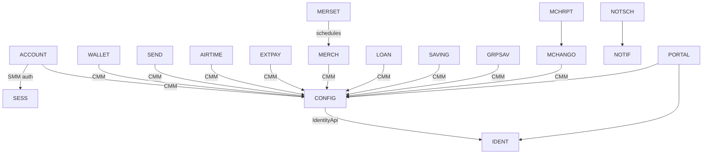

# Service dependency map

```mermaid
flowchart TD
  ACCOUNT -->|SMM auth| SESS
  ACCOUNT -->|CMM| CONFIG
  WALLET -->|CMM| CONFIG
  SEND -->|CMM| CONFIG
  AIRTIME -->|CMM| CONFIG
  EXTPAY -->|CMM| CONFIG
  MERCH -->|CMM| CONFIG
  MERSET -->|schedules| MERCH
  LOAN -->|CMM| CONFIG
  SAVING -->|CMM| CONFIG
  GRPSAV -->|CMM| CONFIG
  MCHANGO -->|CMM| CONFIG
  MCHRPT --> MCHANGO
  NOTSCH --> NOTIF
  CONFIG -->|IdentityApi| IDENT
  PORTAL --> IDENT
  PORTAL --> CONFIG
```
