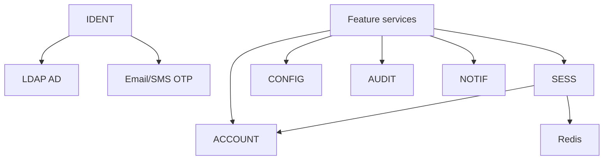

# Service dependency map

```mermaid
flowchart TB
  IDENT --> LDAP[LDAP AD]
  IDENT --> OTP[Email/SMS OTP]
  SESS --> ACCOUNT
  SESS --> Redis
  Feature[Feature services] --> SESS
  Feature --> ACCOUNT
  Feature --> CONFIG
  Feature --> AUDIT
  Feature --> NOTIF
```
