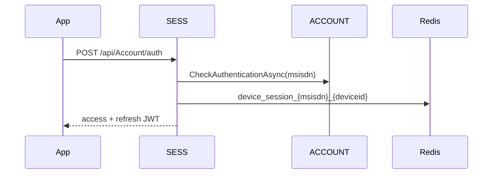

# BE-FLW-001 Login / OTP / session

## Mobile (customer)
1. SESS `POST /api/Account/auth` with `msisdn` + `deviceid` after ACCOUNT profile check (`CheckAuthenticationAsync`).
2. JWT access + refresh stored in Redis `device_session_{msisdn}_{deviceid}` and `tokens` table.
3. Subsequent feature APIs send `X-User-Session` + AES `payload`; `SessionValidationFilter` checks cache then DB.

## Portal (IDENT)
1. `POST /api/Account/login` or `loginwithad` (LDAP bind) → OTP via email/SMS.
2. `POST /api/Account/login2fa` completes login and issues portal JWT (header `X-User-Session`).
3. `AuthorizationFilter` enforces `Controller:Action` claims or Admin.

Evidence: `TZ-Tigo-SuperApp-Session/.../AccountController.Auth`, `TZ-Tigo-SuperApp-Identity/.../AccountController.LoginWithAD`.
