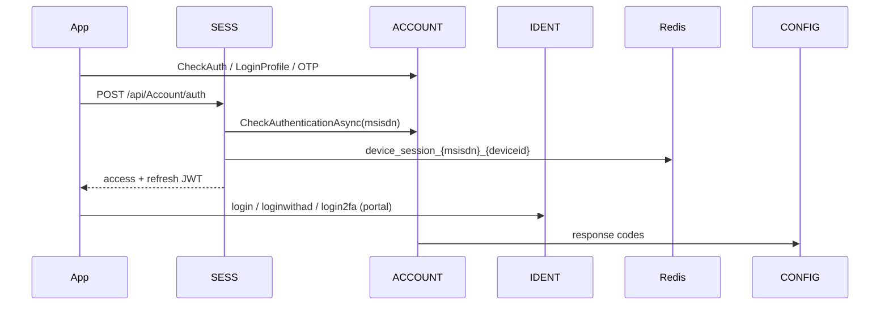

# BE-FLW-001 Login, registration, OTP, session

Merged from PR #1's deeper login hops plus the full-run flow index.

## Mobile (customer)
1. ACCOUNT `CheckAuth` / `LoginProfile` / `Registration` / OTP (`GenerateOtp`, `VerifyOtp`) as required by the journey.
2. SESS `POST /api/Account/auth` with `msisdn` + `deviceid` after ACCOUNT profile check (`CheckAuthenticationAsync`).
3. JWT access + refresh stored in Redis key shape `device_session_{msisdn}_{deviceid}` and `tokens` table.
4. Subsequent feature APIs send `X-User-Session` + AES `payload`; `SessionValidationFilter` checks cache then DB.
5. CONFIG maps `responseCode` via ResponseCodeApp.

## Portal (IDENT)
1. `POST /api/Account/login` or `loginwithad` (LDAP bind) → OTP via email/SMS.
2. `POST /api/Account/login2fa` completes login and issues portal JWT (header `X-User-Session`).
3. `AuthorizationFilter` enforces `Controller:Action` claims or Admin.

Evidence: `TZ-Tigo-SuperApp-Session/.../AccountController.Auth`, `TZ-Tigo-SuperApp-Account/.../ProfileController`, `TZ-Tigo-SuperApp-Identity/.../AccountController.LoginWithAD`.
