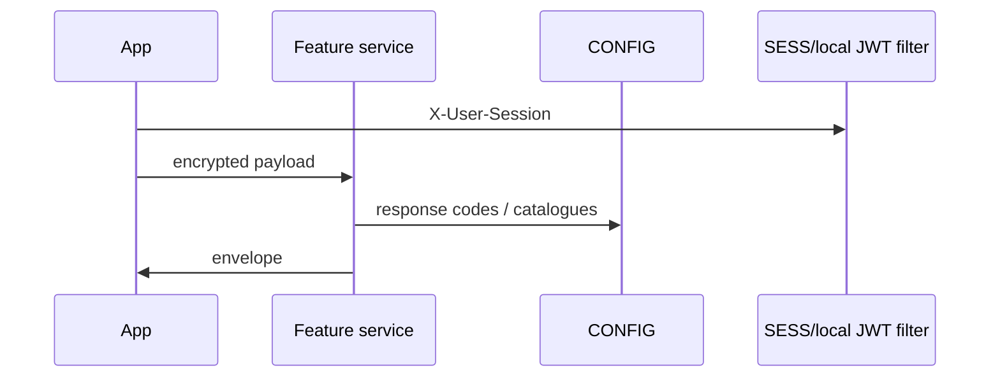

# BE-FLW-014 Notification delivery

**Hops (sync unless noted):** NOTIF APIs + NOTSCH Worker + FCM consumer source

Failure: session 410; handler 400/500; CONFIG lookup failure falls back to handler messages. No distributed saga/compensation parsed; money movement is downstream MMP HTTP with local response mapping.

See `catalog/api-catalog.md` for match keys. Evidence: per-service controllers at recorded SHAs.
