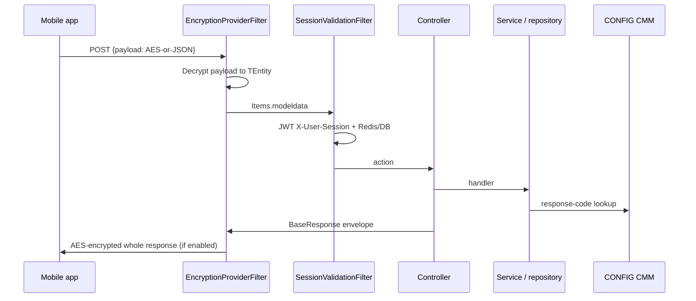

# Request pipeline

There is **no API-gateway repo** in this workspace. The mobile client calls each service’s Kestrel endpoints (hosts not recorded). Typical money-path service:

## Envelope
- Request: `{ "payload": "<string>" }` (`RequestModel.payload`) except Identity portal JWTs, Session `auth`, MChango middleware-bound DTOs, and helper `enc`/`dec` endpoints.
- Success (after `ApiResponseHandler`): `success`, `responseCode`, `transactionStatus`, `appVersionInfo`, `responseData`.
- Failure: `success`, `responseCode`, `appVersionInfo`, `errorDescription`.
- HTTP: 200 if `responseCode=="200"` else 201 on success; 400 or 500 on failure.

## Middleware variants
| Pattern | Services | Order |
|---|---|---|
| A | Most feature services | Swagger → Https → UseAuthorization → MapControllers |
| B | Wallet, Reward, Notification, AuditLogs | Swagger → GlobalError → Cors → Https → UseAuthorization → MapControllers |
| C | GSM | Cors → Https → UseAuthorization → GlobalError → MapControllers |
| D | Identity, Session | Cors → (Https) → UseAuthentication → UseAuthorization → MapControllers |
| E | MChango | EncryptionMiddleware → Cors → UseAuthentication → UseAuthorization → MapControllers |
| F | CONFIG | GlobalError → Https → Cors → UseAuthorization (JWT registered; UseAuthentication missing) |

No `Startup.cs`. Auth on money-path APIs is **filter-based**, not `UseAuthentication`.
