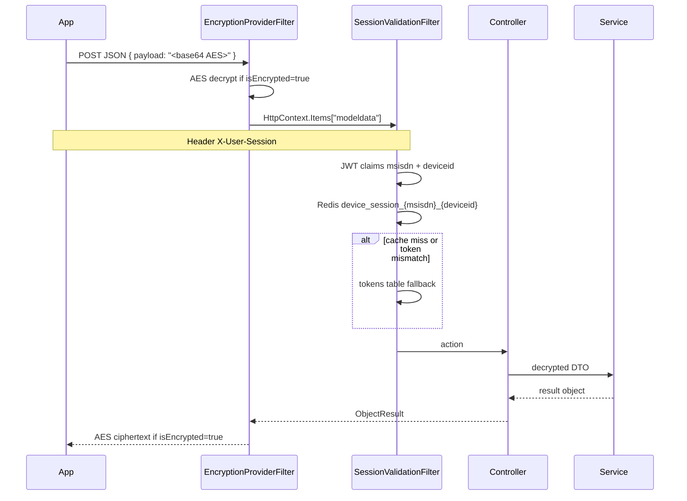

# Request pipeline

Typical **mobile feature** request (WALLET, SEND, ACCOUNT, …):

**IDENT (portal):** `[Authorize(JwtBearer)]` + `AuthorizationFilter` (claim `Controller:Action` or role Admin). Login/OTP/AD/logout/passwordchange are AllowAnonymous bypasses in the filter. Token is read from header `X-User-Session` in JwtBearer `OnMessageReceived`.

**SESS:** `POST /api/Account/auth` issues access+refresh JWT; `POST /api/Account/refreshToken` uses encryption filter + validates stored refresh token. HTTP **411** is used as invalid-token status on refresh.

Config flags (names only): `isEncrypted` (most services) vs `is_encrypted` (IDENT filter).
