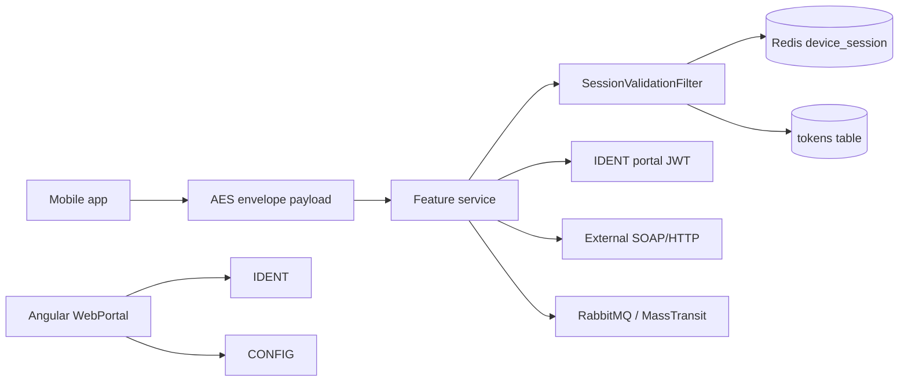

# System architecture

29 repositories: ASP.NET Core `net8.0` microservices plus an Angular admin portal. There is **no API gateway repo** in this environment. The mobile app likely calls each service (or an undocumented gateway) with:

Feature services share a copied pattern: `RequestModel.payload` + `EncryptionProviderFilter<T>` + `SessionValidationFilter` + `X-User-Session`. IDENT is different: ASP.NET Identity + LDAP for the **web portal**, JWT in `X-User-Session`. SESS issues mobile JWTs keyed by `msisdn` + `deviceid`.
