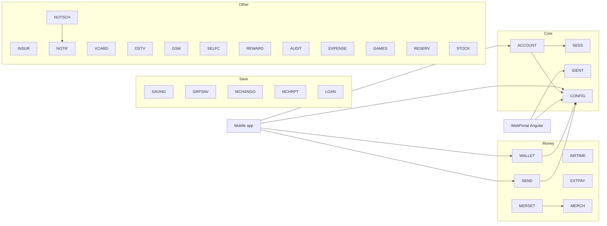

# System architecture

```mermaid
flowchart LR
  Mobile[Mobile app]
  Portal[WebPortal Angular]
  subgraph Core
    ACCOUNT
    SESS
    IDENT
    CONFIG
  end
  subgraph Money
    WALLET
    SEND
    AIRTIME
    EXTPAY
    MERCH
    MERSET
  end
  subgraph Save
    SAVING
    GRPSAV
    MCHANGO
    MCHRPT
    LOAN
  end
  subgraph Other
    INSUR
    VCARD
    DSTV
    GSM
    SELFC
    REWARD
    NOTIF
    NOTSCH
    AUDIT
    EXPENSE
    GAMES
    RESERV
    STOCK
  end
  Mobile --> ACCOUNT
  Mobile --> WALLET
  Mobile --> SEND
  Mobile --> CONFIG
  ACCOUNT --> SESS
  ACCOUNT --> CONFIG
  WALLET --> CONFIG
  SEND --> CONFIG
  MERSET --> MERCH
  Portal --> IDENT
  Portal --> CONFIG
  NOTSCH --> NOTIF
```

29 repositories; schedulers have no HTTP surface (or unused). PORTAL is UI-only.
