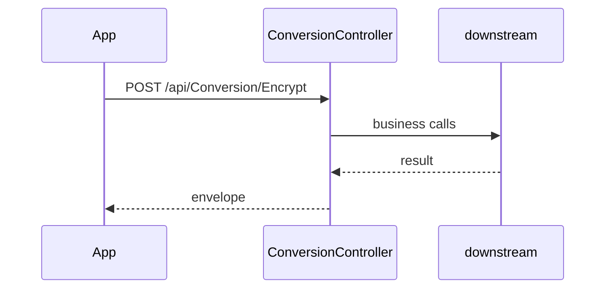

# BE-API-ACCOUNT-045 ConversionController.Decrypt
**Service:** BE-SVC-ACCOUNT · **Handler:** `TZ-Tigo-SuperApp-Account/TZTigoSuperAppAccount/Controllers/ConversionController.cs › ConversionController.Decrypt` · **Conf.:** confirmed

## Match keys
```yaml
match_keys:
  public_method: POST
  public_path: /api/Conversion/Encrypt
  internal_path: /api/Conversion/Encrypt
  dispatch_field: null
  dispatch_value: null
  controller_action: ConversionController.Decrypt
  topic: null
```

## Exposure & security
- **Auth:** none
- **Channel:** IDENT/SESS are portal or session APIs; mobile feature APIs typically use encrypted `payload` + `X-User-Session`.
- **Encryption filter:** none on this action

## Request (decrypted)
| Field (JSON) | Type | Req. | Format / length / enum | Enforced by | Meaning |
|---|---|---|---|---|---|
| payload | `string` | yes | — | DataAnnotations / action | — |

Headers / route / query params:
- `X-User-Session` (Bearer JWT) when authenticated
- Content-Type: application/json

Sample (synthetic):
```json
{ "payload": "<payload>" }
```

## Checks & validations (execution order)
| # | Check | On failure | Rule ID | Evidence |
|---|---|---|---|---|
| 1 | Guard: success = true, transactionStatus = "Data Decrypted Successfully", returnData = data  | HTTP 200 | — | `TZTigoSuperAppAccount/Controllers/ConversionController.cs › ConversionController.Decrypt` |
| 2 | Guard: success = false, responseCode = 500, errordescription = "Internal Server Error"  | HTTP 500 | — | `TZTigoSuperAppAccount/Controllers/ConversionController.cs › ConversionController.Decrypt` |


## Internal call chain
1. ASP.NET model binding (and EncryptionProviderFilter when present) → `ConversionController.Decrypt`
2. Action body in `TZTigoSuperAppAccount/Controllers/ConversionController.cs` (UserManager / services / DbContext as called)
3. Envelope returned (`BaseDto` / `BaseResponse` / `IActionResult`)



## Downstream
| Order | Target (BE-API / BE-INT / BE-EVT) | Sync/Async | Condition | Sent / used fields |
|---|---|---|---|---|
| 1 | In-process services / EF / cache | Sync | always | see call chain |

## Data touched
| Entity / table / SP | R/W | Notes |
|---|---|---|
| See service data-model | R/W | Traced at SHA 5c549d6 |

## Response (decrypted)
| Field (JSON) | Type | Always / when | Meaning |
|---|---|---|---|
| success | bool | typical | Operation flag |
| responseCode / responseMessage_* | string | typical | Envelope |
| Data / responseData | object | on success | Payload |

Sample (synthetic):
```json
{ "success": true, "responseCode": "00", "Data": {} }
```

## Errors
| BE code | HTTP | ID | Condition | Message key/text | Retryable |
|---|---|---|---|---|---|
| — | 200 | — | reachable return | success = true, transactionStatus = "Data Decrypted Successfully", returnData = data  | no |
| — | 500 | — | reachable return | success = false, responseCode = 500, errordescription = "Internal Server Error"  | no |


## Side effects
Documented when the action writes users, tokens, OTP, cache, or audit. See service files.

## Business rules (links)
See `services/account/business-rules.md`.

## Config keys
Names only: `TokenKey`, `isEncrypted` / `is_encrypted`, `Encryption_Decryption_Key`, `IV`, service-specific sections.

## Evidence
- `TZ-Tigo-SuperApp-Account/TZTigoSuperAppAccount/Controllers/ConversionController.cs › ConversionController.Decrypt` @ `5c549d6`

## Open questions
- Public gateway path may differ from controller route (no gateway repo in this set).
