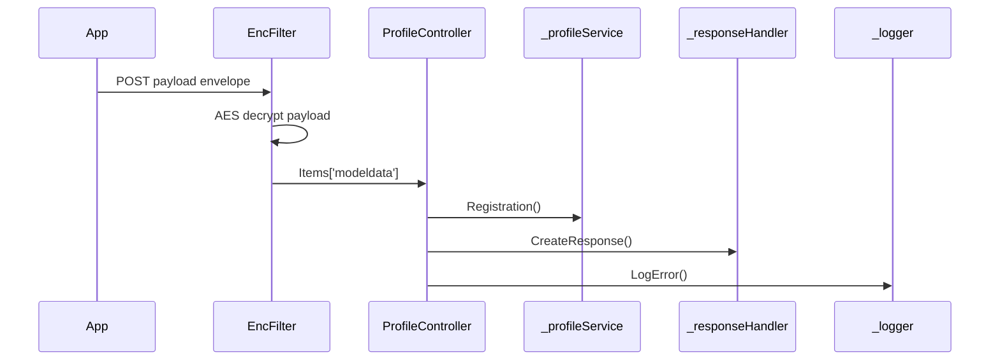

# BE-API-ACCOUNT-007 ProfileController.Registration
**Service:** BE-SVC-ACCOUNT · **Handler:** `TZ-Tigo-SuperApp-Account/TZTigoSuperAppAccount/Controllers/ProfileController.cs › ProfileController.Registration` · **Conf.:** confirmed

## Match keys
```yaml
match_keys:
  public_method: POST
  public_path: /api/Profile/Registration
  internal_path: /api/Profile/Registration
  dispatch_field: null
  dispatch_value: null
  controller_action: ProfileController.Registration
  topic: null
```

## Exposure & security
- **Method / path:** `POST /api/Profile/Registration`
- **Auth / filters:** EncryptionProviderFilter<RegistrationRequest>
- **Headers:** `X-User-Session` (Bearer JWT) when session filter present; `Content-Type: application/json`.
- **Encryption:** whole-body AES on `payload` / response when enabled (`is_encrypted` or `isEncrypted`). Mechanism only; keys not documented.

## Request (decrypted)
Wire envelope (encrypted or plaintext JSON string in `payload`). Table below is the **decrypted** DTO bound after the filter.

| Field (JSON) | Type | Req. | Format / length / enum | Enforced by | Meaning |
|---|---|---|---|---|---|
| `payload` | string | Y | AES ciphertext or JSON | `RequestModel` | whole-body envelope |

**Decrypted type:** `RegistrationRequest`

| Field (JSON) | Type | Req. | Format / length / enum | Enforced by | Meaning |
|---|---|---|---|---|---|
| `requestingOrganisationTransactionReference` | `string?` | N | — | shape only | requestingOrganisationTransactionReference |
| `requestID` | `string?` | N | — | shape only | requestID |
| `channel` | `string?` | N | — | shape only | channel |
| `ipInfo` | `string?` | N | — | shape only | ipInfo |
| `appVersion` | `string?` | N | — | shape only | appVersion |
| `languageCode` | `string?` | N | — | shape only | languageCode |
| `deviceId` | `string?` | N | — | shape only | deviceId |
| `deviceMaker` | `string?` | N | — | shape only | deviceMaker |
| `deviceType` | `string?` | N | — | shape only | deviceType |
| `oS` | `string?` | N | — | shape only | oS |
| `pushId` | `string?` | N | — | shape only | pushId |
| `geoCode` | `string?` | N | — | shape only | geoCode |
| `latitude` | `string?` | N | — | shape only | latitude |
| `longitude` | `string?` | N | — | shape only | longitude |
| `useCaseName` | `string?` | N | — | shape only | useCaseName |
| `accessToken` | `string?` | N | — | shape only | accessToken |
| `msisdn` | `string?` | N | — | shape only | msisdn |
| `firstName` | `string?` | N | — | shape only | firstName |
| `middleName` | `string?` | N | — | shape only | middleName |
| `lastName` | `string?` | N | — | shape only | lastName |
| `dateOfBirth` | `string?` | N | — | shape only | dateOfBirth |
| `gender` | `string?` | N | — | shape only | gender |
| `placeofbirth` | `string?` | N | — | shape only | placeofbirth |
| `address` | `string?` | N | — | shape only | address |
| `city` | `string?` | N | — | shape only | city |
| `district` | `string?` | N | — | shape only | district |
| `region` | `string?` | N | — | shape only | region |
| `nationality` | `string?` | N | — | shape only | nationality |
| `emailid` | `string?` | N | — | shape only | emailid |
| `profileimage` | `string?` | N | — | shape only | profileimage |
| `nicfrontimage` | `string?` | N | — | shape only | nicfrontimage |
| `nicbackimage` | `string?` | N | — | shape only | nicbackimage |
| `newMpin` | `string?` | N | — | shape only | newMpin |
| `confirmMpin` | `string?` | N | — | shape only | confirmMpin |

Headers / route / query params: none parsed beyond action signature `[('msg', 'RequestModel')]`

Sample (synthetic):
```json
{"payload": "<ciphertext-or-json>"}
# decrypted payload:
{
  "requestingOrganisationTransactionReference": "<string>",
  "requestID": "<string>",
  "channel": "<string>",
  "ipInfo": "<encrypted-pin>",
  "appVersion": "<string>",
  "languageCode": "<string>",
  "deviceId": "<device-id>",
  "deviceMaker": "<string>",
  "deviceType": "<string>",
  "oS": "<string>",
  "pushId": "<push-token>",
  "geoCode": "<string>",
  "latitude": "<lat>",
  "longitude": "<lng>",
  "useCaseName": "<string>",
  "accessToken": "<jwt>",
  "msisdn": "255XXXXXXXXX",
  "firstName": "<string>",
  "middleName": "<string>",
  "lastName": "<string>",
  "dateOfBirth": "<string>",
  "gender": "<string>",
  "placeofbirth": "<string>",
  "address": "<string>",
  "city": "<string>"
}
```

## Checks & validations (execution order)
| # | Check | On failure | Rule ID | Evidence |
|---|---|---|---|---|
| 1 | Decrypt | 500 | — | `ProfileController.Registration` |
| 2 | profilestatus==false; OTP-verified device | fail | — | `ProfileService.Registration` |
| 3 | Optional blob if images; SOAP ChangePin `ChangePin` | fail | — | same |

## Internal call chain
1. Client POST `/api/Profile/Registration` with `{ payload }` envelope.
2. Encryption filter decrypts payload into `RegistrationRequest` on `HttpContext.Items['modeldata']`.
3. `ProfileController.Registration` runs (`TZ-Tigo-SuperApp-Account/TZTigoSuperAppAccount/Controllers/ProfileController.cs`).
4. Calls `_profileService.Registration`.
5. Calls `_responseHandler.CreateResponse`.
6. Calls `this.StatusCode`.
7. Returns via `ApiResponseHandler.CreateResponse` or action result; filter may AES-encrypt whole response.



## Downstream
| Order | Target | Sync/Async | Condition | Sent / used fields |
|---|---|---|---|---|
| 1 | SOAP `ChangePin` | Sync | always | newMpin; `Tanzania:Registration:Username\|Password\|consumerID` |
| 2 | Azure blob | Sync | images present | container keys |

## Data touched
| Entity / table / SP | R/W | Notes |
|---|---|---|
| see service `data-model.md` | mixed | not fully attributed per action |

## Response (decrypted)
| Field (JSON) | Type | Always / when | Meaning |
|---|---|---|---|
| `success` | boolean | always | handler outcome |
| `responseCode` | string | always | mapped via CONFIG when handler used |
| `transactionStatus` | string | success | mapped message |
| `errorDescription` | string | failure | mapped or static |
| `appVersionInfo` | string | often | app version hint |
| `responseData` | object | success | action-specific |

Sample (synthetic):
```json
{
  "success": true,
  "responseCode": "<code>",
  "transactionStatus": "<message>",
  "appVersionInfo": "<version>",
  "responseData": {}
}
```

## Errors
| BE code | HTTP | ID | Condition | Message key/text | Retryable |
|---|---|---|---|---|---|
| 500 | 500 | BE-ERR-ACCOUNT-001 | unhandled exception in action | Internal Server Error | yes (idempotent GETs only) |
| (session) | 410 | BE-ERR-ACCOUNT-002 | invalid/expired `X-User-Session` | session filter envelope | no (re-auth) |
| mapped | 400/200/201 | — | handler `BaseResponse.success` | CONFIG response-code catalogue | depends |

## Side effects
- Possible audit publish via RabbitMQ `IAuditLogsService` in encryption filter (service-dependent).
- Possible FCM via `IFCMService` when the handler calls it.

## Business rules (links)
- Session validity: `BE-BR-ACCOUNT-001` (when session filter present).

## Config keys
- `ChangePin`, `Tanzania:Registration:Username`, `Tanzania:Registration:Password`, `Tanzania:Registration:consumerID`

## Evidence
- `TZ-Tigo-SuperApp-Account/TZTigoSuperAppAccount/Controllers/ProfileController.cs › ProfileController.Registration` @ `5c549d6`
- Decrypted DTO `RegistrationRequest` properties from type index.

## Open questions
- Public path may be rewritten by an external gateway not in this repo set.
