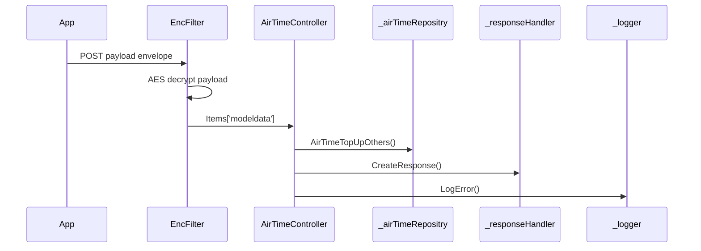

# BE-API-AIRTIME-008 AirTimeController.AirTimeTopUpOthers
**Service:** BE-SVC-AIRTIME · **Handler:** `TZ-Tigo-SuperApp-AirTimeTopup/TZTigoSuperAppAirTimeTopup/Controllers/AirTimeController.cs › AirTimeController.AirTimeTopUpOthers` · **Conf.:** confirmed

## Match keys
```yaml
match_keys:
  public_method: POST
  public_path: /api/AirTime/AirTimeTopUpOthers
  internal_path: /api/AirTime/AirTimeTopUpOthers
  dispatch_field: null
  dispatch_value: null
  controller_action: AirTimeController.AirTimeTopUpOthers
  topic: null
```

## Exposure & security
- **Method / path:** `POST /api/AirTime/AirTimeTopUpOthers`
- **Auth / filters:** SessionValidationFilter (X-User-Session), EncryptionProviderFilter<AirTimeTopUpRequest>
- **Headers:** `X-User-Session` (Bearer JWT) when session filter present; `Content-Type: application/json`.
- **Encryption:** whole-body AES on `payload` / response when enabled (`is_encrypted` or `isEncrypted`). Mechanism only; keys not documented.

## Request (decrypted)
Wire envelope (encrypted or plaintext JSON string in `payload`). Table below is the **decrypted** DTO bound after the filter.

| Field (JSON) | Type | Req. | Format / length / enum | Enforced by | Meaning |
|---|---|---|---|---|---|
| `payload` | string | Y | AES ciphertext or JSON | `RequestModel` | whole-body envelope |

**Decrypted type:** `AirTimeTopUpRequest`

| Field (JSON) | Type | Req. | Format / length / enum | Enforced by | Meaning |
|---|---|---|---|---|---|
| `requestingOrganisationTransactionReference` | `string?` | N | — | shape only | requestingOrganisationTransactionReference |
| `requestId` | `string?` | N | — | shape only | requestId |
| `channel` | `string?` | N | — | shape only | channel |
| `ipInfo` | `string?` | N | — | shape only | ipInfo |
| `appVersion` | `string?` | N | — | shape only | appVersion |
| `languageCode` | `string?` | N | — | shape only | languageCode |
| `deviceId` | `string?` | N | — | shape only | deviceId |
| `deviceMaker` | `string?` | N | — | shape only | deviceMaker |
| `pushId` | `string?` | N | — | shape only | pushId |
| `deviceType` | `string?` | N | — | shape only | deviceType |
| `oS` | `string?` | N | — | shape only | oS |
| `geoCode` | `string?` | N | — | shape only | geoCode |
| `userCaseName` | `string?` | N | — | shape only | userCaseName |
| `accessToken` | `string?` | N | — | shape only | accessToken |
| `consumerID` | `string?` | N | — | shape only | consumerID |
| `transactionID` | `string?` | N | — | shape only | transactionID |
| `country` | `string?` | N | — | shape only | country |
| `correlationID` | `string?` | N | — | shape only | correlationID |
| `sourceMsisdn` | `string?` | N | — | shape only | sourceMsisdn |
| `targetMsisdn` | `string?` | N | — | shape only | targetMsisdn |
| `pin` | `string?` | N | — | shape only | pin |
| `providerSource` | `string?` | N | — | shape only | providerSource |
| `providerTarget` | `string?` | N | — | shape only | providerTarget |
| `walletSource` | `string?` | N | — | shape only | walletSource |
| `walletTarget` | `int` | N | — | shape only | walletTarget |
| `amount` | `int` | N | — | shape only | amount |
| `shortCode` | `string?` | N | — | shape only | shortCode |
| `operatorName` | `string?` | N | — | shape only | operatorName |
| `overDraftBrandId` | `string?` | N | — | shape only | overDraftBrandId |

Headers / route / query params: none parsed beyond action signature `[('msg', 'RequestModel')]`

Sample (synthetic):
```json
{"payload": "<ciphertext-or-json>"}
# decrypted payload:
{
  "requestingOrganisationTransactionReference": "<string>",
  "requestId": "<string>",
  "channel": "<string>",
  "ipInfo": "<encrypted-pin>",
  "appVersion": "<string>",
  "languageCode": "<string>",
  "deviceId": "<device-id>",
  "deviceMaker": "<string>",
  "pushId": "<push-token>",
  "deviceType": "<string>",
  "oS": "<string>",
  "geoCode": "<string>",
  "userCaseName": "<string>",
  "accessToken": "<jwt>",
  "consumerID": "<string>",
  "transactionID": "<string>",
  "country": "<string>",
  "correlationID": "<string>",
  "sourceMsisdn": "255XXXXXXXXX",
  "targetMsisdn": "255XXXXXXXXX",
  "pin": "<encrypted-pin>",
  "providerSource": "<string>",
  "providerTarget": "<string>",
  "walletSource": "<string>",
  "walletTarget": 0
}
```

## Checks & validations (execution order)
| # | Check | On failure | Rule ID | Evidence |
|---|---|---|---|---|
| 1 | Decrypt + session | 500 / 410 | BE-BR-AIRTIME-001 | `AirTimeController.AirTimeTopUpOthers` |
| 2 | If source==target MSISDN, GET OperatorsInformation to fill shortCode/operatorName | — | — | `AirTimeRepository.AirTimeTopUpOthers` |
| 3 | MTPGPaymentRequest XML POST `MTPGPaymentRequest:URL`; success iff ResultCode `99999` | fail + FCM only on success | — | same |
| 4 | finally insert `airtimetopup` | — | — | same |

## Internal call chain
1. Client POST `/api/AirTime/AirTimeTopUpOthers` with `{ payload }` envelope.
2. Encryption filter decrypts payload into `AirTimeTopUpRequest` on `HttpContext.Items['modeldata']`.
3. SessionValidationFilter validates `X-User-Session`.
4. `AirTimeController.AirTimeTopUpOthers` runs (`TZ-Tigo-SuperApp-AirTimeTopup/TZTigoSuperAppAirTimeTopup/Controllers/AirTimeController.cs`).
5. Calls `_airTimeRepositry.AirTimeTopUpOthers`.
6. Calls `_responseHandler.CreateResponse`.
7. Calls `_responseHandler.CreateResponse`.
8. Returns via `ApiResponseHandler.CreateResponse` or action result; filter may AES-encrypt whole response.



## Downstream
| Order | Target | Sync/Async | Condition | Sent / used fields |
|---|---|---|---|---|
| 1 | HTTP `VerifySendMoney:OperatorsInformation` | Sync | source==target | msisdn |
| 2 | SOAP MTPGPayment `MTPGPaymentRequest:URL` | Sync | always | `MTPGPaymentRequest:ConsumerID\|TerminalType\|PaymentType` |
| 3 | FCM | Sync | ResultCode 99999 | notify |

## Data touched
| Entity / table / SP | R/W | Notes |
|---|---|---|
| see service `data-model.md` | mixed | not fully attributed per action |

## Response (decrypted)
| Field (JSON) | Type | Always / when | Meaning |
|---|---|---|---|
| `success` | boolean | always | handler outcome |
| `responseCode` | string | always | mapped via CONFIG when handler used |
| `transactionStatus` | string | success | mapped message |
| `errorDescription` | string | failure | mapped or static |
| `appVersionInfo` | string | often | app version hint |
| `responseData` | object | success | action-specific |

Sample (synthetic):
```json
{
  "success": true,
  "responseCode": "<code>",
  "transactionStatus": "<message>",
  "appVersionInfo": "<version>",
  "responseData": {}
}
```

## Errors
| BE code | HTTP | ID | Condition | Message key/text | Retryable |
|---|---|---|---|---|---|
| 500 | 500 | BE-ERR-AIRTIME-001 | unhandled exception in action | Internal Server Error | yes (idempotent GETs only) |
| (session) | 410 | BE-ERR-AIRTIME-002 | invalid/expired `X-User-Session` | session filter envelope | no (re-auth) |
| mapped | 400/200/201 | — | handler `BaseResponse.success` | CONFIG response-code catalogue | depends |

## Side effects
- Possible audit publish via RabbitMQ `IAuditLogsService` in encryption filter (service-dependent).
- Possible FCM via `IFCMService` when the handler calls it.

## Business rules (links)
- Session validity: `BE-BR-AIRTIME-001` (when session filter present).

## Config keys
- `MTPGPaymentRequest:URL`, `MTPGPaymentRequest:ConsumerID`, `MTPGPaymentRequest:TerminalType`, `MTPGPaymentRequest:PaymentType`, `VerifySendMoney:OperatorsInformation`

## Evidence
- `TZ-Tigo-SuperApp-AirTimeTopup/TZTigoSuperAppAirTimeTopup/Controllers/AirTimeController.cs › AirTimeController.AirTimeTopUpOthers` @ `7a52359`
- Decrypted DTO `AirTimeTopUpRequest` properties from type index.

## Open questions
- Public path may be rewritten by an external gateway not in this repo set.
