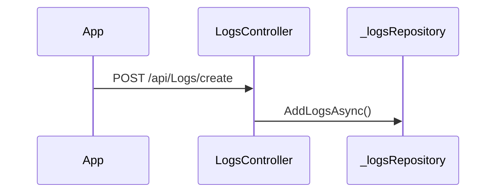

# BE-API-AUDIT-001 LogsController.CreateLogsAsync
**Service:** BE-SVC-AUDIT · **Handler:** `TZ-Tigo-SuperApp-AuditLogs/TZTigoSuperAppAuditLogs/Controllers/LogsController.cs › LogsController.CreateLogsAsync` · **Conf.:** confirmed

## Match keys
```yaml
match_keys:
  public_method: POST
  public_path: /api/Logs/create
  internal_path: /api/Logs/create
  dispatch_field: null
  dispatch_value: null
  controller_action: LogsController.CreateLogsAsync
  topic: null
```

## Exposure & security
- **Method / path:** `POST /api/Logs/create`
- **Auth / filters:** none on action (pipeline may still authorize)
- **Headers:** `X-User-Session` (Bearer JWT) when session filter present; `Content-Type: application/json`.
- **Encryption:** whole-body AES on `payload` / response when enabled (`is_encrypted` or `isEncrypted`). Mechanism only; keys not documented.

## Request (decrypted)
| Field (JSON) | Type | Req. | Format / length / enum | Enforced by | Meaning |
|---|---|---|---|---|---|
| `requestingOrganisationTransactionReference` | `string?` | N | — | shape only | requestingOrganisationTransactionReference |
| `json_request` | `string?` | N | — | shape only | json_request |
| `Controller` | `string?` | N | — | shape only | Controller |
| `Method` | `string?` | N | — | shape only | Method |

Headers / route / query params: none parsed beyond action signature `[('request', 'AuditLogsRequest')]`

Sample (synthetic):
```json
{
  "requestingOrganisationTransactionReference": "<string>",
  "json_request": "<string>",
  "Controller": "<string>",
  "Method": "<string>"
}
```

## Checks & validations (execution order)
| # | Check | On failure | Rule ID | Evidence |
|---|---|---|---|---|
| 1 | `request == null` | branch / error envelope | — | `TZ-Tigo-SuperApp-AuditLogs/TZTigoSuperAppAuditLogs/Controllers/LogsController.cs › LogsController.CreateLogsAsync` |
| 2 | `request.Method == "TransferSendMoney"` | branch / error envelope | — | `TZ-Tigo-SuperApp-AuditLogs/TZTigoSuperAppAuditLogs/Controllers/LogsController.cs › LogsController.CreateLogsAsync` |
| 3 | `request.Method == "VerifySendMoney"` | branch / error envelope | — | `TZ-Tigo-SuperApp-AuditLogs/TZTigoSuperAppAuditLogs/Controllers/LogsController.cs › LogsController.CreateLogsAsync` |

## Internal call chain
1. Client POST `/api/Logs/create`.
2. `LogsController.CreateLogsAsync` runs (`TZ-Tigo-SuperApp-AuditLogs/TZTigoSuperAppAuditLogs/Controllers/LogsController.cs`).
3. Calls `_logsRepository.AddLogsAsync`.
4. Returns via `ApiResponseHandler.CreateResponse` or action result; filter may AES-encrypt whole response.



## Downstream
| Order | Target (BE-API / BE-INT / BE-EVT) | Sync/Async | Condition | Sent / used fields |
|---|---|---|---|---|
| — | none parsed beyond in-process services | — | — | — |

## Data touched
| Entity / table / SP | R/W | Notes |
|---|---|---|
| see service `data-model.md` | mixed | not fully attributed per action |

## Response (decrypted)
| Field (JSON) | Type | Always / when | Meaning |
|---|---|---|---|
| `success` | boolean | always | handler outcome |
| `responseCode` | string | always | mapped via CONFIG when handler used |
| `transactionStatus` | string | success | mapped message |
| `errorDescription` | string | failure | mapped or static |
| `appVersionInfo` | string | often | app version hint |
| `responseData` | object | success | action-specific |

Sample (synthetic):
```json
{
  "success": true,
  "responseCode": "<code>",
  "transactionStatus": "<message>",
  "appVersionInfo": "<version>",
  "responseData": {}
}
```

## Errors
| BE code | HTTP | ID | Condition | Message key/text | Retryable |
|---|---|---|---|---|---|
| 500 | 500 | BE-ERR-AUDIT-001 | unhandled exception in action | Internal Server Error | yes (idempotent GETs only) |
| (session) | 410 | BE-ERR-AUDIT-002 | invalid/expired `X-User-Session` | session filter envelope | no (re-auth) |
| mapped | 400/200/201 | — | handler `BaseResponse.success` | CONFIG response-code catalogue | depends |

## Side effects
- Possible audit publish via RabbitMQ `IAuditLogsService` in encryption filter (service-dependent).
- Possible FCM via `IFCMService` when the handler calls it.

## Business rules (links)
- Session validity: `BE-BR-AUDIT-001` (when session filter present).

## Config keys
- `is_encrypted` or `isEncrypted` (toggle)
- `responseChanel`, `serviceName` / `Tanzania:serviceName` (message mapping)
- `TokenKey` (JWT validation; value not recorded)

## Evidence
- `TZ-Tigo-SuperApp-AuditLogs/TZTigoSuperAppAuditLogs/Controllers/LogsController.cs › LogsController.CreateLogsAsync` @ `eb87819`
- Decrypted DTO `AuditLogsRequest` properties from type index.

## Open questions
- Public path may be rewritten by an external gateway not in this repo set.
