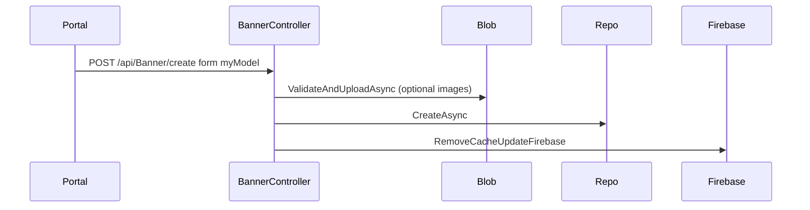

# BE-API-CONFIG-431 BannerController.Create
**Service:** BE-SVC-CONFIG · **Handler:** `TZ-Tigo-SuperApp-Configuration/TZTigoSuperAppConfiguration/Controllers/BO/BannerController.cs › BannerController.Create` · **Conf.:** confirmed

Missed in the first catalog pass because the attribute is combined: `[HttpPost("create"), DisableRequestSizeLimit]` (BE-GAP-009). This is a public BO action.

## Match keys
```yaml
match_keys:
  public_method: POST
  public_path: /api/Banner/create
  internal_path: /api/Banner/create
  dispatch_field: null
  dispatch_value: null
  controller_action: BannerController.Create
  topic: null
```

## Exposure & security
- **Method / path:** `POST /api/Banner/create`
- **Auth / filters:** `[Authorize(JwtBearer)]` + `AuthorizationFilter`. Request size limit disabled for image form posts.
- **Headers:** `Authorization: Bearer` JWT. `Content-Type: multipart/form-data`.
- **Encryption:** none on this BO form path.

## Request (decrypted)
Multipart form. JSON banner lives in form field `myModel` (not AES `payload`). Nested type `BannerDto`.

| Field (form/JSON) | Type | Req. | Format / length / enum | Enforced by | Meaning |
|---|---|---|---|---|---|
| `myModel` | string (JSON) | Y | deserialized to `BannerDto` | `JsonConvert.DeserializeObject` | banner metadata |
| `myModel.id` | int | N | — | shape | unused on create |
| `myModel.country_id` | `KeyValue { Key, Value }` | N | lookup pair | shape | country |
| `myModel.channel_id` | `KeyValue { Key, Value }` | N | lookup pair | shape | channel |
| `myModel.app_channel_os` | `KeyValue { Key, Value }` | N | lookup pair | shape | OS channel |
| `myModel.sort_order` | int | N | — | shape | display order |
| `myModel.height` | double | N | default 88 | shape | banner height |
| `myModel.type` | `KeyValue` | N | — | shape | banner type |
| `myModel.subType` | `KeyValue?` | N | — | shape | subtype |
| `myModel.category` | `KeyValue?` | N | — | shape | category |
| `myModel.flowid` | string? | N | flow id | shape | deep-link flow |
| `myModel.image_url` | string? | N | URL or image payload | `ImageValidationUploadHelper` | EN promo image |
| `myModel.dashboardimage_url` | string? | N | URL or image payload | same | EN dashboard image |
| `myModel.imagesawahi_url` | string? | N | URL or image payload | same | SW promo image |
| `myModel.dashboardimagesawahi_url` | string? | N | URL or image payload | same | SW dashboard image |
| `myModel.video_url` | string? | N | — | shape | video |
| `myModel.cta` | bool? | N | — | shape | call-to-action flag |
| `myModel.title` | string | Y | — | shape | title |
| `myModel.buttontext` | string? | N | default `ok` | shape | EN button |
| `myModel.buttontextsw` | string? | N | — | shape | SW button |
| `myModel.buttoncolor` / `buttontextcolor` / `textcolor` / `descriptiontextcolor` | string? | N | — | shape | colours |
| `myModel.showdashboard` | `KeyValue` | N | — | shape | show on dashboard |
| `myModel.frequency` | int? | N | default 0 | shape | display frequency |
| `myModel.start_date` / `end_date` | DateTime | N | — | shape | window |
| `myModel.is_active` | bool | N | default true | shape | active |
| `myModel.lang[]` | `SelectItem[]` | N | `{ field, code, name, message, title, description }` | shape | localized copy |
| `myModel.isrevamp` | bool | N | default false | shape | revamp layout |
| `myModel.image_*` / `imagesawahi_*` / `dashboardimage_*` / `dashboardimagesawahi_*` | string? | N | name/size/type | shape | asset metadata |

Sample (synthetic):
```json
{
  "title": "<title>",
  "country_id": { "Key": "<id>", "Value": "<name>" },
  "channel_id": { "Key": "<id>", "Value": "<name>" },
  "type": { "Key": "<id>", "Value": "<name>" },
  "showdashboard": { "Key": "<id>", "Value": "<name>" },
  "lang": [{ "field": "en", "code": 1, "name": "English", "title": "<title>", "description": "<text>" }],
  "image_url": "<image-or-url>",
  "is_active": true
}
```

## Checks & validations (execution order)
| # | Check | On failure | Rule ID | Evidence |
|---|---|---|---|---|
| 1 | JWT + `AuthorizationFilter` | 401 / 403 | — | `TZ-Tigo-SuperApp-Configuration/TZTigoSuperAppConfiguration/Controllers/BO/BannerController.cs › BannerController.Create` |
| 2 | Deserialize form `myModel` to `BannerDto` | exception → 500 | — | same |
| 3 | Claim `NameIdentifier` (created_by) | exception if missing | — | same |
| 4 | If `image_url` / `dashboardimage_url` / `imagesawahi_url` / `dashboardimagesawahi_url` set → validate+upload to blob container key `AzureBlobStorage:BannerContainer` | HTTP 400 `success=false` + validation errors | — | `ImageValidationUploadHelper.ValidateAndUploadAsync` |
| 5 | Map to `Banner`; set `created_by` / `created_date`; persist | repo error | — | `IBannerRepository.CreateAsync` |
| 6 | Image warnings → `responseCode=UM-L1-22-WARN` | still 200 with warning text | — | same |
| 7 | `RemoveCacheUpdateFirebase` | cache/Firebase side path | — | same |

## Internal call chain
1. Portal POST `/api/Banner/create` multipart.
2. `BannerController.Create` deserializes `myModel`.
3. Optional image upload via `IFileValidationService` + `ICloudStorage`.
4. `IBannerRepository.CreateAsync`.
5. Cache drop + Firebase client update.



## Downstream
| Order | Target (BE-API / BE-INT / BE-EVT) | Sync/Async | Condition | Sent / used fields |
|---|---|---|---|---|
| 1 | Azure blob (`AzureBlobStorage:BannerContainer`) | Sync | any image field set | image payload, folder `Banners` |
| 2 | Firebase realtime (`FirebaseClient:BasePath`) | Sync | after persist | cache invalidation / banner sync |
| 3 | Redis cache (`ICacheService`) | Sync | after persist | drop banner cache |

## Data touched
| Entity / table / SP | R/W | Notes |
|---|---|---|
| banner EF set | W | create |

## Response (decrypted)
| Field (JSON) | Type | Always / when | Meaning |
|---|---|---|---|
| `success` | boolean | always | handler outcome |
| `responseCode` | string | when warnings | `UM-L1-22-WARN` if image warnings |
| `errorDescription` | string | warnings | joined warning text |
| `responseData` | `BannerDto` | success | created banner |

## Errors
| BE code | HTTP | ID | Condition | Message key/text | Retryable |
|---|---|---|---|---|---|
| 400 | 400 | — | image validation fail | `responseMessage_en` join of errors / FR static | no |
| 401 | 401 | — | missing JWT | ASP.NET | no |
| 403 | 403 | — | AuthorizationFilter | — | no |
| 500 | 500 | — | unhandled | logged then rethrow | yes |

## Side effects
- Blob upload of up to four banner images.
- Cache invalidation and Firebase update via `RemoveCacheUpdateFirebase`.
- Audit: `created_by` from JWT name identifier.

## Config keys
- `AzureBlobStorage:BannerContainer`
- `EnableLog:Debug` (logging)

## Evidence
- `TZ-Tigo-SuperApp-Configuration/TZTigoSuperAppConfiguration/Controllers/BO/BannerController.cs › BannerController.Create` @ `9c00072`
- DTO `TZTigoSuperAppConfiguration/Domain/Model/BannerDto.cs` (+ nested `KeyValue`, `SelectItem[]`)

## Open questions
- Combined `[HttpPost, DisableRequestSizeLimit]` attribute form is unique to Create/Update among CONFIG controllers.
