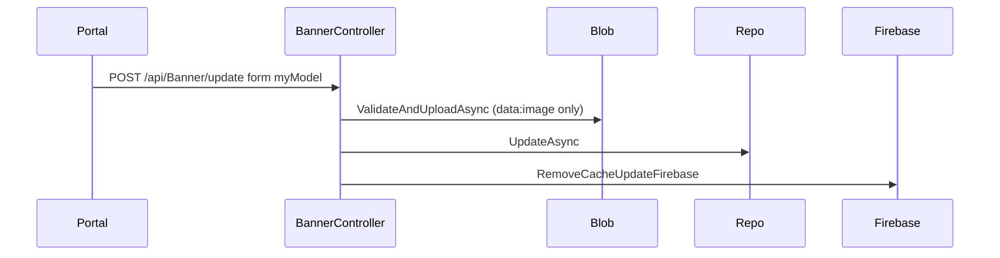

# BE-API-CONFIG-432 BannerController.Update
**Service:** BE-SVC-CONFIG · **Handler:** `TZ-Tigo-SuperApp-Configuration/TZTigoSuperAppConfiguration/Controllers/BO/BannerController.cs › BannerController.Update` · **Conf.:** confirmed

Missed in the first catalog pass because the attribute is combined: `[HttpPost("update"), DisableRequestSizeLimit]` (BE-GAP-009). This is a public BO action.

## Match keys
```yaml
match_keys:
  public_method: POST
  public_path: /api/Banner/update
  internal_path: /api/Banner/update
  dispatch_field: null
  dispatch_value: null
  controller_action: BannerController.Update
  topic: null
```

## Exposure & security
- **Method / path:** `POST /api/Banner/update`
- **Auth / filters:** `[Authorize(JwtBearer)]` + `AuthorizationFilter`. Request size limit disabled.
- **Headers:** `Authorization: Bearer` JWT. `Content-Type: multipart/form-data`.
- **Encryption:** none on this BO form path.

## Request (decrypted)
Same nested `BannerDto` as BE-API-CONFIG-431 in form field `myModel`. Update only re-uploads an image field when the value contains `data:image` (existing URLs are kept).

| Field (form/JSON) | Type | Req. | Format / length / enum | Enforced by | Meaning |
|---|---|---|---|---|---|
| `myModel` | string (JSON) | Y | `BannerDto` | deserialize | banner to update |
| `myModel.id` | int | Y (for update) | existing banner id | repository | target row |
| nested KeyValue / `lang[]` / image fields | see BE-API-CONFIG-431 | | | | same shape |

Sample (synthetic):
```json
{
  "id": 1,
  "title": "<title>",
  "image_url": "<existing-url-or-data:image>",
  "is_active": true
}
```

## Checks & validations (execution order)
| # | Check | On failure | Rule ID | Evidence |
|---|---|---|---|---|
| 1 | JWT + `AuthorizationFilter` | 401 / 403 | — | `TZ-Tigo-SuperApp-Configuration/TZTigoSuperAppConfiguration/Controllers/BO/BannerController.cs › BannerController.Update` |
| 2 | Deserialize form `myModel` | exception → 500 | — | same |
| 3 | Claim `NameIdentifier` (updated_by) | exception if missing | — | same |
| 4 | Re-upload image fields only if value contains `data:image` via `AzureBlobStorage:BannerContainer` | HTTP 400 | — | `ImageValidationUploadHelper.ValidateAndUploadAsync` |
| 5 | Map; set `updated_by` / `updated_date`; `UpdateAsync` | 404/error from repo if missing | — | `IBannerRepository.UpdateAsync` |
| 6 | Image warnings → `UM-L1-22-WARN` | still success body | — | same |
| 7 | `RemoveCacheUpdateFirebase` | cache/Firebase | — | same |

## Internal call chain
1. Portal POST `/api/Banner/update` multipart.
2. Conditional blob re-upload.
3. `IBannerRepository.UpdateAsync`.
4. Cache drop + Firebase update.



## Downstream
| Order | Target (BE-API / BE-INT / BE-EVT) | Sync/Async | Condition | Sent / used fields |
|---|---|---|---|---|
| 1 | Azure blob (`AzureBlobStorage:BannerContainer`) | Sync | image field contains `data:image` | new image payload |
| 2 | Firebase realtime | Sync | after persist | banner sync |
| 3 | Redis cache | Sync | after persist | drop banner cache |

## Data touched
| Entity / table / SP | R/W | Notes |
|---|---|---|
| banner EF set | R/W | update by id |

## Response (decrypted)
| Field (JSON) | Type | Always / when | Meaning |
|---|---|---|---|
| `success` | boolean | always | handler outcome |
| `responseCode` | string | warnings | `UM-L1-22-WARN` |
| `errorDescription` | string | warnings | joined warnings |
| `responseData` | `BannerDto` | success | updated banner |

## Errors
| BE code | HTTP | ID | Condition | Message key/text | Retryable |
|---|---|---|---|---|---|
| 400 | 400 | — | image validation fail | validation errors | no |
| 401 / 403 | 401/403 | — | JWT / AuthorizationFilter | — | no |
| 404 | 404 | — | banner missing (repo) | — | no |
| 500 | 500 | — | unhandled rethrow | logged | yes |

## Side effects
- Optional blob replace; cache + Firebase refresh; `updated_by` from JWT.

## Config keys
- `AzureBlobStorage:BannerContainer`
- `EnableLog:Debug`

## Evidence
- `TZ-Tigo-SuperApp-Configuration/TZTigoSuperAppConfiguration/Controllers/BO/BannerController.cs › BannerController.Update` @ `9c00072`

## Open questions
- None beyond gateway overlay (BE-GAP-001).
