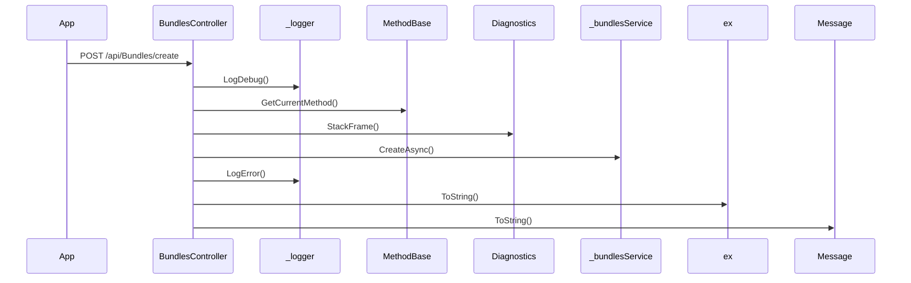

# BE-API-CONFIG-205 BundlesController.Create
**Service:** BE-SVC-CONFIG · **Handler:** `TZ-Tigo-SuperApp-Configuration/TZTigoSuperAppConfiguration/Controllers/BO/BundlesController.cs › BundlesController.Create` · **Conf.:** confirmed

## Match keys
```yaml
match_keys:
  public_method: POST
  public_path: /api/Bundles/create
  internal_path: /api/Bundles/create
  dispatch_field: null
  dispatch_value: null
  controller_action: BundlesController.Create
  topic: null
```

## Exposure & security
- **Method / path:** `POST /api/Bundles/create`
- **Auth / filters:** Authorize (JWT)
- **Headers:** `X-User-Session` (Bearer JWT) when session filter present; `Content-Type: application/json`.
- **Encryption:** whole-body AES on `payload` / response when enabled (`is_encrypted` or `isEncrypted`). Mechanism only; keys not documented.

## Request (decrypted)
| Field (JSON) | Type | Req. | Format / length / enum | Enforced by | Meaning |
|---|---|---|---|---|---|
| `id` | `int` | N | — | shape only | id |
| `engCategory` | `string?` | N | — | shape only | engCategory |
| `swCategory` | `string?` | N | — | shape only | swCategory |
| `enPackName` | `string?` | N | — | shape only | enPackName |
| `swPackName` | `string?` | N | — | shape only | swPackName |
| `productId` | `string?` | N | — | shape only | productId |
| `ffeId` | `string?` | N | — | shape only | ffeId |
| `engValidity` | `string?` | N | — | shape only | engValidity |
| `swValidity` | `string?` | N | — | shape only | swValidity |
| `data` | `string?` | N | — | shape only | data |
| `levelIDisplay` | `string?` | N | — | shape only | levelIDisplay |
| `levelIIDisplay` | `string?` | N | — | shape only | levelIIDisplay |
| `dataUnit` | `string?` | N | — | shape only | dataUnit |
| `voiceUnit` | `string?` | N | — | shape only | voiceUnit |
| `unit` | `string?` | N | — | shape only | unit |
| `price` | `string?` | N | — | shape only | price |
| `engDescription` | `string?` | N | — | shape only | engDescription |
| `swDescription` | `string?` | N | — | shape only | swDescription |
| `simCategory` | `bool?` | N | — | shape only | simCategory |
| `category` | `string?` | N | — | shape only | category |
| `type` | `string?` | N | — | shape only | type |
| `typesw` | `string?` | N | — | shape only | typesw |
| `bundleClass` | `string?` | N | — | shape only | bundleClass |
| `action` | `string?` | N | — | shape only | action |
| `levelIDisplaySwahili` | `string?` | N | — | shape only | levelIDisplaySwahili |
| `levelIDisplayEnglish` | `string?` | N | — | shape only | levelIDisplayEnglish |
| `levelIIDisplayEnglish` | `string?` | N | — | shape only | levelIIDisplayEnglish |
| `levelIIDisplaySwahili` | `string?` | N | — | shape only | levelIIDisplaySwahili |
| `dataUnitEnglish` | `string?` | N | — | shape only | dataUnitEnglish |
| `dataUnitSwahili` | `string?` | N | — | shape only | dataUnitSwahili |
| `voice` | `string?` | N | — | shape only | voice |
| `voiceUnitEnglish` | `string?` | N | — | shape only | voiceUnitEnglish |
| `voiceUnitSwahili` | `string?` | N | — | shape only | voiceUnitSwahili |
| `sms` | `string?` | N | — | shape only | sms |
| `tpProductId` | `string?` | N | — | shape only | tpProductId |
| `cbsProductId` | `string?` | N | — | shape only | cbsProductId |
| `tpFfeId` | `string?` | N | — | shape only | tpFfeId |
| `giftFfeId` | `string?` | N | — | shape only | giftFfeId |
| `cbsFfeId` | `string?` | N | — | shape only | cbsFfeId |
| `subscriber` | `string?` | N | — | shape only | subscriber |
| `operatorType` | `string?` | N | — | shape only | operatorType |
| `isShowYasDashboard` | `bool?` | N | — | shape only | isShowYasDashboard |

Headers / route / query params: none parsed beyond action signature `[('bundleDto', 'BundleDto')]`

Sample (synthetic):
```json
{
  "id": 0,
  "engCategory": "<string>",
  "swCategory": "<string>",
  "enPackName": "<string>",
  "swPackName": "<string>",
  "productId": "<string>",
  "ffeId": "<string>",
  "engValidity": "<string>",
  "swValidity": "<string>",
  "data": "<string>",
  "levelIDisplay": "<string>",
  "levelIIDisplay": "<string>",
  "dataUnit": "<string>",
  "voiceUnit": "<string>",
  "unit": "<string>",
  "price": "<string>",
  "engDescription": "<string>",
  "swDescription": "<string>",
  "simCategory": false,
  "category": "<string>",
  "type": "<string>",
  "typesw": "<string>",
  "bundleClass": "<string>",
  "action": "<string>",
  "levelIDisplaySwahili": "<string>"
}
```

## Checks & validations (execution order)
| # | Check | On failure | Rule ID | Evidence |
|---|---|---|---|---|
| 1 | `response.success == false` | branch / error envelope | — | `TZ-Tigo-SuperApp-Configuration/TZTigoSuperAppConfiguration/Controllers/BO/BundlesController.cs › BundlesController.Create` |
| 2 | `_configuration.GetValue<string>("EnableLog:Debug"` | branch / error envelope | — | `TZ-Tigo-SuperApp-Configuration/TZTigoSuperAppConfiguration/Controllers/BO/BundlesController.cs › BundlesController.Create` |
| 3 | `imageSubCategoriesList != null && imageSubCategoriesList.Data != null` | branch / error envelope | — | `TZ-Tigo-SuperApp-Configuration/TZTigoSuperAppConfiguration/Controllers/BO/BundlesController.cs › BundlesController.Create` |
| 4 | `subCategoryId != null` | branch / error envelope | — | `TZ-Tigo-SuperApp-Configuration/TZTigoSuperAppConfiguration/Controllers/BO/BundlesController.cs › BundlesController.Create` |
| 5 | `_configuration.GetValue<string>("EnableLog:Debug"` | branch / error envelope | — | `TZ-Tigo-SuperApp-Configuration/TZTigoSuperAppConfiguration/Controllers/BO/BundlesController.cs › BundlesController.Create` |
| 6 | `_configuration.GetValue<string>("EnableLog:Error"` | branch / error envelope | — | `TZ-Tigo-SuperApp-Configuration/TZTigoSuperAppConfiguration/Controllers/BO/BundlesController.cs › BundlesController.Create` |

## Internal call chain
1. Client POST `/api/Bundles/create`.
2. `BundlesController.Create` runs (`TZ-Tigo-SuperApp-Configuration/TZTigoSuperAppConfiguration/Controllers/BO/BundlesController.cs`).
3. Calls `_logger.LogDebug`.
4. Calls `MethodBase.GetCurrentMethod`.
5. Calls `MethodBase.GetCurrentMethod`.
6. Calls `JsonConvert.SerializeObject`.
7. Calls `Diagnostics.StackFrame`.
8. Calls `_bundlesService.CreateAsync`.
9. Calls `_logger.LogDebug`.
10. Calls `MethodBase.GetCurrentMethod`.
11. Returns via `ApiResponseHandler.CreateResponse` or action result; filter may AES-encrypt whole response.



## Downstream
| Order | Target (BE-API / BE-INT / BE-EVT) | Sync/Async | Condition | Sent / used fields |
|---|---|---|---|---|
| — | none parsed beyond in-process services | — | — | — |

## Data touched
| Entity / table / SP | R/W | Notes |
|---|---|---|
| see service `data-model.md` | mixed | not fully attributed per action |

## Response (decrypted)
| Field (JSON) | Type | Always / when | Meaning |
|---|---|---|---|
| `success` | boolean | always | handler outcome |
| `responseCode` | string | always | mapped via CONFIG when handler used |
| `transactionStatus` | string | success | mapped message |
| `errorDescription` | string | failure | mapped or static |
| `appVersionInfo` | string | often | app version hint |
| `responseData` | object | success | action-specific |

Sample (synthetic):
```json
{
  "success": true,
  "responseCode": "<code>",
  "transactionStatus": "<message>",
  "appVersionInfo": "<version>",
  "responseData": {}
}
```

## Errors
| BE code | HTTP | ID | Condition | Message key/text | Retryable |
|---|---|---|---|---|---|
| 500 | 500 | BE-ERR-CONFIG-001 | unhandled exception in action | Internal Server Error | yes (idempotent GETs only) |
| (session) | 410 | BE-ERR-CONFIG-002 | invalid/expired `X-User-Session` | session filter envelope | no (re-auth) |
| mapped | 400/200/201 | — | handler `BaseResponse.success` | CONFIG response-code catalogue | depends |

## Side effects
- Possible audit publish via RabbitMQ `IAuditLogsService` in encryption filter (service-dependent).
- Possible FCM via `IFCMService` when the handler calls it.

## Business rules (links)
- Session validity: `BE-BR-CONFIG-001` (when session filter present).

## Config keys
- `is_encrypted` or `isEncrypted` (toggle)
- `responseChanel`, `serviceName` / `Tanzania:serviceName` (message mapping)
- `TokenKey` (JWT validation; value not recorded)

## Evidence
- `TZ-Tigo-SuperApp-Configuration/TZTigoSuperAppConfiguration/Controllers/BO/BundlesController.cs › BundlesController.Create` @ `9c00072`
- Decrypted DTO `BundleDto` properties from type index.

## Open questions
- Public path may be rewritten by an external gateway not in this repo set.
