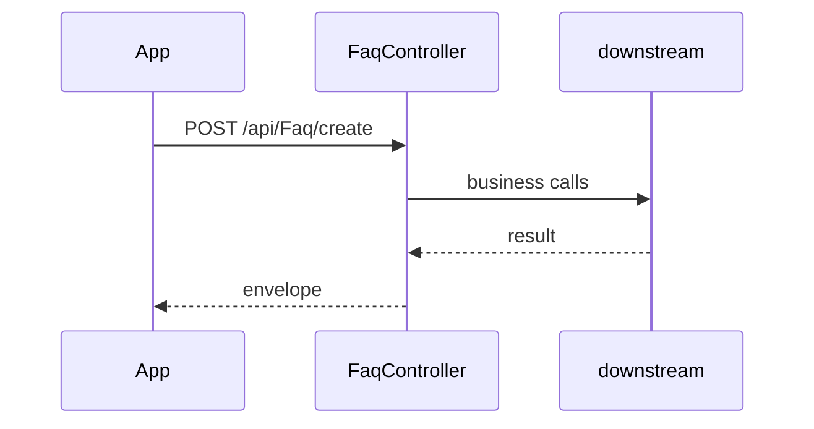

# BE-API-CONFIG-206 FaqController.Create
**Service:** BE-SVC-CONFIG · **Handler:** `TZ-Tigo-SuperApp-Configuration/TZTigoSuperAppConfiguration/Controllers/BO/FaqController.cs › FaqController.Create` · **Conf.:** confirmed

## Match keys
```yaml
match_keys:
  public_method: POST
  public_path: /api/Faq/create
  internal_path: /api/Faq/create
  dispatch_field: null
  dispatch_value: null
  controller_action: FaqController.Create
  topic: null
```

## Exposure & security
- **Auth:** JWT
- **Channel:** IDENT/SESS are portal or session APIs; mobile feature APIs typically use encrypted `payload` + `X-User-Session`.
- **Encryption filter:** none on this action

## Request (decrypted)
| Field (JSON) | Type | Req. | Format / length / enum | Enforced by | Meaning |
|---|---|---|---|---|---|
| Id | `int` | no | — | DataAnnotations / action | — |
| section_id | `int?` | no | — | DataAnnotations / action | — |
| section_item_id | `int?` | no | — | DataAnnotations / action | — |
| sub_section_item_id | `int?` | no | — | DataAnnotations / action | — |
| question | `string?` | no | — | DataAnnotations / action | — |
| answer | `string?` | no | — | DataAnnotations / action | — |
| status | `bool?` | no | — | DataAnnotations / action | — |
| deleted | `bool?` | no | — | DataAnnotations / action | — |
| created_by | `string?` | no | — | DataAnnotations / action | — |
| created_date | `DateTime?` | no | — | DataAnnotations / action | — |
| updated_by | `string?` | no | — | DataAnnotations / action | — |
| updated_date | `DateTime?` | no | — | DataAnnotations / action | — |
| faq_Translations | `List<FaqTranslationsRequest>?` | no | — | DataAnnotations / action | — |
| country_id | `int?` | no | — | DataAnnotations / action | — |
| channel_id | `int?` | no | — | DataAnnotations / action | — |
| os_id | `int?` | no | — | DataAnnotations / action | — |
| Id | `int?` | no | — | DataAnnotations / action | — |
| language_id | `int?` | no | — | DataAnnotations / action | — |
| faq_id | `int?` | no | — | DataAnnotations / action | — |
| question | `string?` | no | — | DataAnnotations / action | — |
| answer | `string?` | no | — | DataAnnotations / action | — |

Headers / route / query params:
- `X-User-Session` (Bearer JWT) when authenticated
- Content-Type: application/json

Sample (synthetic):
```json
{ "Id": "<Id>", "section_id": "<section_id>", "section_item_id": "<section_item_id>", "sub_section_item_id": "<sub_section_item_id>", "question": "<question>", "answer": "<answer>" }
```

## Checks & validations (execution order)
| # | Check | On failure | Rule ID | Evidence |
|---|---|---|---|---|
| 1 | JWT via `X-User-Session` / Bearer | 401 | — | `TZTigoSuperAppConfiguration/Controllers/BO/FaqController.cs › FaqController` |
| 2 | Guard: some error occurred | HTTP 200-envelope | — | `TZTigoSuperAppConfiguration/Controllers/BO/FaqController.cs › FaqController.Create` |


## Internal call chain
1. ASP.NET model binding (and EncryptionProviderFilter when present) → `FaqController.Create`
2. Action body in `TZTigoSuperAppConfiguration/Controllers/BO/FaqController.cs` (UserManager / services / DbContext as called)
3. Envelope returned (`BaseDto` / `BaseResponse` / `IActionResult`)



## Downstream
| Order | Target (BE-API / BE-INT / BE-EVT) | Sync/Async | Condition | Sent / used fields |
|---|---|---|---|---|
| 1 | In-process services / EF / cache | Sync | always | see call chain |

## Data touched
| Entity / table / SP | R/W | Notes |
|---|---|---|
| See service data-model | R/W | Traced at SHA 9c00072 |

## Response (decrypted)
| Field (JSON) | Type | Always / when | Meaning |
|---|---|---|---|
| success | bool | typical | Operation flag |
| responseCode / responseMessage_* | string | typical | Envelope |
| Data / responseData | object | on success | Payload |

Sample (synthetic):
```json
{ "success": true, "responseCode": "00", "Data": {} }
```

## Errors
| BE code | HTTP | ID | Condition | Message key/text | Retryable |
|---|---|---|---|---|---|
| — | 200-envelope | — | success=false envelope | some error occurred | no |


## Side effects
Documented when the action writes users, tokens, OTP, cache, or audit. See service files.

## Business rules (links)
See `services/config/business-rules.md`.

## Config keys
Names only: `TokenKey`, `isEncrypted` / `is_encrypted`, `Encryption_Decryption_Key`, `IV`, service-specific sections.

## Evidence
- `TZ-Tigo-SuperApp-Configuration/TZTigoSuperAppConfiguration/Controllers/BO/FaqController.cs › FaqController.Create` @ `9c00072`

## Open questions
- Public gateway path may differ from controller route (no gateway repo in this set).
