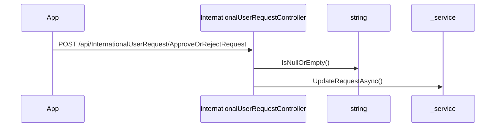

# BE-API-CONFIG-046 InternationalUserRequestController.ApproveOrRejectRequest
**Service:** BE-SVC-CONFIG · **Handler:** `TZ-Tigo-SuperApp-Configuration/TZTigoSuperAppConfiguration/Controllers/BO/InternationalUserRequestController.cs › InternationalUserRequestController.ApproveOrRejectRequest` · **Conf.:** confirmed

## Match keys
```yaml
match_keys:
  public_method: POST
  public_path: /api/InternationalUserRequest/ApproveOrRejectRequest
  internal_path: /api/InternationalUserRequest/ApproveOrRejectRequest
  dispatch_field: null
  dispatch_value: null
  controller_action: InternationalUserRequestController.ApproveOrRejectRequest
  topic: null
```

## Exposure & security
- **Method / path:** `POST /api/InternationalUserRequest/ApproveOrRejectRequest`
- **Auth / filters:** Authorize (JWT)
- **Headers:** `X-User-Session` (Bearer JWT) when session filter present; `Content-Type: application/json`.
- **Encryption:** whole-body AES on `payload` / response when enabled (`is_encrypted` or `isEncrypted`). Mechanism only; keys not documented.

## Request (decrypted)
| Field (JSON) | Type | Req. | Format / length / enum | Enforced by | Meaning |
|---|---|---|---|---|---|
| `Id` | `int` | N | — | shape only | Id |
| `RegistrationStatus` | `string?` | N | — | shape only | RegistrationStatus |
| `AdminComment` | `string?` | N | — | shape only | AdminComment |
| `CreatedBy` | `string?` | N | — | shape only | CreatedBy |
| `RegMsisdn` | `string?` | N | — | shape only | RegMsisdn |
| `FirstName` | `string?` | N | — | shape only | FirstName |
| `MiddleName` | `string?` | N | — | shape only | MiddleName |
| `LastName` | `string?` | N | — | shape only | LastName |
| `Dob` | `string?` | N | — | shape only | Dob |
| `Gender` | `string?` | N | — | shape only | Gender |
| `City` | `string?` | N | — | shape only | City |
| `Nationality` | `string?` | N | — | shape only | Nationality |
| `Email` | `string?` | N | — | shape only | Email |
| `ZipCode` | `string?` | N | — | shape only | ZipCode |
| `Occupation` | `string?` | N | — | shape only | Occupation |
| `TinNumber` | `string?` | N | — | shape only | TinNumber |
| `VrnNumber` | `string?` | N | — | shape only | VrnNumber |
| `VatRegistration` | `string?` | N | — | shape only | VatRegistration |
| `PrimaryIDType` | `string?` | N | — | shape only | PrimaryIDType |
| `PrimaryIDNumber` | `string?` | N | — | shape only | PrimaryIDNumber |
| `Country` | `string?` | N | — | shape only | Country |
| `FullName` | `string?` | N | — | shape only | FullName |
| `Street` | `string?` | N | — | shape only | Street |
| `Neighborhood` | `string?` | N | — | shape only | Neighborhood |

Headers / route / query params: none parsed beyond action signature `[('updateDto', 'InternationalUserRequestUpdateDto')]`

Sample (synthetic):
```json
{
  "Id": 0,
  "RegistrationStatus": "<string>",
  "AdminComment": "<string>",
  "CreatedBy": "<string>",
  "RegMsisdn": "255XXXXXXXXX",
  "FirstName": "<string>",
  "MiddleName": "<string>",
  "LastName": "<string>",
  "Dob": "<string>",
  "Gender": "<string>",
  "City": "<string>",
  "Nationality": "<string>",
  "Email": "user@example.com",
  "ZipCode": "<string>",
  "Occupation": "<string>",
  "TinNumber": "<string>",
  "VrnNumber": "<string>",
  "VatRegistration": "<string>",
  "PrimaryIDType": "<string>",
  "PrimaryIDNumber": "<string>",
  "Country": "<string>",
  "FullName": "<string>",
  "Street": "<string>",
  "Neighborhood": "<string>"
}
```

## Checks & validations (execution order)
| # | Check | On failure | Rule ID | Evidence |
|---|---|---|---|---|
| 1 | `!ModelState.IsValid` | branch / error envelope | — | `TZ-Tigo-SuperApp-Configuration/TZTigoSuperAppConfiguration/Controllers/BO/InternationalUserRequestController.cs › InternationalUserRequestController.ApproveOrRejectRequest` |
| 2 | `string.IsNullOrEmpty(updateDto.RegistrationStatus` | branch / error envelope | — | `TZ-Tigo-SuperApp-Configuration/TZTigoSuperAppConfiguration/Controllers/BO/InternationalUserRequestController.cs › InternationalUserRequestController.ApproveOrRejectRequest` |
| 3 | `!result` | branch / error envelope | — | `TZ-Tigo-SuperApp-Configuration/TZTigoSuperAppConfiguration/Controllers/BO/InternationalUserRequestController.cs › InternationalUserRequestController.ApproveOrRejectRequest` |
| 4 | `existingRequest == null` | branch / error envelope | — | `TZ-Tigo-SuperApp-Configuration/TZTigoSuperAppConfiguration/Controllers/BO/InternationalUserRequestController.cs › InternationalUserRequestController.ApproveOrRejectRequest` |
| 5 | `requestedStatus == "Approved"` | branch / error envelope | — | `TZ-Tigo-SuperApp-Configuration/TZTigoSuperAppConfiguration/Controllers/BO/InternationalUserRequestController.cs › InternationalUserRequestController.ApproveOrRejectRequest` |
| 6 | `registrationResult.Success` | branch / error envelope | — | `TZ-Tigo-SuperApp-Configuration/TZTigoSuperAppConfiguration/Controllers/BO/InternationalUserRequestController.cs › InternationalUserRequestController.ApproveOrRejectRequest` |
| 7 | `requestedStatus == "Rejected"` | branch / error envelope | — | `TZ-Tigo-SuperApp-Configuration/TZTigoSuperAppConfiguration/Controllers/BO/InternationalUserRequestController.cs › InternationalUserRequestController.ApproveOrRejectRequest` |
| 8 | `!string.IsNullOrEmpty(requestedStatus` | branch / error envelope | — | `TZ-Tigo-SuperApp-Configuration/TZTigoSuperAppConfiguration/Controllers/BO/InternationalUserRequestController.cs › InternationalUserRequestController.ApproveOrRejectRequest` |

## Internal call chain
1. Client POST `/api/InternationalUserRequest/ApproveOrRejectRequest`.
2. `InternationalUserRequestController.ApproveOrRejectRequest` runs (`TZ-Tigo-SuperApp-Configuration/TZTigoSuperAppConfiguration/Controllers/BO/InternationalUserRequestController.cs`).
3. Calls `string.IsNullOrEmpty`.
4. Calls `_service.UpdateRequestAsync`.
5. Returns via `ApiResponseHandler.CreateResponse` or action result; filter may AES-encrypt whole response.



## Downstream
| Order | Target (BE-API / BE-INT / BE-EVT) | Sync/Async | Condition | Sent / used fields |
|---|---|---|---|---|
| — | none parsed beyond in-process services | — | — | — |

## Data touched
| Entity / table / SP | R/W | Notes |
|---|---|---|
| see service `data-model.md` | mixed | not fully attributed per action |

## Response (decrypted)
| Field (JSON) | Type | Always / when | Meaning |
|---|---|---|---|
| `success` | boolean | always | handler outcome |
| `responseCode` | string | always | mapped via CONFIG when handler used |
| `transactionStatus` | string | success | mapped message |
| `errorDescription` | string | failure | mapped or static |
| `appVersionInfo` | string | often | app version hint |
| `responseData` | object | success | action-specific |

Sample (synthetic):
```json
{
  "success": true,
  "responseCode": "<code>",
  "transactionStatus": "<message>",
  "appVersionInfo": "<version>",
  "responseData": {}
}
```

## Errors
| BE code | HTTP | ID | Condition | Message key/text | Retryable |
|---|---|---|---|---|---|
| 500 | 500 | BE-ERR-CONFIG-001 | unhandled exception in action | Internal Server Error | yes (idempotent GETs only) |
| (session) | 410 | BE-ERR-CONFIG-002 | invalid/expired `X-User-Session` | session filter envelope | no (re-auth) |
| mapped | 400/200/201 | — | handler `BaseResponse.success` | CONFIG response-code catalogue | depends |

## Side effects
- Possible audit publish via RabbitMQ `IAuditLogsService` in encryption filter (service-dependent).
- Possible FCM via `IFCMService` when the handler calls it.

## Business rules (links)
- Session validity: `BE-BR-CONFIG-001` (when session filter present).

## Config keys
- `is_encrypted` or `isEncrypted` (toggle)
- `responseChanel`, `serviceName` / `Tanzania:serviceName` (message mapping)
- `TokenKey` (JWT validation; value not recorded)

## Evidence
- `TZ-Tigo-SuperApp-Configuration/TZTigoSuperAppConfiguration/Controllers/BO/InternationalUserRequestController.cs › InternationalUserRequestController.ApproveOrRejectRequest` @ `9c00072`
- Decrypted DTO `InternationalUserRequestUpdateDto` properties from type index.

## Open questions
- Public path may be rewritten by an external gateway not in this repo set.
