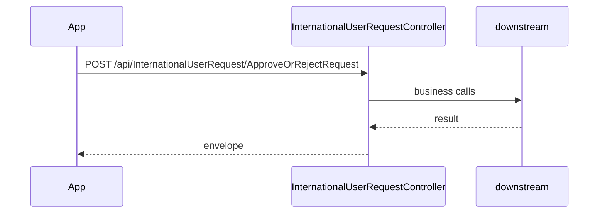

# BE-API-CONFIG-310 InternationalUserRequestController.ApproveOrRejectRequest
**Service:** BE-SVC-CONFIG · **Handler:** `TZ-Tigo-SuperApp-Configuration/TZTigoSuperAppConfiguration/Controllers/BO/InternationalUserRequestController.cs › InternationalUserRequestController.ApproveOrRejectRequest` · **Conf.:** confirmed

## Match keys
```yaml
match_keys:
  public_method: POST
  public_path: /api/InternationalUserRequest/ApproveOrRejectRequest
  internal_path: /api/InternationalUserRequest/ApproveOrRejectRequest
  dispatch_field: null
  dispatch_value: null
  controller_action: InternationalUserRequestController.ApproveOrRejectRequest
  topic: null
```

## Exposure & security
- **Auth:** JWT
- **Channel:** IDENT/SESS are portal or session APIs; mobile feature APIs typically use encrypted `payload` + `X-User-Session`.
- **Encryption filter:** none on this action

## Request (decrypted)
| Field (JSON) | Type | Req. | Format / length / enum | Enforced by | Meaning |
|---|---|---|---|---|---|
| Id | `int` | no | — | DataAnnotations / action | — |
| RegistrationStatus | `string?` | no | — | DataAnnotations / action | — |
| AdminComment | `string?` | no | — | DataAnnotations / action | — |
| CreatedBy | `string?` | no | — | DataAnnotations / action | — |
| RegMsisdn | `string?` | no | — | DataAnnotations / action | — |
| FirstName | `string?` | no | — | DataAnnotations / action | — |
| MiddleName | `string?` | no | — | DataAnnotations / action | — |
| LastName | `string?` | no | — | DataAnnotations / action | — |
| Dob | `string?` | no | — | DataAnnotations / action | — |
| Gender | `string?` | no | — | DataAnnotations / action | — |
| City | `string?` | no | — | DataAnnotations / action | — |
| Nationality | `string?` | no | — | DataAnnotations / action | — |
| Email | `string?` | no | — | DataAnnotations / action | — |
| ZipCode | `string?` | no | — | DataAnnotations / action | — |
| Occupation | `string?` | no | — | DataAnnotations / action | — |
| TinNumber | `string?` | no | — | DataAnnotations / action | — |
| VrnNumber | `string?` | no | — | DataAnnotations / action | — |
| VatRegistration | `string?` | no | — | DataAnnotations / action | — |
| PrimaryIDType | `string?` | no | — | DataAnnotations / action | — |
| PrimaryIDNumber | `string?` | no | — | DataAnnotations / action | — |
| Country | `string?` | no | — | DataAnnotations / action | — |
| FullName | `string?` | no | — | DataAnnotations / action | — |
| Street | `string?` | no | — | DataAnnotations / action | — |
| Neighborhood | `string?` | no | — | DataAnnotations / action | — |

Headers / route / query params:
- `X-User-Session` (Bearer JWT) when authenticated
- Content-Type: application/json

Sample (synthetic):
```json
{ "Id": "<Id>", "RegistrationStatus": "<RegistrationStatus>", "AdminComment": "<AdminComment>", "CreatedBy": "<CreatedBy>", "RegMsisdn": "<RegMsisdn>", "FirstName": "<FirstName>" }
```

## Checks & validations (execution order)
| # | Check | On failure | Rule ID | Evidence |
|---|---|---|---|---|
| 1 | JWT via `X-User-Session` / Bearer | 401 | — | `TZTigoSuperAppConfiguration/Controllers/BO/InternationalUserRequestController.cs › InternationalUserRequestController` |
| 2 | ModelState.IsValid | 400 Invalid request | — | `TZTigoSuperAppConfiguration/Controllers/BO/InternationalUserRequestController.cs › InternationalUserRequestController.ApproveOrRejectRequest` |
| 3 | Guard: success = false, responseCode = "400", responseMessage_en = "Invalid request data.", responseMessage_fr = "Données de requête invalides.", Data = false  | HTTP 400 | — | `TZTigoSuperAppConfiguration/Controllers/BO/InternationalUserRequestController.cs › InternationalUserRequestController.ApproveOrRejectRequest` |
| 4 | Guard: success = false, responseCode = "400", responseMessage_en = "Invalid status for approval/rejection.", responseMessage_fr = "Statut invalide pour l'approbation/le rejet.", Data = fa | HTTP 400 | — | `TZTigoSuperAppConfiguration/Controllers/BO/InternationalUserRequestController.cs › InternationalUserRequestController.ApproveOrRejectRequest` |
| 5 | Guard: success = false, responseCode = "400", responseMessage_en = "Failed to update request status.", responseMessage_fr = "Imeshindwa kusasisha hali ya ombi.", Data = false  | HTTP 400 | — | `TZTigoSuperAppConfiguration/Controllers/BO/InternationalUserRequestController.cs › InternationalUserRequestController.ApproveOrRejectRequest` |
| 6 | Guard: Invalid request data. | HTTP 200-envelope | — | `TZTigoSuperAppConfiguration/Controllers/BO/InternationalUserRequestController.cs › InternationalUserRequestController.ApproveOrRejectRequest` |
| 7 | Guard: Invalid status for approval/rejection. | HTTP 200-envelope | — | `TZTigoSuperAppConfiguration/Controllers/BO/InternationalUserRequestController.cs › InternationalUserRequestController.ApproveOrRejectRequest` |
| 8 | Guard: Failed to update request status. | HTTP 200-envelope | — | `TZTigoSuperAppConfiguration/Controllers/BO/InternationalUserRequestController.cs › InternationalUserRequestController.ApproveOrRejectRequest` |


## Internal call chain
1. ASP.NET model binding (and EncryptionProviderFilter when present) → `InternationalUserRequestController.ApproveOrRejectRequest`
2. Action body in `TZTigoSuperAppConfiguration/Controllers/BO/InternationalUserRequestController.cs` (UserManager / services / DbContext as called)
3. Envelope returned (`BaseDto` / `BaseResponse` / `IActionResult`)



## Downstream
| Order | Target (BE-API / BE-INT / BE-EVT) | Sync/Async | Condition | Sent / used fields |
|---|---|---|---|---|
| 1 | In-process services / EF / cache | Sync | always | see call chain |

## Data touched
| Entity / table / SP | R/W | Notes |
|---|---|---|
| See service data-model | R/W | Traced at SHA 9c00072 |

## Response (decrypted)
| Field (JSON) | Type | Always / when | Meaning |
|---|---|---|---|
| success | bool | typical | Operation flag |
| responseCode / responseMessage_* | string | typical | Envelope |
| Data / responseData | object | on success | Payload |

Sample (synthetic):
```json
{ "success": true, "responseCode": "00", "Data": {} }
```

## Errors
| BE code | HTTP | ID | Condition | Message key/text | Retryable |
|---|---|---|---|---|---|
| — | 400 | — | reachable return | success = false, responseCode = "400", responseMessage_en = "Invalid request data.", responseMessage_fr = "Données de requête invalides.", Data = false  | no |
| — | 400 | — | reachable return | success = false, responseCode = "400", responseMessage_en = "Invalid status for approval/rejection.", responseMessage_fr = "Statut invalide pour l'approbation/le rejet.", Data = fa | no |
| — | 400 | — | reachable return | success = false, responseCode = "400", responseMessage_en = "Failed to update request status.", responseMessage_fr = "Imeshindwa kusasisha hali ya ombi.", Data = false  | no |
| — | 200-envelope | — | success=false envelope | Invalid request data. | no |
| — | 200-envelope | — | success=false envelope | Invalid status for approval/rejection. | no |
| — | 200-envelope | — | success=false envelope | Failed to update request status. | no |


## Side effects
Documented when the action writes users, tokens, OTP, cache, or audit. See service files.

## Business rules (links)
See `services/config/business-rules.md`.

## Config keys
Names only: `TokenKey`, `isEncrypted` / `is_encrypted`, `Encryption_Decryption_Key`, `IV`, service-specific sections.

## Evidence
- `TZ-Tigo-SuperApp-Configuration/TZTigoSuperAppConfiguration/Controllers/BO/InternationalUserRequestController.cs › InternationalUserRequestController.ApproveOrRejectRequest` @ `9c00072`

## Open questions
- Public gateway path may differ from controller route (no gateway repo in this set).
