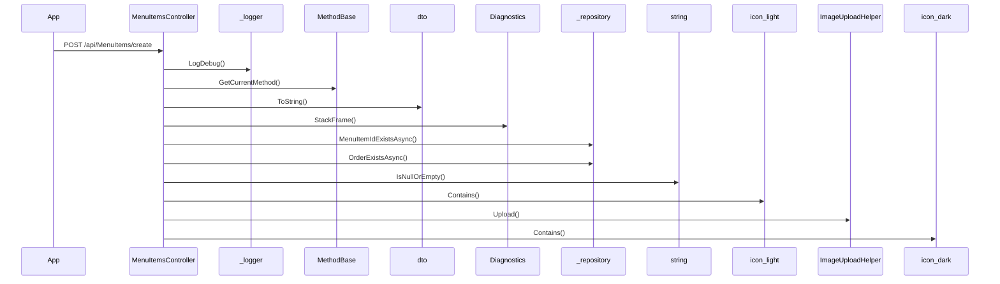

# BE-API-CONFIG-109 MenuItemsController.Create
**Service:** BE-SVC-CONFIG · **Handler:** `TZ-Tigo-SuperApp-Configuration/TZTigoSuperAppConfiguration/Controllers/BO/MenuItemsController.cs › MenuItemsController.Create` · **Conf.:** confirmed

## Match keys
```yaml
match_keys:
  public_method: POST
  public_path: /api/MenuItems/create
  internal_path: /api/MenuItems/create
  dispatch_field: null
  dispatch_value: null
  controller_action: MenuItemsController.Create
  topic: null
```

## Exposure & security
- **Method / path:** `POST /api/MenuItems/create`
- **Auth / filters:** Authorize (JWT)
- **Headers:** `X-User-Session` (Bearer JWT) when session filter present; `Content-Type: application/json`.
- **Encryption:** whole-body AES on `payload` / response when enabled (`is_encrypted` or `isEncrypted`). Mechanism only; keys not documented.

## Request (decrypted)
| Field (JSON) | Type | Req. | Format / length / enum | Enforced by | Meaning |
|---|---|---|---|---|---|
| `Id` | `int` | N | — | shape only | Id |
| `menu_item_id` | `string` | N | — | shape only | menu_item_id |
| `title_en` | `string?` | N | — | shape only | title_en |
| `title_sw` | `string?` | N | — | shape only | title_sw |
| `enabled` | `bool` | N | — | shape only | enabled |
| `sort_order` | `int` | N | — | shape only | sort_order |
| `icon_light` | `string?` | N | — | shape only | icon_light |
| `icon_dark` | `string?` | N | — | shape only | icon_dark |
| `has_toggle` | `bool` | N | — | shape only | has_toggle |
| `toggle_enabled` | `bool` | N | — | shape only | toggle_enabled |
| `parent_id` | `int?` | N | — | shape only | parent_id |
| `created_by` | `string?` | N | — | shape only | created_by |
| `created_date` | `DateTime?` | N | — | shape only | created_date |
| `updated_by` | `string?` | N | — | shape only | updated_by |
| `updated_date` | `DateTime?` | N | — | shape only | updated_date |
| `subItems` | `List<MenuItemDto>?` | N | — | shape only | subItems |

Headers / route / query params: none parsed beyond action signature `[('dto', 'MenuItemDto')]`

Sample (synthetic):
```json
{
  "Id": 0,
  "menu_item_id": "<string>",
  "title_en": "<string>",
  "title_sw": "<string>",
  "enabled": false,
  "sort_order": 0,
  "icon_light": "<string>",
  "icon_dark": "<string>",
  "has_toggle": false,
  "toggle_enabled": false,
  "parent_id": 0,
  "created_by": "<string>",
  "created_date": "<iso-datetime>",
  "updated_by": "<string>",
  "updated_date": "<iso-datetime>",
  "subItems": []
}
```

## Checks & validations (execution order)
| # | Check | On failure | Rule ID | Evidence |
|---|---|---|---|---|
| 1 | `await _repository.MenuItemIdExistsAsync(dto.menu_item_id` | branch / error envelope | — | `TZ-Tigo-SuperApp-Configuration/TZTigoSuperAppConfiguration/Controllers/BO/MenuItemsController.cs › MenuItemsController.Create` |
| 2 | `await _repository.OrderExistsAsync(dto.sort_order, dto.parent_id` | branch / error envelope | — | `TZ-Tigo-SuperApp-Configuration/TZTigoSuperAppConfiguration/Controllers/BO/MenuItemsController.cs › MenuItemsController.Create` |
| 3 | `!string.IsNullOrEmpty(dto.icon_light` | branch / error envelope | — | `TZ-Tigo-SuperApp-Configuration/TZTigoSuperAppConfiguration/Controllers/BO/MenuItemsController.cs › MenuItemsController.Create` |
| 4 | `!string.IsNullOrEmpty(dto.icon_dark` | branch / error envelope | — | `TZ-Tigo-SuperApp-Configuration/TZTigoSuperAppConfiguration/Controllers/BO/MenuItemsController.cs › MenuItemsController.Create` |
| 5 | `_configuration.GetValue<string>("EnableLog:Debug"` | branch / error envelope | — | `TZ-Tigo-SuperApp-Configuration/TZTigoSuperAppConfiguration/Controllers/BO/MenuItemsController.cs › MenuItemsController.Create` |
| 6 | `excludeId.HasValue` | branch / error envelope | — | `TZ-Tigo-SuperApp-Configuration/TZTigoSuperAppConfiguration/Controllers/BO/MenuItemsController.cs › MenuItemsController.Create` |
| 7 | `excludeId.HasValue` | branch / error envelope | — | `TZ-Tigo-SuperApp-Configuration/TZTigoSuperAppConfiguration/Controllers/BO/MenuItemsController.cs › MenuItemsController.Create` |

## Internal call chain
1. Client POST `/api/MenuItems/create`.
2. `MenuItemsController.Create` runs (`TZ-Tigo-SuperApp-Configuration/TZTigoSuperAppConfiguration/Controllers/BO/MenuItemsController.cs`).
3. Calls `_logger.LogDebug`.
4. Calls `MethodBase.GetCurrentMethod`.
5. Calls `MethodBase.GetCurrentMethod`.
6. Calls `Diagnostics.StackFrame`.
7. Calls `_repository.MenuItemIdExistsAsync`.
8. Calls `_repository.OrderExistsAsync`.
9. Calls `string.IsNullOrEmpty`.
10. Calls `icon_light.Contains`.
11. Returns via `ApiResponseHandler.CreateResponse` or action result; filter may AES-encrypt whole response.



## Downstream
| Order | Target (BE-API / BE-INT / BE-EVT) | Sync/Async | Condition | Sent / used fields |
|---|---|---|---|---|
| — | none parsed beyond in-process services | — | — | — |

## Data touched
| Entity / table / SP | R/W | Notes |
|---|---|---|
| see service `data-model.md` | mixed | not fully attributed per action |

## Response (decrypted)
| Field (JSON) | Type | Always / when | Meaning |
|---|---|---|---|
| `success` | boolean | always | handler outcome |
| `responseCode` | string | always | mapped via CONFIG when handler used |
| `transactionStatus` | string | success | mapped message |
| `errorDescription` | string | failure | mapped or static |
| `appVersionInfo` | string | often | app version hint |
| `responseData` | object | success | action-specific |

Sample (synthetic):
```json
{
  "success": true,
  "responseCode": "<code>",
  "transactionStatus": "<message>",
  "appVersionInfo": "<version>",
  "responseData": {}
}
```

## Errors
| BE code | HTTP | ID | Condition | Message key/text | Retryable |
|---|---|---|---|---|---|
| 500 | 500 | BE-ERR-CONFIG-001 | unhandled exception in action | Internal Server Error | yes (idempotent GETs only) |
| (session) | 410 | BE-ERR-CONFIG-002 | invalid/expired `X-User-Session` | session filter envelope | no (re-auth) |
| mapped | 400/200/201 | — | handler `BaseResponse.success` | CONFIG response-code catalogue | depends |

## Side effects
- Possible audit publish via RabbitMQ `IAuditLogsService` in encryption filter (service-dependent).
- Possible FCM via `IFCMService` when the handler calls it.

## Business rules (links)
- Session validity: `BE-BR-CONFIG-001` (when session filter present).

## Config keys
- `is_encrypted` or `isEncrypted` (toggle)
- `responseChanel`, `serviceName` / `Tanzania:serviceName` (message mapping)
- `TokenKey` (JWT validation; value not recorded)

## Evidence
- `TZ-Tigo-SuperApp-Configuration/TZTigoSuperAppConfiguration/Controllers/BO/MenuItemsController.cs › MenuItemsController.Create` @ `9c00072`
- Decrypted DTO `MenuItemDto` properties from type index.

## Open questions
- Public path may be rewritten by an external gateway not in this repo set.
