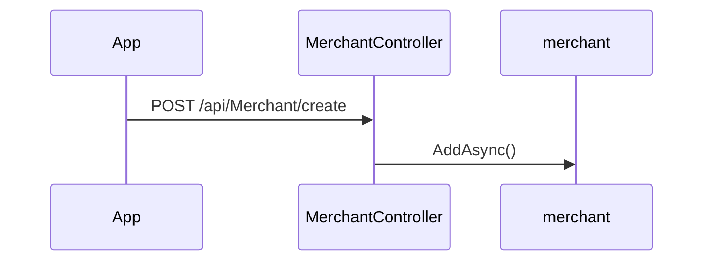

# BE-API-CONFIG-263 MerchantController.CreateAsync
**Service:** BE-SVC-CONFIG · **Handler:** `TZ-Tigo-SuperApp-Configuration/TZTigoSuperAppConfiguration/Controllers/BO/MerchantController.cs › MerchantController.CreateAsync` · **Conf.:** confirmed

## Match keys
```yaml
match_keys:
  public_method: POST
  public_path: /api/Merchant/create
  internal_path: /api/Merchant/create
  dispatch_field: null
  dispatch_value: null
  controller_action: MerchantController.CreateAsync
  topic: null
```

## Exposure & security
- **Method / path:** `POST /api/Merchant/create`
- **Auth / filters:** Authorize (JWT)
- **Headers:** `X-User-Session` (Bearer JWT) when session filter present; `Content-Type: application/json`.
- **Encryption:** whole-body AES on `payload` / response when enabled (`is_encrypted` or `isEncrypted`). Mechanism only; keys not documented.

## Request (decrypted)
| Field (JSON) | Type | Req. | Format / length / enum | Enforced by | Meaning |
|---|---|---|---|---|---|
| `Id` | `int` | N | — | shape only | Id |
| `Region` | `string?` | N | — | shape only | Region |
| `Locality` | `string?` | N | — | shape only | Locality |
| `NameOfEstablishment` | `string?` | N | — | shape only | NameOfEstablishment |
| `AddressLine` | `string?` | N | — | shape only | AddressLine |
| `Latitude` | `string?` | N | — | shape only | Latitude |
| `Longitude` | `string?` | N | — | shape only | Longitude |
| `PhoneNumber` | `string?` | N | — | shape only | PhoneNumber |
| `MondayScheduleFrom` | `string?` | N | — | shape only | MondayScheduleFrom |
| `MondayScheduleTo` | `string?` | N | — | shape only | MondayScheduleTo |
| `TuesdayScheduleFrom` | `string?` | N | — | shape only | TuesdayScheduleFrom |
| `TuesdayScheduleTo` | `string?` | N | — | shape only | TuesdayScheduleTo |
| `WednesdayScheduleFrom` | `string?` | N | — | shape only | WednesdayScheduleFrom |
| `WednesdayScheduleTo` | `string?` | N | — | shape only | WednesdayScheduleTo |
| `ThursdayScheduleFrom` | `string?` | N | — | shape only | ThursdayScheduleFrom |
| `ThursdayScheduleTo` | `string?` | N | — | shape only | ThursdayScheduleTo |
| `FridayScheduleFrom` | `string?` | N | — | shape only | FridayScheduleFrom |
| `FridayScheduleTo` | `string?` | N | — | shape only | FridayScheduleTo |
| `SaturdayScheduleFrom` | `string?` | N | — | shape only | SaturdayScheduleFrom |
| `SaturdayScheduleTo` | `string?` | N | — | shape only | SaturdayScheduleTo |
| `SundayScheduleFrom` | `string?` | N | — | shape only | SundayScheduleFrom |
| `SundayScheduleTo` | `string?` | N | — | shape only | SundayScheduleTo |
| `CreatedBy` | `string?` | N | — | shape only | CreatedBy |
| `UpdatedBy` | `string?` | N | — | shape only | UpdatedBy |

Headers / route / query params: none parsed beyond action signature `[('merchant', 'merchantDto')]`

Sample (synthetic):
```json
{
  "Id": 0,
  "Region": "<string>",
  "Locality": "<string>",
  "NameOfEstablishment": "<string>",
  "AddressLine": "<string>",
  "Latitude": "<lat>",
  "Longitude": "<lng>",
  "PhoneNumber": "255XXXXXXXXX",
  "MondayScheduleFrom": "<string>",
  "MondayScheduleTo": "<string>",
  "TuesdayScheduleFrom": "<string>",
  "TuesdayScheduleTo": "<string>",
  "WednesdayScheduleFrom": "<string>",
  "WednesdayScheduleTo": "<string>",
  "ThursdayScheduleFrom": "<string>",
  "ThursdayScheduleTo": "<string>",
  "FridayScheduleFrom": "<string>",
  "FridayScheduleTo": "<string>",
  "SaturdayScheduleFrom": "<string>",
  "SaturdayScheduleTo": "<string>",
  "SundayScheduleFrom": "<string>",
  "SundayScheduleTo": "<string>",
  "CreatedBy": "<string>",
  "UpdatedBy": "<string>"
}
```

## Checks & validations (execution order)
| # | Check | On failure | Rule ID | Evidence |
|---|---|---|---|---|
| 1 | `merchantDB.id == 0` | branch / error envelope | — | `TZ-Tigo-SuperApp-Configuration/TZTigoSuperAppConfiguration/Controllers/BO/MerchantController.cs › MerchantController.CreateAsync` |
| 2 | `existing != null` | branch / error envelope | — | `TZ-Tigo-SuperApp-Configuration/TZTigoSuperAppConfiguration/Controllers/BO/MerchantController.cs › MerchantController.CreateAsync` |

## Internal call chain
1. Client POST `/api/Merchant/create`.
2. `MerchantController.CreateAsync` runs (`TZ-Tigo-SuperApp-Configuration/TZTigoSuperAppConfiguration/Controllers/BO/MerchantController.cs`).
3. Calls `merchant.AddAsync`.
4. Returns via `ApiResponseHandler.CreateResponse` or action result; filter may AES-encrypt whole response.



## Downstream
| Order | Target (BE-API / BE-INT / BE-EVT) | Sync/Async | Condition | Sent / used fields |
|---|---|---|---|---|
| — | none parsed beyond in-process services | — | — | — |

## Data touched
| Entity / table / SP | R/W | Notes |
|---|---|---|
| see service `data-model.md` | mixed | not fully attributed per action |

## Response (decrypted)
| Field (JSON) | Type | Always / when | Meaning |
|---|---|---|---|
| `success` | boolean | always | handler outcome |
| `responseCode` | string | always | mapped via CONFIG when handler used |
| `transactionStatus` | string | success | mapped message |
| `errorDescription` | string | failure | mapped or static |
| `appVersionInfo` | string | often | app version hint |
| `responseData` | object | success | action-specific |

Sample (synthetic):
```json
{
  "success": true,
  "responseCode": "<code>",
  "transactionStatus": "<message>",
  "appVersionInfo": "<version>",
  "responseData": {}
}
```

## Errors
| BE code | HTTP | ID | Condition | Message key/text | Retryable |
|---|---|---|---|---|---|
| 500 | 500 | BE-ERR-CONFIG-001 | unhandled exception in action | Internal Server Error | yes (idempotent GETs only) |
| (session) | 410 | BE-ERR-CONFIG-002 | invalid/expired `X-User-Session` | session filter envelope | no (re-auth) |
| mapped | 400/200/201 | — | handler `BaseResponse.success` | CONFIG response-code catalogue | depends |

## Side effects
- Possible audit publish via RabbitMQ `IAuditLogsService` in encryption filter (service-dependent).
- Possible FCM via `IFCMService` when the handler calls it.

## Business rules (links)
- Session validity: `BE-BR-CONFIG-001` (when session filter present).

## Config keys
- `is_encrypted` or `isEncrypted` (toggle)
- `responseChanel`, `serviceName` / `Tanzania:serviceName` (message mapping)
- `TokenKey` (JWT validation; value not recorded)

## Evidence
- `TZ-Tigo-SuperApp-Configuration/TZTigoSuperAppConfiguration/Controllers/BO/MerchantController.cs › MerchantController.CreateAsync` @ `9c00072`
- Decrypted DTO `merchantDto` properties from type index.

## Open questions
- Public path may be rewritten by an external gateway not in this repo set.
