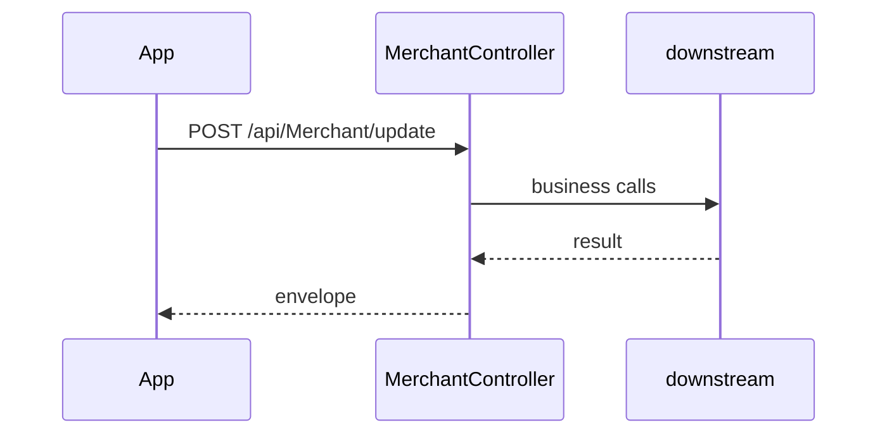

# BE-API-CONFIG-038 MerchantController.UpdateAsync
**Service:** BE-SVC-CONFIG · **Handler:** `TZ-Tigo-SuperApp-Configuration/TZTigoSuperAppConfiguration/Controllers/BO/MerchantController.cs › MerchantController.UpdateAsync` · **Conf.:** confirmed

## Match keys
```yaml
match_keys:
  public_method: POST
  public_path: /api/Merchant/update
  internal_path: /api/Merchant/update
  dispatch_field: null
  dispatch_value: null
  controller_action: MerchantController.UpdateAsync
  topic: null
```

## Exposure & security
- **Auth:** JWT
- **Channel:** IDENT/SESS are portal or session APIs; mobile feature APIs typically use encrypted `payload` + `X-User-Session`.
- **Encryption filter:** none on this action

## Request (decrypted)
| Field (JSON) | Type | Req. | Format / length / enum | Enforced by | Meaning |
|---|---|---|---|---|---|
| id | `Int32` | no | — | DataAnnotations / action | — |
| agent_name | `String` | no | — | DataAnnotations / action | — |
| shop_type | `String` | no | — | DataAnnotations / action | — |
| shop_keeper_name | `String` | no | — | DataAnnotations / action | — |
| shop_address | `String` | no | — | DataAnnotations / action | — |
| phone_number | `String` | no | — | DataAnnotations / action | — |
| whats_app_number | `String` | no | — | DataAnnotations / action | — |
| facebook_messenger_number | `String` | no | — | DataAnnotations / action | — |
| shop_location_longitude | `double` | no | — | DataAnnotations / action | — |
| shop_location_latitude | `double` | no | — | DataAnnotations / action | — |
| shop_hour_from | `String` | no | — | DataAnnotations / action | — |
| shop_hour_to | `String` | no | — | DataAnnotations / action | — |
| shop_address2 | `String` | no | — | DataAnnotations / action | — |
| city | `String` | no | — | DataAnnotations / action | — |
| state_province | `String` | no | — | DataAnnotations / action | — |
| postal_code | `String` | no | — | DataAnnotations / action | — |
| country_id | `Int32` | no | — | DataAnnotations / action | — |
| created_by | `string?` | no | — | DataAnnotations / action | — |
| created_date | `DateTime` | no | — | DataAnnotations / action | — |
| updated_by | `string?` | no | — | DataAnnotations / action | — |
| updated_date | `DateTime` | no | — | DataAnnotations / action | — |
| messages | `List<DashboardMultilingualMessage>` | no | — | DataAnnotations / action | — |
| Id | `int` | no | — | DataAnnotations / action | — |
| Region | `string?` | no | — | DataAnnotations / action | — |
| Locality | `string?` | no | — | DataAnnotations / action | — |
| NameOfEstablishment | `string?` | no | — | DataAnnotations / action | — |
| AddressLine | `string?` | no | — | DataAnnotations / action | — |
| Latitude | `string?` | no | — | DataAnnotations / action | — |
| Longitude | `string?` | no | — | DataAnnotations / action | — |
| PhoneNumber | `string?` | no | — | DataAnnotations / action | — |
| MondayScheduleFrom | `string?` | no | — | DataAnnotations / action | — |
| MondayScheduleTo | `string?` | no | — | DataAnnotations / action | — |
| TuesdayScheduleFrom | `string?` | no | — | DataAnnotations / action | — |
| TuesdayScheduleTo | `string?` | no | — | DataAnnotations / action | — |
| WednesdayScheduleFrom | `string?` | no | — | DataAnnotations / action | — |
| WednesdayScheduleTo | `string?` | no | — | DataAnnotations / action | — |
| ThursdayScheduleFrom | `string?` | no | — | DataAnnotations / action | — |
| ThursdayScheduleTo | `string?` | no | — | DataAnnotations / action | — |
| FridayScheduleFrom | `string?` | no | — | DataAnnotations / action | — |
| FridayScheduleTo | `string?` | no | — | DataAnnotations / action | — |
| SaturdayScheduleFrom | `string?` | no | — | DataAnnotations / action | — |
| SaturdayScheduleTo | `string?` | no | — | DataAnnotations / action | — |
| SundayScheduleFrom | `string?` | no | — | DataAnnotations / action | — |
| SundayScheduleTo | `string?` | no | — | DataAnnotations / action | — |
| CreatedBy | `string?` | no | — | DataAnnotations / action | — |
| UpdatedBy | `string?` | no | — | DataAnnotations / action | — |
| addressLine | `string?` | no | — | DataAnnotations / action | — |
| createdBy | `object?` | no | — | DataAnnotations / action | — |
| fridayScheduleFrom | `string?` | no | — | DataAnnotations / action | — |
| fridayScheduleTo | `string?` | no | — | DataAnnotations / action | — |
| id | `int?` | no | — | DataAnnotations / action | — |
| latitude | `string?` | no | — | DataAnnotations / action | — |
| locality | `string?` | no | — | DataAnnotations / action | — |
| longitude | `string?` | no | — | DataAnnotations / action | — |
| mondayScheduleFrom | `string?` | no | — | DataAnnotations / action | — |
| mondayScheduleTo | `string?` | no | — | DataAnnotations / action | — |
| nameOfEstablishment | `string?` | no | — | DataAnnotations / action | — |
| phoneNumber | `string?` | no | — | DataAnnotations / action | — |
| region | `string?` | no | — | DataAnnotations / action | — |
| saturdayScheduleFrom | `string?` | no | — | DataAnnotations / action | — |
| saturdayScheduleTo | `string?` | no | — | DataAnnotations / action | — |
| sundayScheduleFrom | `string?` | no | — | DataAnnotations / action | — |
| sundayScheduleTo | `string?` | no | — | DataAnnotations / action | — |
| thursdayScheduleFrom | `string?` | no | — | DataAnnotations / action | — |
| thursdayScheduleTo | `string?` | no | — | DataAnnotations / action | — |
| tuesdayScheduleFrom | `string?` | no | — | DataAnnotations / action | — |
| tuesdayScheduleTo | `string?` | no | — | DataAnnotations / action | — |
| updatedBy | `object?` | no | — | DataAnnotations / action | — |
| wednesdayScheduleFrom | `string?` | no | — | DataAnnotations / action | — |
| wednesdayScheduleTo | `string?` | no | — | DataAnnotations / action | — |

Headers / route / query params:
- `X-User-Session` (Bearer JWT) when authenticated
- Content-Type: application/json

Sample (synthetic):
```json
{ "id": "<id>", "agent_name": "<agent_name>", "shop_type": "<shop_type>", "shop_keeper_name": "<shop_keeper_name>", "shop_address": "<shop_address>", "phone_number": "<phone_number>" }
```

## Checks & validations (execution order)
| # | Check | On failure | Rule ID | Evidence |
|---|---|---|---|---|
| 1 | JWT via `X-User-Session` / Bearer | 401 | — | `TZTigoSuperAppConfiguration/Controllers/BO/MerchantController.cs › MerchantController` |
| 2 | Guard: Record not found | HTTP 200-envelope | — | `TZTigoSuperAppConfiguration/Controllers/BO/MerchantController.cs › MerchantController.UpdateAsync` |
| 3 | Guard: update successfully | HTTP 200-envelope | — | `TZTigoSuperAppConfiguration/Controllers/BO/MerchantController.cs › MerchantController.UpdateAsync` |
| 4 | Guard: some error occurred | HTTP 200-envelope | — | `TZTigoSuperAppConfiguration/Controllers/BO/MerchantController.cs › MerchantController.UpdateAsync` |


## Internal call chain
1. ASP.NET model binding (and EncryptionProviderFilter when present) → `MerchantController.UpdateAsync`
2. Action body in `TZTigoSuperAppConfiguration/Controllers/BO/MerchantController.cs` (UserManager / services / DbContext as called)
3. Envelope returned (`BaseDto` / `BaseResponse` / `IActionResult`)



## Downstream
| Order | Target (BE-API / BE-INT / BE-EVT) | Sync/Async | Condition | Sent / used fields |
|---|---|---|---|---|
| 1 | In-process services / EF / cache | Sync | always | see call chain |

## Data touched
| Entity / table / SP | R/W | Notes |
|---|---|---|
| See service data-model | R/W | Traced at SHA 9c00072 |

## Response (decrypted)
| Field (JSON) | Type | Always / when | Meaning |
|---|---|---|---|
| success | bool | typical | Operation flag |
| responseCode / responseMessage_* | string | typical | Envelope |
| Data / responseData | object | on success | Payload |

Sample (synthetic):
```json
{ "success": true, "responseCode": "00", "Data": {} }
```

## Errors
| BE code | HTTP | ID | Condition | Message key/text | Retryable |
|---|---|---|---|---|---|
| — | 200-envelope | — | success=false envelope | Record not found | no |
| — | 200-envelope | — | success=false envelope | update successfully | no |
| — | 200-envelope | — | success=false envelope | some error occurred | no |


## Side effects
Documented when the action writes users, tokens, OTP, cache, or audit. See service files.

## Business rules (links)
See `services/config/business-rules.md`.

## Config keys
Names only: `TokenKey`, `isEncrypted` / `is_encrypted`, `Encryption_Decryption_Key`, `IV`, service-specific sections.

## Evidence
- `TZ-Tigo-SuperApp-Configuration/TZTigoSuperAppConfiguration/Controllers/BO/MerchantController.cs › MerchantController.UpdateAsync` @ `9c00072`

## Open questions
- Public gateway path may differ from controller route (no gateway repo in this set).
