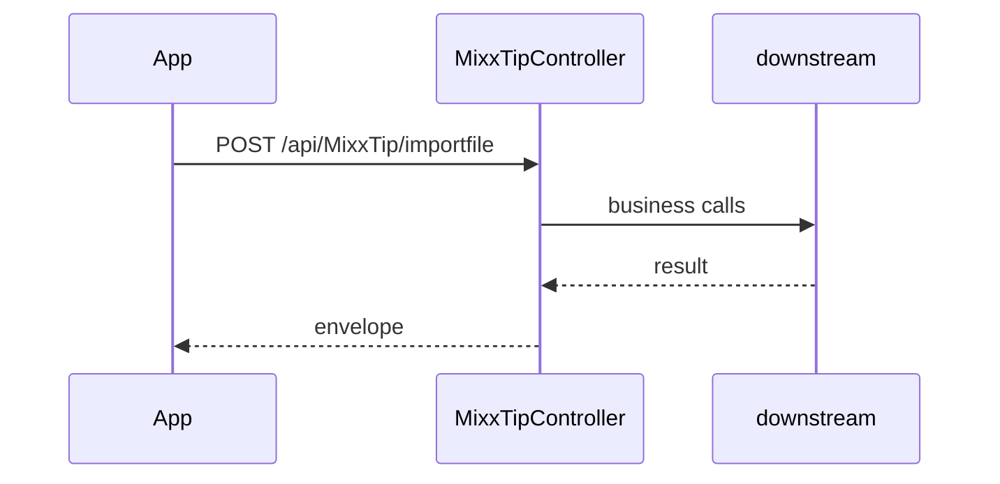

# BE-API-CONFIG-110 MixxTipController.ImportFile
**Service:** BE-SVC-CONFIG · **Handler:** `TZ-Tigo-SuperApp-Configuration/TZTigoSuperAppConfiguration/Controllers/BO/MixxTipController.cs › MixxTipController.ImportFile` · **Conf.:** confirmed

## Match keys
```yaml
match_keys:
  public_method: POST
  public_path: /api/MixxTip/importfile
  internal_path: /api/MixxTip/importfile
  dispatch_field: null
  dispatch_value: null
  controller_action: MixxTipController.ImportFile
  topic: null
```

## Exposure & security
- **Auth:** JWT
- **Channel:** IDENT/SESS are portal or session APIs; mobile feature APIs typically use encrypted `payload` + `X-User-Session`.
- **Encryption filter:** none on this action

## Request (decrypted)
| Field (JSON) | Type | Req. | Format / length / enum | Enforced by | Meaning |
|---|---|---|---|---|---|
| Id | `int` | no | — | DataAnnotations / action | — |
| File | `string?` | no | — | DataAnnotations / action | — |
| FileLocation | `string?` | no | — | DataAnnotations / action | — |
| FileName | `string?` | no | — | DataAnnotations / action | — |
| FileSize | `string?` | no | — | DataAnnotations / action | — |
| OperatorType | `string?` | no | — | DataAnnotations / action | — |

Headers / route / query params:
- `X-User-Session` (Bearer JWT) when authenticated
- Content-Type: application/json

Sample (synthetic):
```json
{ "Id": "<Id>", "File": "<File>", "FileLocation": "<FileLocation>", "FileName": "<FileName>", "FileSize": "<FileSize>", "OperatorType": "<OperatorType>" }
```

## Checks & validations (execution order)
| # | Check | On failure | Rule ID | Evidence |
|---|---|---|---|---|
| 1 | JWT via `X-User-Session` / Bearer | 401 | — | `TZTigoSuperAppConfiguration/Controllers/BO/MixxTipController.cs › MixxTipController` |
| 2 | Guard: success = false, responseMessage_en = "File is required.", responseMessage_fr = "Le fichier est requis."  | HTTP 400 | — | `TZTigoSuperAppConfiguration/Controllers/BO/MixxTipController.cs › MixxTipController.ImportFile` |
| 3 | Guard: success = false, responseMessage_en = "Invalid base64 file payload.", responseMessage_fr = "Charge utile base64 invalide."  | HTTP 400 | — | `TZTigoSuperAppConfiguration/Controllers/BO/MixxTipController.cs › MixxTipController.ImportFile` |
| 4 | Guard: success = false, responseMessage_en = "Only .xlsx files are supported.", responseMessage_fr = "Seuls les fichiers .xlsx sont pris en charge."  | HTTP 406 | — | `TZTigoSuperAppConfiguration/Controllers/BO/MixxTipController.cs › MixxTipController.ImportFile` |
| 5 | Guard: success = false, responseMessage_en = ex.Message, responseMessage_fr = "Une erreur s'est produite."  | HTTP 500 | — | `TZTigoSuperAppConfiguration/Controllers/BO/MixxTipController.cs › MixxTipController.ImportFile` |
| 6 | Guard: File is required. | HTTP 200-envelope | — | `TZTigoSuperAppConfiguration/Controllers/BO/MixxTipController.cs › MixxTipController.ImportFile` |
| 7 | Guard: Invalid base64 file payload. | HTTP 200-envelope | — | `TZTigoSuperAppConfiguration/Controllers/BO/MixxTipController.cs › MixxTipController.ImportFile` |
| 8 | Guard: Only .xlsx files are supported. | HTTP 200-envelope | — | `TZTigoSuperAppConfiguration/Controllers/BO/MixxTipController.cs › MixxTipController.ImportFile` |


## Internal call chain
1. ASP.NET model binding (and EncryptionProviderFilter when present) → `MixxTipController.ImportFile`
2. Action body in `TZTigoSuperAppConfiguration/Controllers/BO/MixxTipController.cs` (UserManager / services / DbContext as called)
3. Envelope returned (`BaseDto` / `BaseResponse` / `IActionResult`)



## Downstream
| Order | Target (BE-API / BE-INT / BE-EVT) | Sync/Async | Condition | Sent / used fields |
|---|---|---|---|---|
| 1 | In-process services / EF / cache | Sync | always | see call chain |

## Data touched
| Entity / table / SP | R/W | Notes |
|---|---|---|
| See service data-model | R/W | Traced at SHA 9c00072 |

## Response (decrypted)
| Field (JSON) | Type | Always / when | Meaning |
|---|---|---|---|
| success | bool | typical | Operation flag |
| responseCode / responseMessage_* | string | typical | Envelope |
| Data / responseData | object | on success | Payload |

Sample (synthetic):
```json
{ "success": true, "responseCode": "00", "Data": {} }
```

## Errors
| BE code | HTTP | ID | Condition | Message key/text | Retryable |
|---|---|---|---|---|---|
| — | 400 | — | reachable return | success = false, responseMessage_en = "File is required.", responseMessage_fr = "Le fichier est requis."  | no |
| — | 400 | — | reachable return | success = false, responseMessage_en = "Invalid base64 file payload.", responseMessage_fr = "Charge utile base64 invalide."  | no |
| — | 406 | — | reachable return | success = false, responseMessage_en = "Only .xlsx files are supported.", responseMessage_fr = "Seuls les fichiers .xlsx sont pris en charge."  | no |
| — | 500 | — | reachable return | success = false, responseMessage_en = ex.Message, responseMessage_fr = "Une erreur s'est produite."  | no |
| — | 200-envelope | — | success=false envelope | File is required. | no |
| — | 200-envelope | — | success=false envelope | Invalid base64 file payload. | no |
| — | 200-envelope | — | success=false envelope | Only .xlsx files are supported. | no |


## Side effects
Documented when the action writes users, tokens, OTP, cache, or audit. See service files.

## Business rules (links)
See `services/config/business-rules.md`.

## Config keys
Names only: `TokenKey`, `isEncrypted` / `is_encrypted`, `Encryption_Decryption_Key`, `IV`, service-specific sections.

## Evidence
- `TZ-Tigo-SuperApp-Configuration/TZTigoSuperAppConfiguration/Controllers/BO/MixxTipController.cs › MixxTipController.ImportFile` @ `9c00072`

## Open questions
- Public gateway path may differ from controller route (no gateway repo in this set).
