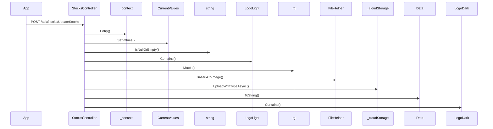

# BE-API-CONFIG-197 StocksController.UpdateStocks
**Service:** BE-SVC-CONFIG · **Handler:** `TZ-Tigo-SuperApp-Configuration/TZTigoSuperAppConfiguration/Controllers/BO/StocksController.cs › StocksController.UpdateStocks` · **Conf.:** confirmed

## Match keys
```yaml
match_keys:
  public_method: POST
  public_path: /api/Stocks/UpdateStocks
  internal_path: /api/Stocks/UpdateStocks
  dispatch_field: null
  dispatch_value: null
  controller_action: StocksController.UpdateStocks
  topic: null
```

## Exposure & security
- **Method / path:** `POST /api/Stocks/UpdateStocks`
- **Auth / filters:** none on action (pipeline may still authorize)
- **Headers:** `X-User-Session` (Bearer JWT) when session filter present; `Content-Type: application/json`.
- **Encryption:** whole-body AES on `payload` / response when enabled (`is_encrypted` or `isEncrypted`). Mechanism only; keys not documented.

## Request (decrypted)
| Field (JSON) | Type | Req. | Format / length / enum | Enforced by | Meaning |
|---|---|---|---|---|---|
| `Id` | `int?` | N | — | shape only | Id |
| `companyName` | `string?` | N | — | shape only | companyName |
| `LogoDark` | `string?` | N | — | shape only | LogoDark |
| `LogoLight` | `string?` | N | — | shape only | LogoLight |
| `category` | `string?` | N | — | shape only | category |
| `abbreviation` | `string?` | N | — | shape only | abbreviation |
| `uniqueId` | `string?` | N | — | shape only | uniqueId |
| `logoLight_url` | `string?` | N | — | shape only | logoLight_url |
| `logoLight_name` | `string?` | N | — | shape only | logoLight_name |
| `logoLight_size` | `string?` | N | — | shape only | logoLight_size |
| `logoLight_type` | `string?` | N | — | shape only | logoLight_type |
| `logoDark_url` | `string?` | N | — | shape only | logoDark_url |
| `logoDark_name` | `string?` | N | — | shape only | logoDark_name |
| `logoDark_size` | `string?` | N | — | shape only | logoDark_size |
| `logoDark_type` | `string?` | N | — | shape only | logoDark_type |

Headers / route / query params: none parsed beyond action signature `[('stockData', 'StockData')]`

Sample (synthetic):
```json
{
  "Id": 0,
  "companyName": "<string>",
  "LogoDark": "<string>",
  "LogoLight": "<string>",
  "category": "<string>",
  "abbreviation": "<string>",
  "uniqueId": "<string>",
  "logoLight_url": "<string>",
  "logoLight_name": "<string>",
  "logoLight_size": "<string>",
  "logoLight_type": "<string>",
  "logoDark_url": "<string>",
  "logoDark_name": "<string>",
  "logoDark_size": "<string>",
  "logoDark_type": "<string>"
}
```

## Checks & validations (execution order)
| # | Check | On failure | Rule ID | Evidence |
|---|---|---|---|---|
| 1 | `!string.IsNullOrEmpty(stockData.LogoLight` | branch / error envelope | — | `TZ-Tigo-SuperApp-Configuration/TZTigoSuperAppConfiguration/Controllers/BO/StocksController.cs › StocksController.UpdateStocks` |
| 2 | `!string.IsNullOrEmpty(stockData.LogoDark` | branch / error envelope | — | `TZ-Tigo-SuperApp-Configuration/TZTigoSuperAppConfiguration/Controllers/BO/StocksController.cs › StocksController.UpdateStocks` |
| 3 | `format == "svg+xml"` | branch / error envelope | — | `TZ-Tigo-SuperApp-Configuration/TZTigoSuperAppConfiguration/Controllers/BO/StocksController.cs › StocksController.UpdateStocks` |
| 4 | `_configuration.GetValue<string>("UploadOnAzureStorage"` | branch / error envelope | — | `TZ-Tigo-SuperApp-Configuration/TZTigoSuperAppConfiguration/Controllers/BO/StocksController.cs › StocksController.UpdateStocks` |
| 5 | `format == "svg+xml"` | branch / error envelope | — | `TZ-Tigo-SuperApp-Configuration/TZTigoSuperAppConfiguration/Controllers/BO/StocksController.cs › StocksController.UpdateStocks` |
| 6 | `_configuration.GetValue<string>("UploadOnAzureStorage"` | branch / error envelope | — | `TZ-Tigo-SuperApp-Configuration/TZTigoSuperAppConfiguration/Controllers/BO/StocksController.cs › StocksController.UpdateStocks` |

## Internal call chain
1. Client POST `/api/Stocks/UpdateStocks`.
2. `StocksController.UpdateStocks` runs (`TZ-Tigo-SuperApp-Configuration/TZTigoSuperAppConfiguration/Controllers/BO/StocksController.cs`).
3. Calls `_context.Entry`.
4. Calls `CurrentValues.SetValues`.
5. Calls `string.IsNullOrEmpty`.
6. Calls `LogoLight.Contains`.
7. Calls `rg.Match`.
8. Calls `FileHelper.Base64ToImage`.
9. Calls `_cloudStorage.UploadWithTypeAsync`.
10. Calls `string.IsNullOrEmpty`.
11. Returns via `ApiResponseHandler.CreateResponse` or action result; filter may AES-encrypt whole response.



## Downstream
| Order | Target (BE-API / BE-INT / BE-EVT) | Sync/Async | Condition | Sent / used fields |
|---|---|---|---|---|
| — | none parsed beyond in-process services | — | — | — |

## Data touched
| Entity / table / SP | R/W | Notes |
|---|---|---|
| see service `data-model.md` | mixed | not fully attributed per action |

## Response (decrypted)
| Field (JSON) | Type | Always / when | Meaning |
|---|---|---|---|
| `success` | boolean | always | handler outcome |
| `responseCode` | string | always | mapped via CONFIG when handler used |
| `transactionStatus` | string | success | mapped message |
| `errorDescription` | string | failure | mapped or static |
| `appVersionInfo` | string | often | app version hint |
| `responseData` | object | success | action-specific |

Sample (synthetic):
```json
{
  "success": true,
  "responseCode": "<code>",
  "transactionStatus": "<message>",
  "appVersionInfo": "<version>",
  "responseData": {}
}
```

## Errors
| BE code | HTTP | ID | Condition | Message key/text | Retryable |
|---|---|---|---|---|---|
| 500 | 500 | BE-ERR-CONFIG-001 | unhandled exception in action | Internal Server Error | yes (idempotent GETs only) |
| (session) | 410 | BE-ERR-CONFIG-002 | invalid/expired `X-User-Session` | session filter envelope | no (re-auth) |
| mapped | 400/200/201 | — | handler `BaseResponse.success` | CONFIG response-code catalogue | depends |

## Side effects
- Possible audit publish via RabbitMQ `IAuditLogsService` in encryption filter (service-dependent).
- Possible FCM via `IFCMService` when the handler calls it.

## Business rules (links)
- Session validity: `BE-BR-CONFIG-001` (when session filter present).

## Config keys
- `is_encrypted` or `isEncrypted` (toggle)
- `responseChanel`, `serviceName` / `Tanzania:serviceName` (message mapping)
- `TokenKey` (JWT validation; value not recorded)

## Evidence
- `TZ-Tigo-SuperApp-Configuration/TZTigoSuperAppConfiguration/Controllers/BO/StocksController.cs › StocksController.UpdateStocks` @ `9c00072`
- Decrypted DTO `StockData` properties from type index.

## Open questions
- Public path may be rewritten by an external gateway not in this repo set.
