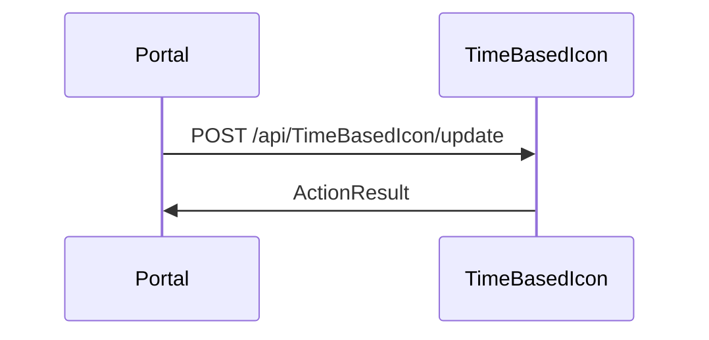

# BE-API-CONFIG-428 TimeBasedIcon.SaveSectionItemAsync
**Service:** BE-SVC-CONFIG · **Handler:** `TZ-Tigo-SuperApp-Configuration/TZTigoSuperAppConfiguration/Controllers/BO/TimeBasedIconController.cs › TimeBasedIcon.SaveSectionItemAsync` · **Conf.:** confirmed

## Match keys
```yaml
match_keys:
  public_method: POST
  public_path: /api/TimeBasedIcon/update
  internal_path: /api/TimeBasedIcon/update
  dispatch_field: null
  dispatch_value: null
  controller_action: TimeBasedIcon.SaveSectionItemAsync
  topic: null
```

## Exposure & security
- **Method / path:** `POST /api/TimeBasedIcon/update`
- **Auth / filters:** Authorize (JWT) + AuthorizationFilter (CONFIG BO) or portal session header `X-User-Session`
- **Encryption:** Identity/CONFIG portal APIs are not payload-AES; mobile feature APIs are (see overview).

## Request (decrypted)
Action parameter: `TimeBasedIconDto time_icon_dto`.


Sample (synthetic):
```json
{}
```

## Checks & validations (execution order)
| # | Check | On failure | Rule ID | Evidence |
|---|---|---|---|---|
| 1 | JWT / AuthorizationFilter `Controller:Action` claim | 401/403 | BE-BR-CONFIG-001 | `TZ-Tigo-SuperApp-Configuration/TZTigoSuperAppConfiguration/Controllers/BO/TimeBasedIconController.cs › TimeBasedIcon.SaveSectionItemAsync` |

## Internal call chain
1. `TimeBasedIcon.SaveSectionItemAsync` at `TZ-Tigo-SuperApp-Configuration/TZTigoSuperAppConfiguration/Controllers/BO/TimeBasedIconController.cs`.
2. Repository / EF / Firebase client as implemented in the action body.



## Downstream
| Order | Target (BE-API / BE-INT / BE-EVT) | Sync/Async | Condition | Sent / used fields |
|---|---|---|---|---|
| — | in-process CONFIG/IDENT data stores | Sync | always | — |

## Data touched
| Entity / table / SP | R/W | Notes |
|---|---|---|
| see service data-model | mixed | |

## Response (decrypted)
| Field (JSON) | Type | Always / when | Meaning |
|---|---|---|---|
| body | ActionResult | always | ASP.NET result / BaseDto |

Sample (synthetic):
```json
{ "success": true, "responseData": {} }
```

## Errors
| BE code | HTTP | ID | Condition | Message key/text | Retryable |
|---|---|---|---|---|---|
| 401/403 | 401/403 | BE-ERR-CONFIG-003 | missing/invalid JWT | ASP.NET challenge | no |

## Side effects
## Business rules (links)
## Config keys
## Evidence
- `TZ-Tigo-SuperApp-Configuration/TZTigoSuperAppConfiguration/Controllers/BO/TimeBasedIconController.cs › TimeBasedIcon.SaveSectionItemAsync` @ `9c00072`

## Open questions
- Public gateway prefix not in this repo.
