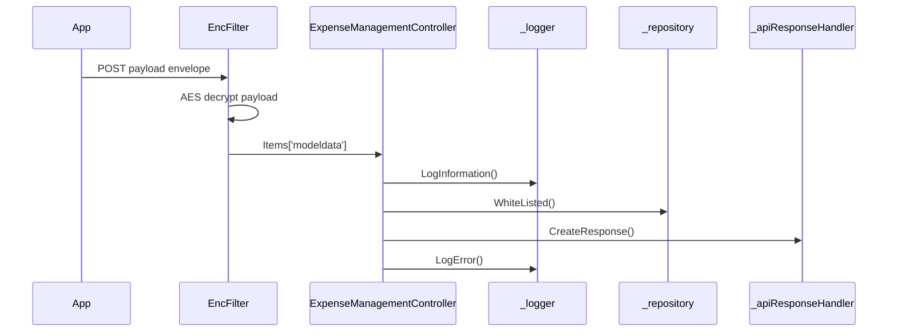

# BE-API-EXPENSE-007 ExpenseManagementController.CheckWhitelisted
**Service:** BE-SVC-EXPENSE · **Handler:** `TZ-Tigo-SuperApp-Expense/TZTigoSuperAppExpense/Controllers/ExpenseManagementController.cs › ExpenseManagementController.CheckWhitelisted` · **Conf.:** confirmed

## Match keys
```yaml
match_keys:
  public_method: POST
  public_path: /api/ExpenseManagement/CheckWhitelisted
  internal_path: /api/ExpenseManagement/CheckWhitelisted
  dispatch_field: null
  dispatch_value: null
  controller_action: ExpenseManagementController.CheckWhitelisted
  topic: null
```

## Exposure & security
- **Method / path:** `POST /api/ExpenseManagement/CheckWhitelisted`
- **Auth / filters:** EncryptionProviderFilter<WhitelistedRequest>
- **Headers:** `X-User-Session` (Bearer JWT) when session filter present; `Content-Type: application/json`.
- **Encryption:** whole-body AES on `payload` / response when enabled (`is_encrypted` or `isEncrypted`). Mechanism only; keys not documented.

## Request (decrypted)
Wire envelope (encrypted or plaintext JSON string in `payload`). Table below is the **decrypted** DTO bound after the filter.

| Field (JSON) | Type | Req. | Format / length / enum | Enforced by | Meaning |
|---|---|---|---|---|---|
| `payload` | string | Y | AES ciphertext or JSON | `RequestModel` | whole-body envelope |

**Decrypted type:** `WhitelistedRequest`

| Field (JSON) | Type | Req. | Format / length / enum | Enforced by | Meaning |
|---|---|---|---|---|---|
| `requestingOrganisationTransactionReference` | `string` | N | — | shape only | requestingOrganisationTransactionReference |
| `channel` | `string` | N | — | shape only | channel |
| `ipInfo` | `string` | N | — | shape only | ipInfo |
| `appVersion` | `string` | N | — | shape only | appVersion |
| `languageCode` | `string` | N | — | shape only | languageCode |
| `deviceId` | `string` | N | — | shape only | deviceId |
| `deviceMaker` | `string` | N | — | shape only | deviceMaker |
| `oS` | `string` | N | — | shape only | oS |
| `geoCode` | `string` | N | — | shape only | geoCode |
| `userCaseName` | `string` | N | — | shape only | userCaseName |
| `accessToken` | `string` | N | — | shape only | accessToken |
| `msisdn` | `string` | N | — | shape only | msisdn |

Headers / route / query params: none parsed beyond action signature `[('msg', 'RequestModel')]`

Sample (synthetic):
```json
{"payload": "<ciphertext-or-json>"}
# decrypted payload:
{
  "requestingOrganisationTransactionReference": "<string>",
  "channel": "<string>",
  "ipInfo": "<encrypted-pin>",
  "appVersion": "<string>",
  "languageCode": "<string>",
  "deviceId": "<device-id>",
  "deviceMaker": "<string>",
  "oS": "<string>",
  "geoCode": "<string>",
  "userCaseName": "<string>",
  "accessToken": "<jwt>",
  "msisdn": "255XXXXXXXXX"
}
```

## Checks & validations (execution order)
| # | Check | On failure | Rule ID | Evidence |
|---|---|---|---|---|
| 1 | Decrypt `payload` with AES when config `is_encrypted`/`isEncrypted` is true; else JSON-deserialize | Filter stores raw string; later cast may fail → 500 | — | `TZ-Tigo-SuperApp-Expense/TZTigoSuperAppExpense/Controllers/ExpenseManagementController.cs › ExpenseManagementController.CheckWhitelisted` |
| 2 | `_configuration.GetValue<string>("EnableLog:Information"` | branch / error envelope | — | `TZ-Tigo-SuperApp-Expense/TZTigoSuperAppExpense/Controllers/ExpenseManagementController.cs › ExpenseManagementController.CheckWhitelisted` |
| 3 | `param is string` | branch / error envelope | — | `TZ-Tigo-SuperApp-Expense/TZTigoSuperAppExpense/Controllers/ExpenseManagementController.cs › ExpenseManagementController.CheckWhitelisted` |
| 4 | `portalType == BusinessPortalType.New` | branch / error envelope | — | `TZ-Tigo-SuperApp-Expense/TZTigoSuperAppExpense/Controllers/ExpenseManagementController.cs › ExpenseManagementController.CheckWhitelisted` |
| 5 | `whitelistedResponse == null` | branch / error envelope | — | `TZ-Tigo-SuperApp-Expense/TZTigoSuperAppExpense/Controllers/ExpenseManagementController.cs › ExpenseManagementController.CheckWhitelisted` |
| 6 | `whitelistedResponse.status == true` | branch / error envelope | — | `TZ-Tigo-SuperApp-Expense/TZTigoSuperAppExpense/Controllers/ExpenseManagementController.cs › ExpenseManagementController.CheckWhitelisted` |
| 7 | `_configuration.GetValue<string>("EnableLog:Information"` | branch / error envelope | — | `TZ-Tigo-SuperApp-Expense/TZTigoSuperAppExpense/Controllers/ExpenseManagementController.cs › ExpenseManagementController.CheckWhitelisted` |
| 8 | `param is string` | branch / error envelope | — | `TZ-Tigo-SuperApp-Expense/TZTigoSuperAppExpense/Controllers/ExpenseManagementController.cs › ExpenseManagementController.CheckWhitelisted` |
| 9 | `_configuration.GetValue<string>("EnableLog:Error"` | branch / error envelope | — | `TZ-Tigo-SuperApp-Expense/TZTigoSuperAppExpense/Controllers/ExpenseManagementController.cs › ExpenseManagementController.CheckWhitelisted` |
| 10 | `param is string` | branch / error envelope | — | `TZ-Tigo-SuperApp-Expense/TZTigoSuperAppExpense/Controllers/ExpenseManagementController.cs › ExpenseManagementController.CheckWhitelisted` |

## Internal call chain
1. Client POST `/api/ExpenseManagement/CheckWhitelisted` with `{ payload }` envelope.
2. Encryption filter decrypts payload into `WhitelistedRequest` on `HttpContext.Items['modeldata']`.
3. `ExpenseManagementController.CheckWhitelisted` runs (`TZ-Tigo-SuperApp-Expense/TZTigoSuperAppExpense/Controllers/ExpenseManagementController.cs`).
4. Calls `_repository.WhiteListed`.
5. Calls `_apiResponseHandler.CreateResponse`.
6. Returns via `ApiResponseHandler.CreateResponse` or action result; filter may AES-encrypt whole response.



## Downstream
| Order | Target (BE-API / BE-INT / BE-EVT) | Sync/Async | Condition | Sent / used fields |
|---|---|---|---|---|
| 1 | BE-API-CONFIG (ResponseCodeApp get-response-code-details) | Sync | after handler | responseCode, language, channel, optional service/method |

## Data touched
| Entity / table / SP | R/W | Notes |
|---|---|---|
| see service `data-model.md` | mixed | not fully attributed per action |

## Response (decrypted)
| Field (JSON) | Type | Always / when | Meaning |
|---|---|---|---|
| `success` | boolean | always | handler outcome |
| `responseCode` | string | always | mapped via CONFIG when handler used |
| `transactionStatus` | string | success | mapped message |
| `errorDescription` | string | failure | mapped or static |
| `appVersionInfo` | string | often | app version hint |
| `responseData` | object | success | action-specific |

Sample (synthetic):
```json
{
  "success": true,
  "responseCode": "<code>",
  "transactionStatus": "<message>",
  "appVersionInfo": "<version>",
  "responseData": {}
}
```

## Errors
| BE code | HTTP | ID | Condition | Message key/text | Retryable |
|---|---|---|---|---|---|
| 500 | 500 | BE-ERR-EXPENSE-001 | unhandled exception in action | Internal Server Error | yes (idempotent GETs only) |
| (session) | 410 | BE-ERR-EXPENSE-002 | invalid/expired `X-User-Session` | session filter envelope | no (re-auth) |
| mapped | 400/200/201 | — | handler `BaseResponse.success` | CONFIG response-code catalogue | depends |

## Side effects
- Possible audit publish via RabbitMQ `IAuditLogsService` in encryption filter (service-dependent).
- Possible FCM via `IFCMService` when the handler calls it.

## Business rules (links)
- Session validity: `BE-BR-EXPENSE-001` (when session filter present).

## Config keys
- `is_encrypted` or `isEncrypted` (toggle)
- `responseChanel`, `serviceName` / `Tanzania:serviceName` (message mapping)
- `TokenKey` (JWT validation; value not recorded)

## Evidence
- `TZ-Tigo-SuperApp-Expense/TZTigoSuperAppExpense/Controllers/ExpenseManagementController.cs › ExpenseManagementController.CheckWhitelisted` @ `e821ac9`
- Decrypted DTO `WhitelistedRequest` properties from type index.

## Open questions
- Public path may be rewritten by an external gateway not in this repo set.
