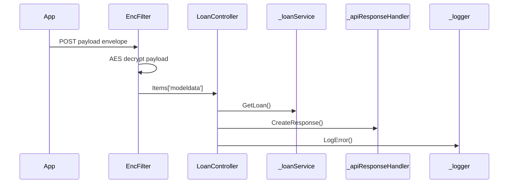

# BE-API-GRPSAV-001 LoanController.GetLoan
**Service:** BE-SVC-GRPSAV · **Handler:** `TZ-Tigo-SuperApp-GroupSaving/GroupSavingMicroservice/Controllers/LoanController.cs › LoanController.GetLoan` · **Conf.:** confirmed

## Match keys
```yaml
match_keys:
  public_method: POST
  public_path: /api/Loan/GetLoan
  internal_path: /api/Loan/GetLoan
  dispatch_field: null
  dispatch_value: null
  controller_action: LoanController.GetLoan
  topic: null
```

## Exposure & security
- **Method / path:** `POST /api/Loan/GetLoan`
- **Auth / filters:** EncryptionProviderFilter<GetLoanRequest>
- **Headers:** `X-User-Session` (Bearer JWT) when session filter present; `Content-Type: application/json`.
- **Encryption:** whole-body AES on `payload` / response when enabled (`is_encrypted` or `isEncrypted`). Mechanism only; keys not documented.

## Request (decrypted)
Wire envelope (encrypted or plaintext JSON string in `payload`). Table below is the **decrypted** DTO bound after the filter.

| Field (JSON) | Type | Req. | Format / length / enum | Enforced by | Meaning |
|---|---|---|---|---|---|
| `payload` | string | Y | AES ciphertext or JSON | `RequestModel` | whole-body envelope |

**Decrypted type:** `GetLoanRequest`

| Field (JSON) | Type | Req. | Format / length / enum | Enforced by | Meaning |
|---|---|---|---|---|---|
| `requestingOrganisationTransactionReference` | `string?` | N | — | shape only | requestingOrganisationTransactionReference |
| `requestId` | `string?` | N | — | shape only | requestId |
| `channel` | `string?` | N | — | shape only | channel |
| `ipInfo` | `string?` | N | — | shape only | ipInfo |
| `appVersion` | `string?` | N | — | shape only | appVersion |
| `languageCode` | `string?` | N | — | shape only | languageCode |
| `deviceId` | `string?` | N | — | shape only | deviceId |
| `deviceType` | `string?` | N | — | shape only | deviceType |
| `pushId` | `string?` | N | — | shape only | pushId |
| `deviceMaker` | `string?` | N | — | shape only | deviceMaker |
| `oS` | `string?` | N | — | shape only | oS |
| `geoCode` | `string?` | N | — | shape only | geoCode |
| `userCaseName` | `string?` | N | — | shape only | userCaseName |
| `accessToken` | `string?` | N | — | shape only | accessToken |
| `groupId` | `string?` | N | — | shape only | groupId |
| `phoneNumber` | `string?` | N | — | shape only | phoneNumber |
| `forOthers` | `string?` | N | — | shape only | forOthers |
| `amount` | `string?` | N | — | shape only | amount |
| `paymentType` | `string?` | N | — | shape only | paymentType |
| `loanType` | `string?` | N | — | shape only | loanType |
| `bParty` | `string?` | N | — | shape only | bParty |

Headers / route / query params: none parsed beyond action signature `[('msg', 'RequestModel')]`

Sample (synthetic):
```json
{"payload": "<ciphertext-or-json>"}
# decrypted payload:
{
  "requestingOrganisationTransactionReference": "<string>",
  "requestId": "<string>",
  "channel": "<string>",
  "ipInfo": "<encrypted-pin>",
  "appVersion": "<string>",
  "languageCode": "<string>",
  "deviceId": "<device-id>",
  "deviceType": "<string>",
  "pushId": "<push-token>",
  "deviceMaker": "<string>",
  "oS": "<string>",
  "geoCode": "<string>",
  "userCaseName": "<string>",
  "accessToken": "<jwt>",
  "groupId": "<string>",
  "phoneNumber": "255XXXXXXXXX",
  "forOthers": "<string>",
  "amount": "<amount>",
  "paymentType": "<string>",
  "loanType": "<string>",
  "bParty": "<string>"
}
```

## Checks & validations (execution order)
| # | Check | On failure | Rule ID | Evidence |
|---|---|---|---|---|
| 1 | Decrypt; SessionValidation **off** | 500 / 410 if on | BE-BR-GRPSAV-001 | handler `GetLoan` |
| 2 | No service-layer field validation; OAuth `Tanzania:GSApplyLoan` via Tanzania:GSToken + username/password/clientId/grantType/clientSecret | fail | — | `SavingService`/`LoanService.GetLoan` |
| 3 | Success downstream `code == "0"` | fail envelope | — | `BaseService.SendAsync` |

## Internal call chain
1. Client POST `/api/Loan/GetLoan` with `{ payload }` envelope.
2. Encryption filter decrypts payload into `GetLoanRequest` on `HttpContext.Items['modeldata']`.
3. `LoanController.GetLoan` runs (`TZ-Tigo-SuperApp-GroupSaving/GroupSavingMicroservice/Controllers/LoanController.cs`).
4. Calls `_loanService.GetLoan`.
5. Calls `_apiResponseHandler.CreateResponse`.
6. Returns via `ApiResponseHandler.CreateResponse` or action result; filter may AES-encrypt whole response.



## Downstream
| Order | Target | Sync/Async | Condition | Sent / used fields |
|---|---|---|---|---|
| 1 | OAuth `Tanzania:GSToken` | Sync | always | Tanzania:username, password, clientId, grantType, clientSecret |
| 2 | HTTP `Tanzania:GSApplyLoan` | Sync | token ok | groupId, phoneNumber, amount, bParty, receipt |

## Data touched
| Entity / table / SP | R/W | Notes |
|---|---|---|
| see service `data-model.md` | mixed | not fully attributed per action |

## Response (decrypted)
| Field (JSON) | Type | Always / when | Meaning |
|---|---|---|---|
| `success` | boolean | always | handler outcome |
| `responseCode` | string | always | mapped via CONFIG when handler used |
| `transactionStatus` | string | success | mapped message |
| `errorDescription` | string | failure | mapped or static |
| `appVersionInfo` | string | often | app version hint |
| `responseData` | object | success | action-specific |

Sample (synthetic):
```json
{
  "success": true,
  "responseCode": "<code>",
  "transactionStatus": "<message>",
  "appVersionInfo": "<version>",
  "responseData": {}
}
```

## Errors
| BE code | HTTP | ID | Condition | Message key/text | Retryable |
|---|---|---|---|---|---|
| 500 | 500 | BE-ERR-GRPSAV-001 | unhandled exception in action | Internal Server Error | yes (idempotent GETs only) |
| (session) | 410 | BE-ERR-GRPSAV-002 | invalid/expired `X-User-Session` | session filter envelope | no (re-auth) |
| mapped | 400/200/201 | — | handler `BaseResponse.success` | CONFIG response-code catalogue | depends |

## Side effects
- Possible audit publish via RabbitMQ `IAuditLogsService` in encryption filter (service-dependent).
- Possible FCM via `IFCMService` when the handler calls it.

## Business rules (links)
- Session validity: `BE-BR-GRPSAV-001` (when session filter present).

## Config keys
- `Tanzania:GSApplyLoan`, `Tanzania:GSToken`, `Tanzania:username`, `Tanzania:password`, `Tanzania:clientId`, `Tanzania:grantType`, `Tanzania:clientSecret`

## Evidence
- `TZ-Tigo-SuperApp-GroupSaving/GroupSavingMicroservice/Controllers/LoanController.cs › LoanController.GetLoan` @ `ed4ac20`
- Decrypted DTO `GetLoanRequest` properties from type index.

## Open questions
- Public path may be rewritten by an external gateway not in this repo set.
