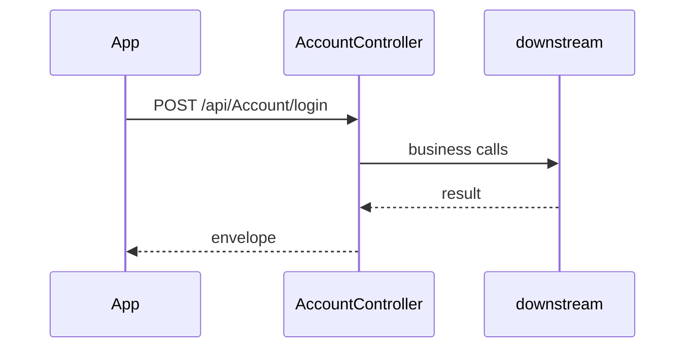

# BE-API-IDENT-016 AccountController.Login
**Service:** BE-SVC-IDENT · **Handler:** `TZ-Tigo-SuperApp-Identity/TZTigoSuperAppIdentity/Controllers/AccountController.cs › AccountController.Login` · **Conf.:** confirmed

## Match keys
```yaml
match_keys:
  public_method: POST
  public_path: /api/Account/login
  internal_path: /api/Account/login
  dispatch_field: null
  dispatch_value: null
  controller_action: AccountController.Login
  topic: null
```

## Exposure & security
- **Auth:** JWT
- **Channel:** IDENT/SESS are portal or session APIs; mobile feature APIs typically use encrypted `payload` + `X-User-Session`.
- **Encryption filter:** none on this action

## Request (decrypted)
| Field (JSON) | Type | Req. | Format / length / enum | Enforced by | Meaning |
|---|---|---|---|---|---|
| userName | `string?` | yes | — | DataAnnotations / action | — |
| password | `string?` | yes | — | DataAnnotations / action | — |

Headers / route / query params:
- `X-User-Session` (Bearer JWT) when authenticated
- Content-Type: application/json

Sample (synthetic):
```json
{ "userName": "<userName>", "password": "<password>" }
```

## Checks & validations (execution order)
| # | Check | On failure | Rule ID | Evidence |
|---|---|---|---|---|
| 1 | JWT via `X-User-Session` / Bearer | 401 | — | `TZTigoSuperAppIdentity/Controllers/AccountController.cs › AccountController` |
| 2 | ModelState.IsValid | 400 Invalid request | — | `TZTigoSuperAppIdentity/Controllers/AccountController.cs › AccountController.Login` |
| 3 | Guard: User does not exist | HTTP 400 | — | `TZTigoSuperAppIdentity/Controllers/AccountController.cs › AccountController.Login` |
| 4 | Guard: User is in-active. Kindly contact to admin | HTTP 400 | — | `TZTigoSuperAppIdentity/Controllers/AccountController.cs › AccountController.Login` |
| 5 | Guard: User not found. Kindly contact to admin | HTTP 400 | — | `TZTigoSuperAppIdentity/Controllers/AccountController.cs › AccountController.Login` |
| 6 | Guard: User account is expired. Kindly contact admin | HTTP 400 | — | `TZTigoSuperAppIdentity/Controllers/AccountController.cs › AccountController.Login` |
| 7 | Guard: success = signInResult.Succeeded, responseMessage_en = $"Your account is in locked state. Please contact support team", responseMessage_fr = $"Votre compte est en état verrouillé.  | HTTP 401 | — | `TZTigoSuperAppIdentity/Controllers/AccountController.cs › AccountController.Login` |
| 8 | Guard: success = signInResult.Succeeded, responseMessage_en = $"Your account is locked out. It will enable after {lockOutTimeSpanTime | HTTP 401 | — | `TZTigoSuperAppIdentity/Controllers/AccountController.cs › AccountController.Login` |
| 9 | Guard: Invalid UserName Or Password | HTTP 400 | — | `TZTigoSuperAppIdentity/Controllers/AccountController.cs › AccountController.Login` |


## Internal call chain
1. ASP.NET model binding (and EncryptionProviderFilter when present) → `AccountController.Login`
2. Action body in `TZTigoSuperAppIdentity/Controllers/AccountController.cs` (UserManager / services / DbContext as called)
3. Envelope returned (`BaseDto` / `BaseResponse` / `IActionResult`)



## Downstream
| Order | Target (BE-API / BE-INT / BE-EVT) | Sync/Async | Condition | Sent / used fields |
|---|---|---|---|---|
| 1 | In-process services / EF / cache | Sync | always | see call chain |

## Data touched
| Entity / table / SP | R/W | Notes |
|---|---|---|
| See service data-model | R/W | Traced at SHA e7397b0 |

## Response (decrypted)
| Field (JSON) | Type | Always / when | Meaning |
|---|---|---|---|
| success | bool | typical | Operation flag |
| responseCode / responseMessage_* | string | typical | Envelope |
| Data / responseData | object | on success | Payload |

Sample (synthetic):
```json
{ "success": true, "responseCode": "00", "Data": {} }
```

## Errors
| BE code | HTTP | ID | Condition | Message key/text | Retryable |
|---|---|---|---|---|---|
| — | 400 | — | reachable return | User does not exist | no |
| — | 400 | — | reachable return | User is in-active. Kindly contact to admin | no |
| — | 400 | — | reachable return | User not found. Kindly contact to admin | no |
| — | 400 | — | reachable return | User account is expired. Kindly contact admin | no |
| — | 401 | — | reachable return | success = signInResult.Succeeded, responseMessage_en = $"Your account is in locked state. Please contact support team", responseMessage_fr = $"Votre compte est en état verrouillé.  | no |
| — | 401 | — | reachable return | success = signInResult.Succeeded, responseMessage_en = $"Your account is locked out. It will enable after {lockOutTimeSpanTime | no |
| — | 400 | — | reachable return | Invalid UserName Or Password | no |


## Side effects
Documented when the action writes users, tokens, OTP, cache, or audit. See service files.

## Business rules (links)
See `services/ident/business-rules.md`.

## Config keys
Names only: `TokenKey`, `isEncrypted` / `is_encrypted`, `Encryption_Decryption_Key`, `IV`, service-specific sections.

## Evidence
- `TZ-Tigo-SuperApp-Identity/TZTigoSuperAppIdentity/Controllers/AccountController.cs › AccountController.Login` @ `e7397b0`

## Open questions
- Public gateway path may differ from controller route (no gateway repo in this set).
