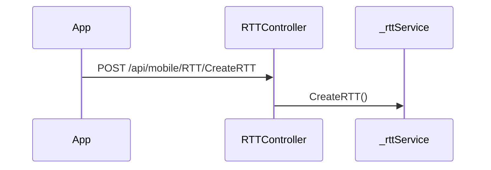

# BE-API-MCHANGO-001 RTTController.CreateRTT
**Service:** BE-SVC-MCHANGO · **Handler:** `TZ-Tigo-SuperApp-MChango/TZTigoMChangoService/Controllers/MobileControllers/RTTController.cs › RTTController.CreateRTT` · **Conf.:** confirmed

## Match keys
```yaml
match_keys:
  public_method: POST
  public_path: /api/mobile/RTT/CreateRTT
  internal_path: /api/mobile/RTT/CreateRTT
  dispatch_field: null
  dispatch_value: null
  controller_action: RTTController.CreateRTT
  topic: null
```

## Exposure & security
- **Method / path:** `POST /api/mobile/RTT/CreateRTT`
- **Auth / filters:** none on action (pipeline may still authorize)
- **Headers:** `X-User-Session` (Bearer JWT) when session filter present; `Content-Type: application/json`.
- **Encryption:** whole-body AES on `payload` / response when enabled (`is_encrypted` or `isEncrypted`). Mechanism only; keys not documented.

## Request (decrypted)
| Field (JSON) | Type | Req. | Format / length / enum | Enforced by | Meaning |
|---|---|---|---|---|---|
| `BrandGroupName` | `string?` | N | — | shape only | BrandGroupName |
| `BrandID` | `string?` | N | — | shape only | BrandID |
| `BrandName` | `string?` | N | — | shape only | BrandName |
| `CreditAmount` | `decimal?` | N | — | shape only | CreditAmount |
| `DebitAmount` | `decimal?` | N | — | shape only | DebitAmount |
| `DestCustomerMobile` | `string?` | N | — | shape only | DestCustomerMobile |
| `DestCustomerFullName` | `string?` | N | — | shape only | DestCustomerFullName |
| `DestCustomerGroupName` | `string?` | N | — | shape only | DestCustomerGroupName |
| `DestFees1` | `decimal?` | N | — | shape only | DestFees1 |
| `DestFees2` | `decimal?` | N | — | shape only | DestFees2 |
| `DestFees3` | `decimal?` | N | — | shape only | DestFees3 |
| `DestFees4` | `decimal?` | N | — | shape only | DestFees4 |
| `DestLevy` | `decimal?` | N | — | shape only | DestLevy |
| `DestTaxOnLevy` | `decimal?` | N | — | shape only | DestTaxOnLevy |
| `ExternalMemo` | `string?` | N | — | shape only | ExternalMemo |
| `OriginalAmount` | `decimal` | N | — | shape only | OriginalAmount |
| `PayableAmount` | `decimal?` | N | — | shape only | PayableAmount |
| `SalesOrderStatus` | `string` | N | — | shape only | SalesOrderStatus |
| `SalesOrderNumber` | `string` | N | — | shape only | SalesOrderNumber |
| `ServiceName` | `string` | N | — | shape only | ServiceName |
| `SourceCustomerMobile` | `string?` | N | — | shape only | SourceCustomerMobile |
| `SenderAccountNumber` | `string?` | N | — | shape only | SenderAccountNumber |
| `SourceCustomerAlias` | `string?` | N | — | shape only | SourceCustomerAlias |
| `SourceCustomerFullName` | `string?` | N | — | shape only | SourceCustomerFullName |
| `SourceCustomerGroupName` | `string?` | N | — | shape only | SourceCustomerGroupName |
| `SourceCustomerId` | `string?` | N | — | shape only | SourceCustomerId |
| `SourceFees1` | `decimal?` | N | — | shape only | SourceFees1 |
| `SourceFees2` | `decimal?` | N | — | shape only | SourceFees2 |
| `SourceFees3` | `decimal?` | N | — | shape only | SourceFees3 |
| `SourceFees4` | `decimal?` | N | — | shape only | SourceFees4 |
| `SrcLevy` | `decimal?` | N | — | shape only | SrcLevy |
| `SrcTaxOnLevy` | `decimal?` | N | — | shape only | SrcTaxOnLevy |
| `TransactionDate` | `long?` | N | — | shape only | TransactionDate |
| `ExtReferenceId` | `string?` | N | — | shape only | ExtReferenceId |
| `ExtraInfo1` | `string?` | N | — | shape only | ExtraInfo1 |
| `ExternalReference` | `string?` | N | — | shape only | ExternalReference |

Headers / route / query params: none parsed beyond action signature `[('request', 'AddRTTDto')]`

Sample (synthetic):
```json
{
  "BrandGroupName": "<string>",
  "BrandID": "<string>",
  "BrandName": "<string>",
  "CreditAmount": "<amount>",
  "DebitAmount": "<amount>",
  "DestCustomerMobile": "<string>",
  "DestCustomerFullName": "<string>",
  "DestCustomerGroupName": "<string>",
  "DestFees1": 0,
  "DestFees2": 0,
  "DestFees3": 0,
  "DestFees4": 0,
  "DestLevy": 0,
  "DestTaxOnLevy": 0,
  "ExternalMemo": "<string>",
  "OriginalAmount": "<amount>",
  "PayableAmount": "<amount>",
  "SalesOrderStatus": "<string>",
  "SalesOrderNumber": "<string>",
  "ServiceName": "<string>",
  "SourceCustomerMobile": "<string>",
  "SenderAccountNumber": "<account>",
  "SourceCustomerAlias": "<string>",
  "SourceCustomerFullName": "<string>",
  "SourceCustomerGroupName": "<string>"
}
```

## Checks & validations (execution order)
| # | Check | On failure | Rule ID | Evidence |
|---|---|---|---|---|
| 1 | `!await CheckIfAccountsExist(request.SourceCustomerMobile, request.DestCustomerMobile` | branch / error envelope | — | `TZ-Tigo-SuperApp-MChango/TZTigoMChangoService/Controllers/MobileControllers/RTTController.cs › RTTController.CreateRTT` |
| 2 | `existingTransaction == null` | branch / error envelope | — | `TZ-Tigo-SuperApp-MChango/TZTigoMChangoService/Controllers/MobileControllers/RTTController.cs › RTTController.CreateRTT` |
| 3 | `IsStatusMatching(existingTransaction, request` | branch / error envelope | — | `TZ-Tigo-SuperApp-MChango/TZTigoMChangoService/Controllers/MobileControllers/RTTController.cs › RTTController.CreateRTT` |

## Internal call chain
1. Client POST `/api/mobile/RTT/CreateRTT`.
2. `RTTController.CreateRTT` runs (`TZ-Tigo-SuperApp-MChango/TZTigoMChangoService/Controllers/MobileControllers/RTTController.cs`).
3. Calls `_rttService.CreateRTT`.
4. Returns via `ApiResponseHandler.CreateResponse` or action result; filter may AES-encrypt whole response.



## Downstream
| Order | Target (BE-API / BE-INT / BE-EVT) | Sync/Async | Condition | Sent / used fields |
|---|---|---|---|---|
| — | none parsed beyond in-process services | — | — | — |

## Data touched
| Entity / table / SP | R/W | Notes |
|---|---|---|
| see service `data-model.md` | mixed | not fully attributed per action |

## Response (decrypted)
| Field (JSON) | Type | Always / when | Meaning |
|---|---|---|---|
| `success` | boolean | always | handler outcome |
| `responseCode` | string | always | mapped via CONFIG when handler used |
| `transactionStatus` | string | success | mapped message |
| `errorDescription` | string | failure | mapped or static |
| `appVersionInfo` | string | often | app version hint |
| `responseData` | object | success | action-specific |

Sample (synthetic):
```json
{
  "success": true,
  "responseCode": "<code>",
  "transactionStatus": "<message>",
  "appVersionInfo": "<version>",
  "responseData": {}
}
```

## Errors
| BE code | HTTP | ID | Condition | Message key/text | Retryable |
|---|---|---|---|---|---|
| 500 | 500 | BE-ERR-MCHANGO-001 | unhandled exception in action | Internal Server Error | yes (idempotent GETs only) |
| (session) | 410 | BE-ERR-MCHANGO-002 | invalid/expired `X-User-Session` | session filter envelope | no (re-auth) |
| mapped | 400/200/201 | — | handler `BaseResponse.success` | CONFIG response-code catalogue | depends |

## Side effects
- Possible audit publish via RabbitMQ `IAuditLogsService` in encryption filter (service-dependent).
- Possible FCM via `IFCMService` when the handler calls it.

## Business rules (links)
- Session validity: `BE-BR-MCHANGO-001` (when session filter present).

## Config keys
- `is_encrypted` or `isEncrypted` (toggle)
- `responseChanel`, `serviceName` / `Tanzania:serviceName` (message mapping)
- `TokenKey` (JWT validation; value not recorded)

## Evidence
- `TZ-Tigo-SuperApp-MChango/TZTigoMChangoService/Controllers/MobileControllers/RTTController.cs › RTTController.CreateRTT` @ `7c288ab`
- Decrypted DTO `AddRTTDto` properties from type index.

## Open questions
- Public path may be rewritten by an external gateway not in this repo set.
