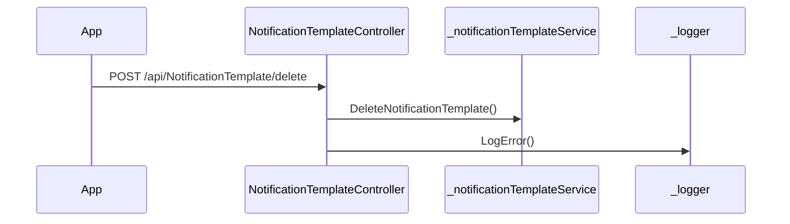

# BE-API-NOTIF-017 NotificationTemplateController.DeleteNotificationTemplate
**Service:** BE-SVC-NOTIF · **Handler:** `TZ-Tigo-SuperApp-Notification/TZTigoSuperAppNotification/Controllers/NotificationTemplateController.cs › NotificationTemplateController.DeleteNotificationTemplate` · **Conf.:** confirmed

## Match keys
```yaml
match_keys:
  public_method: POST
  public_path: /api/NotificationTemplate/delete
  internal_path: /api/NotificationTemplate/delete
  dispatch_field: null
  dispatch_value: null
  controller_action: NotificationTemplateController.DeleteNotificationTemplate
  topic: null
```

## Exposure & security
- **Method / path:** `POST /api/NotificationTemplate/delete`
- **Auth / filters:** none on action (pipeline may still authorize)
- **Headers:** `X-User-Session` (Bearer JWT) when session filter present; `Content-Type: application/json`.
- **Encryption:** whole-body AES on `payload` / response when enabled (`is_encrypted` or `isEncrypted`). Mechanism only; keys not documented.

## Request (decrypted)
| Field (JSON) | Type | Req. | Format / length / enum | Enforced by | Meaning |
|---|---|---|---|---|---|
| `Id` | `int?` | N | — | shape only | Id |
| `createdBy` | `string?` | N | — | shape only | createdBy |
| `createdDate` | `DateTime?` | N | — | shape only | createdDate |
| `updatedBy` | `string?` | N | — | shape only | updatedBy |
| `updatedDate` | `DateTime?` | N | — | shape only | updatedDate |
| `languageCode` | `string?` | N | — | shape only | languageCode |
| `flowId` | `string?` | N | — | shape only | flowId |
| `isDeleted` | `bool?` | N | — | shape only | isDeleted |
| `templateType` | `string?` | N | — | shape only | templateType |
| `title` | `string?` | N | — | shape only | title |
| `name` | `string?` | N | — | shape only | name |
| `description` | `string?` | N | — | shape only | description |
| `enNotification` | `string?` | N | — | shape only | enNotification |
| `swNotification` | `string?` | N | — | shape only | swNotification |
| `isActive` | `bool?` | N | — | shape only | isActive |
| `isSender` | `bool?` | N | — | shape only | isSender |
| `isReceiver` | `bool?` | N | — | shape only | isReceiver |
| `darkIcon` | `string?` | N | — | shape only | darkIcon |
| `lightIcon` | `string?` | N | — | shape only | lightIcon |

Headers / route / query params: none parsed beyond action signature `[('request', 'NotificationTemplateRequest')]`

Sample (synthetic):
```json
{
  "Id": 0,
  "createdBy": "<string>",
  "createdDate": "<iso-datetime>",
  "updatedBy": "<string>",
  "updatedDate": "<iso-datetime>",
  "languageCode": "<string>",
  "flowId": "<string>",
  "isDeleted": false,
  "templateType": "<string>",
  "title": "<string>",
  "name": "<string>",
  "description": "<string>",
  "enNotification": "<string>",
  "swNotification": "<string>",
  "isActive": false,
  "isSender": false,
  "isReceiver": false,
  "darkIcon": "<string>",
  "lightIcon": "<string>"
}
```

## Checks & validations (execution order)
| # | Check | On failure | Rule ID | Evidence |
|---|---|---|---|---|
| 1 | `response` | branch / error envelope | — | `TZ-Tigo-SuperApp-Notification/TZTigoSuperAppNotification/Controllers/NotificationTemplateController.cs › NotificationTemplateController.DeleteNotificationTemplate` |
| 2 | `_configuration.GetSection("EnableLog:Error"` | branch / error envelope | — | `TZ-Tigo-SuperApp-Notification/TZTigoSuperAppNotification/Controllers/NotificationTemplateController.cs › NotificationTemplateController.DeleteNotificationTemplate` |

## Internal call chain
1. Client POST `/api/NotificationTemplate/delete`.
2. `NotificationTemplateController.DeleteNotificationTemplate` runs (`TZ-Tigo-SuperApp-Notification/TZTigoSuperAppNotification/Controllers/NotificationTemplateController.cs`).
3. Calls `_notificationTemplateService.DeleteNotificationTemplate`.
4. Returns via `ApiResponseHandler.CreateResponse` or action result; filter may AES-encrypt whole response.



## Downstream
| Order | Target (BE-API / BE-INT / BE-EVT) | Sync/Async | Condition | Sent / used fields |
|---|---|---|---|---|
| — | none parsed beyond in-process services | — | — | — |

## Data touched
| Entity / table / SP | R/W | Notes |
|---|---|---|
| see service `data-model.md` | mixed | not fully attributed per action |

## Response (decrypted)
| Field (JSON) | Type | Always / when | Meaning |
|---|---|---|---|
| `success` | boolean | always | handler outcome |
| `responseCode` | string | always | mapped via CONFIG when handler used |
| `transactionStatus` | string | success | mapped message |
| `errorDescription` | string | failure | mapped or static |
| `appVersionInfo` | string | often | app version hint |
| `responseData` | object | success | action-specific |

Sample (synthetic):
```json
{
  "success": true,
  "responseCode": "<code>",
  "transactionStatus": "<message>",
  "appVersionInfo": "<version>",
  "responseData": {}
}
```

## Errors
| BE code | HTTP | ID | Condition | Message key/text | Retryable |
|---|---|---|---|---|---|
| 500 | 500 | BE-ERR-NOTIF-001 | unhandled exception in action | Internal Server Error | yes (idempotent GETs only) |
| (session) | 410 | BE-ERR-NOTIF-002 | invalid/expired `X-User-Session` | session filter envelope | no (re-auth) |
| mapped | 400/200/201 | — | handler `BaseResponse.success` | CONFIG response-code catalogue | depends |

## Side effects
- Possible audit publish via RabbitMQ `IAuditLogsService` in encryption filter (service-dependent).
- Possible FCM via `IFCMService` when the handler calls it.

## Business rules (links)
- Session validity: `BE-BR-NOTIF-001` (when session filter present).

## Config keys
- `is_encrypted` or `isEncrypted` (toggle)
- `responseChanel`, `serviceName` / `Tanzania:serviceName` (message mapping)
- `TokenKey` (JWT validation; value not recorded)

## Evidence
- `TZ-Tigo-SuperApp-Notification/TZTigoSuperAppNotification/Controllers/NotificationTemplateController.cs › NotificationTemplateController.DeleteNotificationTemplate` @ `b7c98ec`
- Decrypted DTO `NotificationTemplateRequest` properties from type index.

## Open questions
- Public path may be rewritten by an external gateway not in this repo set.
