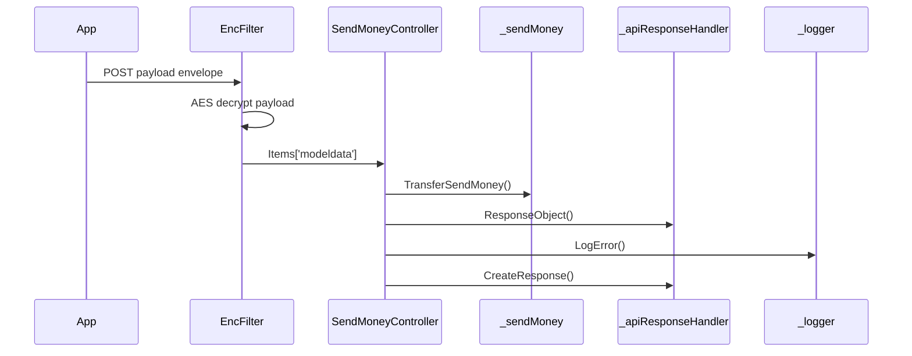

# BE-API-SEND-011 SendMoneyController.TransferSendMoney
**Service:** BE-SVC-SEND · **Handler:** `TZ-Tigo-SuperApp-SendMoney/TZTigoSuperAppSendMoney/Controllers/SendMoneyController.cs › SendMoneyController.TransferSendMoney` · **Conf.:** confirmed

## Match keys
```yaml
match_keys:
  public_method: POST
  public_path: /api/SendMoney/TransferSendMoney
  internal_path: /api/SendMoney/TransferSendMoney
  dispatch_field: null
  dispatch_value: null
  controller_action: SendMoneyController.TransferSendMoney
  topic: null
```

## Exposure & security
- **Method / path:** `POST /api/SendMoney/TransferSendMoney`
- **Auth / filters:** SessionValidationFilter (X-User-Session), EncryptionProviderFilter<TransferSendMoneyRequest>
- **Headers:** `X-User-Session` (Bearer JWT) when session filter present; `Content-Type: application/json`.
- **Encryption:** whole-body AES on `payload` / response when enabled (`is_encrypted` or `isEncrypted`). Mechanism only; keys not documented.

## Request (decrypted)
Wire envelope (encrypted or plaintext JSON string in `payload`). Table below is the **decrypted** DTO bound after the filter.

| Field (JSON) | Type | Req. | Format / length / enum | Enforced by | Meaning |
|---|---|---|---|---|---|
| `payload` | string | Y | AES ciphertext or JSON | `RequestModel` | whole-body envelope |

**Decrypted type:** `TransferSendMoneyRequest`

| Field (JSON) | Type | Req. | Format / length / enum | Enforced by | Meaning |
|---|---|---|---|---|---|
| `requestingOrganisationTransactionReference` | `string?` | N | — | shape only | requestingOrganisationTransactionReference |
| `requestID` | `string?` | N | — | shape only | requestID |
| `channel` | `string?` | N | — | shape only | channel |
| `ipInfo` | `string?` | N | — | shape only | ipInfo |
| `appVersion` | `string?` | N | — | shape only | appVersion |
| `languageCode` | `string?` | N | — | shape only | languageCode |
| `deviceId` | `string?` | N | — | shape only | deviceId |
| `deviceMaker` | `string?` | N | — | shape only | deviceMaker |
| `oS` | `string?` | N | — | shape only | oS |
| `pushId` | `string?` | N | — | shape only | pushId |
| `deviceType` | `string?` | N | — | shape only | deviceType |
| `geoCode` | `string?` | N | — | shape only | geoCode |
| `userCaseName` | `string?` | N | — | shape only | userCaseName |
| `accessToken` | `string?` | N | — | shape only | accessToken |
| `qrType` | `string?` | N | — | shape only | qrType |
| `isMerchant` | `bool?` | N | — | repository | merchant flag |
| `transferMoney` | `List<TransferMoney>` | Y | one+ legs | foreach | debit legs |
| `transferMoney[].consumerID` | `string?` | overwritten | — | `Tanzania:ConsumerID` | MMP consumer |
| `transferMoney[].referenceID` | `string?` | generated | — | repository | MMP/ref |
| `transferMoney[].sourceMSISDN` | `string?` | Y | MSISDN | MMP | payer |
| `transferMoney[].sourcePIN` | `string?` | Y (pay) | PIN | MMP | payer PIN |
| `transferMoney[].terminalType` | `string?` | N | — | config `TerminalType` | channel |
| `transferMoney[].targetMSISDN` | `string?` | Y | MSISDN; TANQR uses first 3 digits | MMP / tanqrshortcode | payee |
| `transferMoney[].amount` | `string?` | Y | decimal string | MMP | amount |
| `transferMoney[].shortCode` | `string?` | Y | TANQR or `50001`/`50024`/`50058` | repository | rail |
| `transferMoney[].inclCOFee` | `bool?` | N | mapped `"true"` forces shortCode 50001 | repository | cash-out fee |
| `transferMoney[].overdraftBrandID` | `string?` | N | — | SOAP additional | overdraft |
| `transferMoney[].channelUser` / `channelPass` | `string?` | N | — | other rail | channel creds |
| `transferMoney[].paymentType` | `string?` | N | — | config `PaymentType` | payment type |
| `transferMoney[].storeLabel` | `string?` | N | — | shape | merchant label |
| `transferMoney[].isTip` | bool | N | if prior leg failed → stop | BE-BR-SEND-007 | tip after payment |
| `transferMoney[].transactionType` | `string?` | N | e.g. giftMoney | gift path | gift vs normal |
| `customData` | `List<{key,value}>` | N | gift metadata | giftmoneyrecord | gift fields |
| `customData[].key` | `string?` | N | — | shape | key |
| `customData[].value` | `string?` | N | — | shape | value |

Headers / route / query params: none parsed beyond action signature `[('msg', 'RequestModel')]`

Sample (synthetic):
```json
{"payload": "<ciphertext-or-json>"}
# decrypted payload:
{
  "requestingOrganisationTransactionReference": "<string>",
  "requestID": "<string>",
  "channel": "<string>",
  "ipInfo": "<encrypted-pin>",
  "appVersion": "<string>",
  "languageCode": "<string>",
  "deviceId": "<device-id>",
  "deviceMaker": "<string>",
  "oS": "<string>",
  "pushId": "<push-token>",
  "deviceType": "<string>",
  "geoCode": "<string>",
  "userCaseName": "<string>",
  "accessToken": "<jwt>",
  "qrType": "<string>",
  "transferMoney": [{ "sourceMSISDN": "255XXXXXXXXX", "targetMSISDN": "255XXXXXXXXX", "amount": "<amount>", "shortCode": "<shortcode>", "sourcePIN": "<encrypted-pin>", "inclCOFee": false, "isTip": false }],
  "customData": [{ "key": "<k>", "value": "<v>" }],
  "isMerchant": false
}
```

## Checks & validations (execution order)
| # | Check | On failure | Rule ID | Evidence |
|---|---|---|---|---|
| 1 | Decrypt + session | 500 / 410 | BE-BR-SEND-001 | `SendMoneyController.TransferSendMoney` |
| 2 | Stamp `Tanzania:ConsumerID` on each `transferMoney[]` leg | — | — | `TZ-Tigo-SuperApp-SendMoney/TZTigoSuperAppSendMoney/Service/SendMoneyRepository.cs › TransferSendMoney` |
| 3 | If `isTip` and prior leg `Status==false` | HTTP 400 “Due to payment failed tip cannot proceed” | BE-BR-SEND-007 | same |
| 4 | If `shortCode` equals `TANQR`, map target prefix via `tanqrshortcode` | 400 Invalid Alias / Msimbo wa Lakabu batili | BE-BR-SEND-003 | same |
| 5 | Generate reference; persist-prep `transfers` row | — | — | same |
| 6 | Rail: `userCaseName==sendmoney` OR shortCode in `50001,50024,50058` → SOAP `SendMoneyRequest` else `MTPGPaymentRequest`; InclCOFee true → ShortCode `50001` | other rail | BE-BR-SEND-004/005 | same |
| 7 | POST SOAP; on exception → `TransactionStatus` (`MTPGGetSODetails`) using `Tanzania:MSIDN` / `Tanzania:PIN` | fallback status | — | same |
| 8 | Success codes `0` / `200102` / `200109` / `99999`; giftMoney+customData → `giftmoneyrecord` + FCM; else FCM + optional Mchango notify | fail mapped/`400` | BE-BR-SEND-006 | same |
| 9 | Encrypt consumerid; save `transfers`; aggregate Status | success `0` / fail | — | same |

## Internal call chain
1. Client POST `/api/SendMoney/TransferSendMoney` with `{ payload }` envelope.
2. Encryption filter decrypts payload into `TransferSendMoneyRequest` on `HttpContext.Items['modeldata']`.
3. SessionValidationFilter validates `X-User-Session`.
4. `SendMoneyController.TransferSendMoney` runs (`TZ-Tigo-SuperApp-SendMoney/TZTigoSuperAppSendMoney/Controllers/SendMoneyController.cs`).
5. Calls `_sendMoney.TransferSendMoney`.
6. Calls `_apiResponseHandler.ResponseObject`.
7. Calls `_apiResponseHandler.CreateResponse`.
8. Returns via `ApiResponseHandler.CreateResponse` or action result; filter may AES-encrypt whole response.



## Downstream
| Order | Target (BE-API / BE-INT / BE-EVT) | Sync/Async | Condition | Sent / used fields |
|---|---|---|---|---|
| 1 | MMP SOAP `SendMoneyRequest` via `TransferSendMoneyTigoToTigoURL` | Sync | sendmoney / shortCodes 50001,50024,50058 | source/target MSISDN, PIN, amount, shortCode, InclCOFee, overdraftBrandID |
| 2 | MMP SOAP `MTPGPaymentRequest` via `TransferSendMoneyTigoToOtherURL` | Sync | other shortCodes | plus TerminalType, PaymentType, channelUser/Pass |
| 3 | MMP SOAP status via `TransactionStatus` | Sync | SOAP exception | `Tanzania:MSIDN`, `Tanzania:PIN` |
| 4 | EF `tanqrshortcode` | Sync | TANQR | prefix → shortcode |
| 5 | EF `transfers` / `giftmoneyrecord` | Sync | always / gift | persist |
| 6 | FCM + optional HTTP `MchangoNotfication` | Async/sync | success | notify |
| 7 | BE-API-CONFIG ResponseCodeApp | Sync | after handler | mapped codes |

## Data touched
| Entity / table / SP | R/W | Notes |
|---|---|---|
| `transfers` | W | each leg |
| `giftmoneyrecord` | W | giftMoney + customData |
| `tanqrshortcode` | R | TANQR alias |

## Response (decrypted)
| Field (JSON) | Type | Always / when | Meaning |
|---|---|---|---|
| `success` | boolean | always | handler outcome |
| `responseCode` | string | always | mapped via CONFIG when handler used |
| `transactionStatus` | string | success | mapped message |
| `errorDescription` | string | failure | mapped or static |
| `appVersionInfo` | string | often | app version hint |
| `responseData` | object | success | action-specific |

Sample (synthetic):
```json
{
  "success": true,
  "responseCode": "<code>",
  "transactionStatus": "<message>",
  "appVersionInfo": "<version>",
  "responseData": {}
}
```

## Errors
| BE code | HTTP | ID | Condition | Message key/text | Retryable |
|---|---|---|---|---|---|
| 500 | 500 | BE-ERR-SEND-001 | unhandled exception in action | Internal Server Error | yes (idempotent GETs only) |
| (session) | 410 | BE-ERR-SEND-002 | invalid/expired `X-User-Session` | session filter envelope | no (re-auth) |
| mapped | 400/200/201 | — | handler `BaseResponse.success` | CONFIG response-code catalogue | depends |

## Side effects
- Possible audit publish via RabbitMQ `IAuditLogsService` in encryption filter (service-dependent).
- Possible FCM via `IFCMService` when the handler calls it.

## Business rules (links)
- Session validity: `BE-BR-SEND-001` (when session filter present).

## Config keys
- `is_encrypted`/`isEncrypted`, `TokenKey`, `Tanzania:ConsumerID`, `TANQR`, `TerminalType`, `PaymentType`
- `TransferSendMoneyTigoToTigoURL`, `TransferSendMoneyTigoToOtherURL`, `TransactionStatus`, `Tanzania:MSIDN`, `Tanzania:PIN`, `MchangoNotfication`

## Evidence
- `TZ-Tigo-SuperApp-SendMoney/TZTigoSuperAppSendMoney/Controllers/SendMoneyController.cs › SendMoneyController.TransferSendMoney` @ `599771b`
- Decrypted DTO `TransferSendMoneyRequest` properties from type index.

## Open questions
- Public path may be rewritten by an external gateway not in this repo set.
