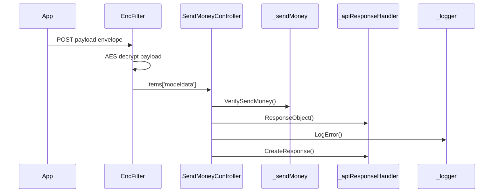

# BE-API-SEND-010 SendMoneyController.VerifySendMoney
**Service:** BE-SVC-SEND · **Handler:** `TZ-Tigo-SuperApp-SendMoney/TZTigoSuperAppSendMoney/Controllers/SendMoneyController.cs › SendMoneyController.VerifySendMoney` · **Conf.:** confirmed

## Match keys
```yaml
match_keys:
  public_method: POST
  public_path: /api/SendMoney/VerifySendMoney
  internal_path: /api/SendMoney/VerifySendMoney
  dispatch_field: null
  dispatch_value: null
  controller_action: SendMoneyController.VerifySendMoney
  topic: null
```

## Exposure & security
- **Method / path:** `POST /api/SendMoney/VerifySendMoney`
- **Auth / filters:** SessionValidationFilter (X-User-Session), EncryptionProviderFilter<VerifySendMoneyRequest>
- **Headers:** `X-User-Session` (Bearer JWT) when session filter present; `Content-Type: application/json`.
- **Encryption:** whole-body AES on `payload` / response when enabled (`is_encrypted` or `isEncrypted`). Mechanism only; keys not documented.

## Request (decrypted)
Wire envelope (encrypted or plaintext JSON string in `payload`). Table below is the **decrypted** DTO bound after the filter.

| Field (JSON) | Type | Req. | Format / length / enum | Enforced by | Meaning |
|---|---|---|---|---|---|
| `payload` | string | Y | AES ciphertext or JSON | `RequestModel` | whole-body envelope |

**Decrypted type:** `VerifySendMoneyRequest` (+ nested `SendMoney`) plus `BaseRequest` header fields.

| Field (JSON) | Type | Req. | Format / length / enum | Enforced by | Meaning |
|---|---|---|---|---|---|
| `requestingOrganisationTransactionReference` | `string?` | N | — | shape only | correlation id |
| `languageCode` | `string?` | N | `en` vs other | handler | selects error text |
| `useCaseName` / `userCaseName` | `string?` | N | `sendmoney` (lowercased) | `SendMoneyRepository.VerifySendMoney` | DTO field is `useCaseName`; repository reads `userCaseName` (possible mismatch) |
| `sendMoney` | `List<SendMoney>` | Y | one+ legs | foreach in repository | verify legs |
| `sendMoney[].consumerID` | `string?` | overwritten | — | config `Tanzania:ConsumerId` | MMP consumer |
| `sendMoney[].referenceID` | `string?` | N | generated if fee path | `Utilities.GenerateReference` | MMP reference |
| `sendMoney[].sourceMSISDN` | `string?` | Y | MSISDN | MMP | payer |
| `sendMoney[].targetMSISDN` | `string?` | Y | MSISDN; TANQR uses first 3 digits as prefix range | MMP / TANQR lookup | payee or alias |
| `sendMoney[].sourcePin` | `string?` | N | PIN (do not log) | bill-query path | payer PIN |
| `sendMoney[].terminalType` | `string?` | N | — | config `TerminalType` on bill path | channel |
| `sendMoney[].amount` | `string?` | Y | decimal string | MMP | amount |
| `sendMoney[].shortCode` | `string?` | Y | `TANQR` config value, or `50001`/`50024`/`50058` | repository | product / rail |
| `sendMoney[].inclCOFee` | `bool?` | N | if true, fee shortCode forced to `50001` | repository | include cash-out fee |

Headers / route / query params: none parsed beyond action signature `[('msg', 'RequestModel')]`

Sample (synthetic):
```json
{"payload": "<ciphertext-or-json>"}
```
Decrypted payload:
```json
{
  "requestingOrganisationTransactionReference": "<corr-id>",
  "languageCode": "en",
  "useCaseName": "sendmoney",
  "sendMoney": [
    {
      "sourceMSISDN": "255XXXXXXXXX",
      "targetMSISDN": "255XXXXXXXXX",
      "amount": "<amount>",
      "shortCode": "<shortcode>",
      "sourcePin": "<encrypted-pin>",
      "inclCOFee": false
    }
  ]
}
```

## Checks & validations (execution order)
| # | Check | On failure | Rule ID | Evidence |
|---|---|---|---|---|
| 1 | Decrypt `payload` with AES when config `is_encrypted`/`isEncrypted` is true; else JSON-deserialize | Filter stores raw string; later cast may fail → 500 | — | `TZ-Tigo-SuperApp-SendMoney/TZTigoSuperAppSendMoney/Controllers/SendMoneyController.cs › SendMoneyController.VerifySendMoney` |
| 2 | Validate `X-User-Session` JWT (`TokenKey`) then Redis/DB token | HTTP 410 envelope | BE-BR-SEND-001 | `TZ-Tigo-SuperApp-SendMoney › SessionValidationFilter` |
| 3 | If `shortCode` equals config `TANQR`, map target prefix (first 3 digits) to `tanqrshortcode` range | HTTP 400 `Invalid Alias Code.` / `Msimbo wa Lakabu batili.` | BE-BR-SEND-003 | `TZ-Tigo-SuperApp-SendMoney/TZTigoSuperAppSendMoney/Service/SendMoneyRepository.cs › VerifySendMoney` |
| 4 | Rail select: `useCaseName==sendmoney` OR shortCode in `50001`,`50024`,`50058` → SOAP `CalculateFeeRequest`; else SOAP `MTPGBillQueryRequest` | other rail | BE-BR-SEND-004 | same |
| 5 | If `inclCOFee` true on fee path, force ShortCode `50001` | — | BE-BR-SEND-005 | same |
| 6 | MMP `ResultCode == "0"` on at least one leg → success | `success=false`, mapped codes | BE-BR-SEND-006 | same |

## Internal call chain
1. Client POST `/api/SendMoney/VerifySendMoney` with `{ payload }` envelope.
2. Encryption filter decrypts payload into `VerifySendMoneyRequest` on `HttpContext.Items['modeldata']`.
3. SessionValidationFilter validates `X-User-Session`.
4. `SendMoneyController.VerifySendMoney` runs (`TZ-Tigo-SuperApp-SendMoney/TZTigoSuperAppSendMoney/Controllers/SendMoneyController.cs`).
5. Calls `_sendMoney.VerifySendMoney`.
6. Calls `_apiResponseHandler.ResponseObject`.
7. Calls `_apiResponseHandler.CreateResponse`.
8. Returns via `ApiResponseHandler.CreateResponse` or action result; filter may AES-encrypt whole response.



## Downstream
| Order | Target (BE-API / BE-INT / BE-EVT) | Sync/Async | Condition | Sent / used fields |
|---|---|---|---|---|
| 1 | BE-INT-SEND MMP SOAP `CalculateFeeRequest` via `VerifySendMoneyTigoToTigoURL` | Sync | sendmoney / shortCodes 50001,50024,50058 | ConsumerID, ReferenceID, Source/Target MSISDN, Amount, ShortCode, InclCOFee |
| 2 | BE-INT-SEND MMP SOAP `MTPGBillQueryRequest` via `VerifySendMoneyTigoToOtherURL` | Sync | other shortCodes | plus SourcePIN, TerminalType, TargetRefNumber |
| 3 | EF `tanqrshortcode` | Sync | TANQR shortCode | min/max MSISDN prefix → shortcode |
| 4 | BE-API-CONFIG ResponseCodeApp | Sync | after handler | responseCode, language, channel |

## Data touched
| Entity / table / SP | R/W | Notes |
|---|---|---|
| see service `data-model.md` | mixed | not fully attributed per action |

## Response (decrypted)
| Field (JSON) | Type | Always / when | Meaning |
|---|---|---|---|
| `success` | boolean | always | handler outcome |
| `responseCode` | string | always | mapped via CONFIG when handler used |
| `transactionStatus` | string | success | mapped message |
| `errorDescription` | string | failure | mapped or static |
| `appVersionInfo` | string | often | app version hint |
| `responseData` | object | success | action-specific |

Sample (synthetic):
```json
{
  "success": true,
  "responseCode": "<code>",
  "transactionStatus": "<message>",
  "appVersionInfo": "<version>",
  "responseData": {}
}
```

## Errors
| BE code | HTTP | ID | Condition | Message key/text | Retryable |
|---|---|---|---|---|---|
| 500 | 500 | BE-ERR-SEND-001 | unhandled exception in action | Internal Server Error | yes (idempotent GETs only) |
| (session) | 410 | BE-ERR-SEND-002 | invalid/expired `X-User-Session` | session filter envelope | no (re-auth) |
| mapped | 400/200/201 | — | handler `BaseResponse.success` | CONFIG response-code catalogue | depends |

## Side effects
- Possible audit publish via RabbitMQ `IAuditLogsService` in encryption filter (service-dependent).
- Possible FCM via `IFCMService` when the handler calls it.

## Business rules (links)
- Session validity: `BE-BR-SEND-001` (when session filter present).

## Config keys
- `is_encrypted`, `TokenKey`, `responseChanel`, `serviceName`
- `Tanzania:ConsumerId`, `TANQR`, `TerminalType`
- `VerifySendMoneyTigoToTigoURL`, `VerifySendMoneyTigoToOtherURL` (URL values omitted)

## Evidence
- `TZ-Tigo-SuperApp-SendMoney/TZTigoSuperAppSendMoney/Controllers/SendMoneyController.cs › SendMoneyController.VerifySendMoney` @ `599771b`
- Decrypted DTO `VerifySendMoneyRequest` properties from type index.

## Open questions
- Public path may be rewritten by an external gateway not in this repo set.
