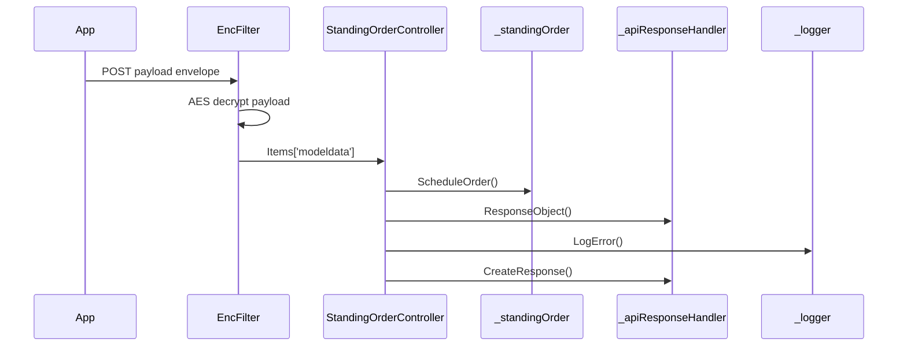

# BE-API-SEND-001 StandingOrderController.ScheduleOrder
**Service:** BE-SVC-SEND · **Handler:** `TZ-Tigo-SuperApp-SendMoney/TZTigoSuperAppSendMoney/Controllers/StandingOrderController.cs › StandingOrderController.ScheduleOrder` · **Conf.:** confirmed

## Match keys
```yaml
match_keys:
  public_method: POST
  public_path: /api/StandingOrder/ScheduleOrder
  internal_path: /api/StandingOrder/ScheduleOrder
  dispatch_field: null
  dispatch_value: null
  controller_action: StandingOrderController.ScheduleOrder
  topic: null
```

## Exposure & security
- **Method / path:** `POST /api/StandingOrder/ScheduleOrder`
- **Auth / filters:** EncryptionProviderFilter<ScheduleOrderRequestDTO>
- **Headers:** `X-User-Session` (Bearer JWT) when session filter present; `Content-Type: application/json`.
- **Encryption:** whole-body AES on `payload` / response when enabled (`is_encrypted` or `isEncrypted`). Mechanism only; keys not documented.

## Request (decrypted)
Wire envelope (encrypted or plaintext JSON string in `payload`). Table below is the **decrypted** DTO bound after the filter.

| Field (JSON) | Type | Req. | Format / length / enum | Enforced by | Meaning |
|---|---|---|---|---|---|
| `payload` | string | Y | AES ciphertext or JSON | `RequestModel` | whole-body envelope |

**Decrypted type:** `ScheduleOrderRequestDTO`

| Field (JSON) | Type | Req. | Format / length / enum | Enforced by | Meaning |
|---|---|---|---|---|---|
| `requestingOrganisationTransactionReference` | `string?` | N | — | shape only | requestingOrganisationTransactionReference |
| `requestID` | `string?` | N | — | shape only | requestID |
| `channel` | `string?` | N | — | shape only | channel |
| `ipInfo` | `string?` | N | — | shape only | ipInfo |
| `appVersion` | `string?` | N | — | shape only | appVersion |
| `languageCode` | `string?` | N | — | shape only | languageCode |
| `deviceId` | `string?` | N | — | shape only | deviceId |
| `deviceMaker` | `string?` | N | — | shape only | deviceMaker |
| `oS` | `string?` | N | — | shape only | oS |
| `pushId` | `string?` | N | — | shape only | pushId |
| `deviceType` | `string?` | N | — | shape only | deviceType |
| `geoCode` | `string?` | N | — | shape only | geoCode |
| `userCaseName` | `string?` | N | — | shape only | userCaseName |
| `accessToken` | `string?` | N | — | shape only | accessToken |
| `qrType` | `string?` | N | — | shape only | qrType |
| `customer_id` | `string?` | N | — | shape only | CustomerId |
| `msisdn` | `string?` | N | — | shape only | Msisdn |
| `fullname` | `string?` | N | — | shape only | FullName |
| `Source` | `string?` | N | — | shape only | Source |
| `order_name` | `string?` | N | — | shape only | OrderName |
| `Duration` | `string?` | N | — | shape only | Duration |
| `start_date` | `DateTime?` | N | — | shape only | StartDate |
| `end_date` | `DateTime?` | N | — | shape only | EndDate |
| `next_payment` | `DateTime?` | N | — | shape only | NextPayment |
| `last_payment` | `DateTime?` | N | — | shape only | LastPayment |
| `order_reference` | `string?` | N | — | shape only | OrderReference |
| `order_reference_name` | `string?` | N | — | shape only | OrderReferenceName |
| `Destination` | `string?` | N | — | shape only | Destination |
| `Mno` | `string?` | N | — | shape only | Mno |
| `Brand` | `string?` | N | — | shape only | Brand |
| `shortcode` | `string?` | N | — | shape only | ShortCode |
| `Status` | `string?` | N | — | shape only | Status |
| `Type` | `string?` | N | — | shape only | Type |
| `RequestChannel` | `string?` | N | — | shape only | RequestChannel |
| `Amount` | `decimal?` | N | — | shape only | Amount |

Headers / route / query params: none parsed beyond action signature `[('msg', 'RequestModel')]`

Sample (synthetic):
```json
{"payload": "<ciphertext-or-json>"}
# decrypted payload:
{
  "requestingOrganisationTransactionReference": "<string>",
  "requestID": "<string>",
  "channel": "<string>",
  "ipInfo": "<encrypted-pin>",
  "appVersion": "<string>",
  "languageCode": "<string>",
  "deviceId": "<device-id>",
  "deviceMaker": "<string>",
  "oS": "<string>",
  "pushId": "<push-token>",
  "deviceType": "<string>",
  "geoCode": "<string>",
  "userCaseName": "<string>",
  "accessToken": "<jwt>",
  "qrType": "<string>",
  "customer_id": "<string>",
  "msisdn": "255XXXXXXXXX",
  "fullname": "<string>",
  "Source": "<string>",
  "order_name": "<string>",
  "Duration": "<string>",
  "start_date": "<iso-datetime>",
  "end_date": "<iso-datetime>",
  "next_payment": "<iso-datetime>",
  "last_payment": "<iso-datetime>"
}
```

## Checks & validations (execution order)
| # | Check | On failure | Rule ID | Evidence |
|---|---|---|---|---|
| 1 | Decrypt | 500 | — | `StandingOrderController.ScheduleOrder` |
| 2 | `GetCustomerId`: MSISDN 255+12; token `GetTokenApiUrl` + `StandingOrderApiKey` | fail “Failed to retrieve customer…” | — | `StandingOrderRepository.ScheduleOrder` |
| 3 | Validate Msisdn / OrderName | fail | — | same |
| 4 | DB insert then Bearer POST `ScheduleOrderApiUrl` | 400 validation_failed; 409 duplicate; else failed | — | same |
| 5 | HTTP 200 + status `active` | mapped fail | — | same |

## Internal call chain
1. Client POST `/api/StandingOrder/ScheduleOrder` with `{ payload }` envelope.
2. Encryption filter decrypts payload into `ScheduleOrderRequestDTO` on `HttpContext.Items['modeldata']`.
3. `StandingOrderController.ScheduleOrder` runs (`TZ-Tigo-SuperApp-SendMoney/TZTigoSuperAppSendMoney/Controllers/StandingOrderController.cs`).
4. Calls `_standingOrder.ScheduleOrder`.
5. Calls `_apiResponseHandler.ResponseObject`.
6. Calls `_apiResponseHandler.CreateResponse`.
7. Returns via `ApiResponseHandler.CreateResponse` or action result; filter may AES-encrypt whole response.



## Downstream
| Order | Target | Sync/Async | Condition | Sent / used fields |
|---|---|---|---|---|
| 1 | HTTP `GetTokenApiUrl` | Sync | always | `StandingOrderApiKey` |
| 2 | HTTP `GetCustomerIdApiUrl` | Sync | token ok | MSISDN |
| 3 | HTTP `ScheduleOrderApiUrl` | Sync | after DB insert | customer_id, msisdn, order_name, dates, destination, amount, channel=mobile |
| 4 | EF standing orders | W | always | persist |

## Data touched
| Entity / table / SP | R/W | Notes |
|---|---|---|
| see service `data-model.md` | mixed | not fully attributed per action |

## Response (decrypted)
| Field (JSON) | Type | Always / when | Meaning |
|---|---|---|---|
| `success` | boolean | always | handler outcome |
| `responseCode` | string | always | mapped via CONFIG when handler used |
| `transactionStatus` | string | success | mapped message |
| `errorDescription` | string | failure | mapped or static |
| `appVersionInfo` | string | often | app version hint |
| `responseData` | object | success | action-specific |

Sample (synthetic):
```json
{
  "success": true,
  "responseCode": "<code>",
  "transactionStatus": "<message>",
  "appVersionInfo": "<version>",
  "responseData": {}
}
```

## Errors
| BE code | HTTP | ID | Condition | Message key/text | Retryable |
|---|---|---|---|---|---|
| 500 | 500 | BE-ERR-SEND-001 | unhandled exception in action | Internal Server Error | yes (idempotent GETs only) |
| (session) | 410 | BE-ERR-SEND-002 | invalid/expired `X-User-Session` | session filter envelope | no (re-auth) |
| mapped | 400/200/201 | — | handler `BaseResponse.success` | CONFIG response-code catalogue | depends |

## Side effects
- Possible audit publish via RabbitMQ `IAuditLogsService` in encryption filter (service-dependent).
- Possible FCM via `IFCMService` when the handler calls it.

## Business rules (links)
- Session validity: `BE-BR-SEND-001` (when session filter present).

## Config keys
- `GetTokenApiUrl`, `StandingOrderApiKey`, `GetCustomerIdApiUrl`, `ScheduleOrderApiUrl`

## Evidence
- `TZ-Tigo-SuperApp-SendMoney/TZTigoSuperAppSendMoney/Controllers/StandingOrderController.cs › StandingOrderController.ScheduleOrder` @ `599771b`
- Decrypted DTO `ScheduleOrderRequestDTO` properties from type index.

## Open questions
- Public path may be rewritten by an external gateway not in this repo set.
