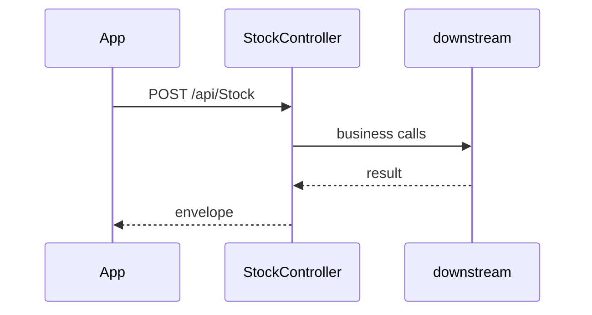

# BE-API-STOCK-014 StockController.GetBuyOrder
**Service:** BE-SVC-STOCK · **Handler:** `TZ-Tigo-SuperApp-Stock/TZTigoSuperAppStock/Controllers/StockController.cs › StockController.GetBuyOrder` · **Conf.:** confirmed

## Match keys
```yaml
match_keys:
  public_method: POST
  public_path: /api/Stock
  internal_path: /api/Stock
  dispatch_field: null
  dispatch_value: null
  controller_action: StockController.GetBuyOrder
  topic: null
```

## Exposure & security
- **Auth:** none
- **Channel:** IDENT/SESS are portal or session APIs; mobile feature APIs typically use encrypted `payload` + `X-User-Session`.
- **Encryption filter:** GetBuyOrdersRequestDTO

## Request (decrypted)
| Field (JSON) | Type | Req. | Format / length / enum | Enforced by | Meaning |
|---|---|---|---|---|---|
| payload | string | yes | AES-CBC Base64 of JSON | EncryptionProviderFilter | Encrypted body |
| nidaNumber | `string` | yes | — | DataAnnotations / action | — |
| securityReference | `string` | yes | — | DataAnnotations / action | — |
| price | `string` | yes | — | DataAnnotations / action | — |
| shares | `string` | yes | — | DataAnnotations / action | — |
| sourceMSISDN | `string?` | yes | — | DataAnnotations / action | — |
| sourcePIN | `string?` | yes | — | DataAnnotations / action | — |
| amount | `string?` | yes | — | DataAnnotations / action | — |
| shortCode | `string?` | yes | — | DataAnnotations / action | — |
| nidaNumber | `string` | no | — | DataAnnotations / action | — |
| startDate | `string` | no | — | DataAnnotations / action | — |
| endDate | `string` | no | — | DataAnnotations / action | — |
| nidaNumber | `string` | no | — | DataAnnotations / action | — |
| orderReference | `string` | no | — | DataAnnotations / action | — |

Headers / route / query params:
- `X-User-Session` (Bearer JWT) when authenticated
- Content-Type: application/json

Sample (synthetic):
```json
{ "nidaNumber": "<nidaNumber>", "securityReference": "<securityReference>", "price": "<price>", "shares": "<shares>", "sourceMSISDN": "<sourceMSISDN>", "sourcePIN": "<sourcePIN>" }
```

## Checks & validations (execution order)
| # | Check | On failure | Rule ID | Evidence |
|---|---|---|---|---|


## Internal call chain
1. ASP.NET model binding (and EncryptionProviderFilter when present) → `StockController.GetBuyOrder`
2. Action body in `TZTigoSuperAppStock/Controllers/StockController.cs` (UserManager / services / DbContext as called)
3. Envelope returned (`BaseDto` / `BaseResponse` / `IActionResult`)



## Downstream
| Order | Target (BE-API / BE-INT / BE-EVT) | Sync/Async | Condition | Sent / used fields |
|---|---|---|---|---|
| 1 | In-process services / EF / cache | Sync | always | see call chain |

## Data touched
| Entity / table / SP | R/W | Notes |
|---|---|---|
| See service data-model | R/W | Traced at SHA 10f0a62 |

## Response (decrypted)
| Field (JSON) | Type | Always / when | Meaning |
|---|---|---|---|
| success | bool | typical | Operation flag |
| responseCode / responseMessage_* | string | typical | Envelope |
| Data / responseData | object | on success | Payload |

Sample (synthetic):
```json
{ "success": true, "responseCode": "00", "Data": {} }
```

## Errors
| BE code | HTTP | ID | Condition | Message key/text | Retryable |
|---|---|---|---|---|---|
| — | 500 | — | Unhandled exception | Internal error | no |


## Side effects
Documented when the action writes users, tokens, OTP, cache, or audit. See service files.

## Business rules (links)
See `services/stock/business-rules.md`.

## Config keys
Names only: `TokenKey`, `isEncrypted` / `is_encrypted`, `Encryption_Decryption_Key`, `IV`, service-specific sections.

## Evidence
- `TZ-Tigo-SuperApp-Stock/TZTigoSuperAppStock/Controllers/StockController.cs › StockController.GetBuyOrder` @ `10f0a62`

## Open questions
- Public gateway path may differ from controller route (no gateway repo in this set).
