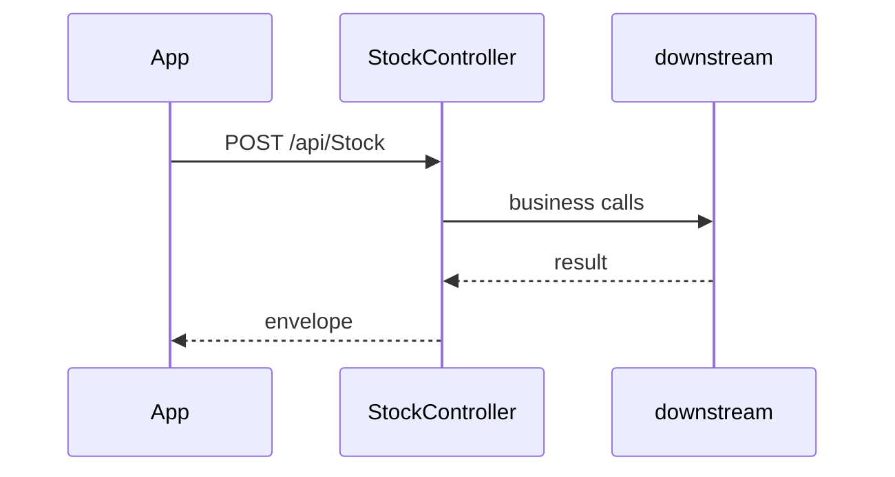

# BE-API-STOCK-009 StockController.GetStockCdsClients
**Service:** BE-SVC-STOCK · **Handler:** `TZ-Tigo-SuperApp-Stock/TZTigoSuperAppStock/Controllers/StockController.cs › StockController.GetStockCdsClients` · **Conf.:** confirmed

## Match keys
```yaml
match_keys:
  public_method: POST
  public_path: /api/Stock
  internal_path: /api/Stock
  dispatch_field: null
  dispatch_value: null
  controller_action: StockController.GetStockCdsClients
  topic: null
```

## Exposure & security
- **Auth:** none
- **Channel:** IDENT/SESS are portal or session APIs; mobile feature APIs typically use encrypted `payload` + `X-User-Session`.
- **Encryption filter:** StockCdsClientRequestDTO

## Request (decrypted)
| Field (JSON) | Type | Req. | Format / length / enum | Enforced by | Meaning |
|---|---|---|---|---|---|
| payload | string | yes | AES-CBC Base64 of JSON | EncryptionProviderFilter | Encrypted body |
| birthDistrict | `string` | no | — | DataAnnotations / action | — |
| birthWard | `string` | no | — | DataAnnotations / action | — |
| brokerRef | `string` | yes | — | DataAnnotations / action | — |
| country | `string` | yes | — | DataAnnotations / action | — |
| dob | `string` | yes | — | DataAnnotations / action | — |
| email | `string` | yes | — | DataAnnotations / action | — |
| firstName | `string` | yes | — | DataAnnotations / action | — |
| gender | `string` | yes | — | DataAnnotations / action | — |
| lastName | `string` | yes | — | DataAnnotations / action | — |
| middleName | `string` | yes | — | DataAnnotations / action | — |
| nationality | `string` | yes | — | DataAnnotations / action | — |
| nidaNumber | `string` | yes | — | DataAnnotations / action | — |
| phoneNumber | `string` | yes | — | DataAnnotations / action | — |
| photo | `string` | no | — | DataAnnotations / action | — |
| physicalAddress | `string` | yes | — | DataAnnotations / action | — |
| placeOfBirth | `string` | yes | — | DataAnnotations / action | — |
| region | `string` | yes | — | DataAnnotations / action | — |
| residentDistrict | `string` | no | — | DataAnnotations / action | — |
| residentHouseNo | `string` | no | — | DataAnnotations / action | — |
| residentPostCode | `string` | no | — | DataAnnotations / action | — |
| residentRegion | `string` | no | — | DataAnnotations / action | — |
| residentVillage | `string` | no | — | DataAnnotations / action | — |
| otherNames | `string` | no | — | DataAnnotations / action | — |
| csdAccount | `string` | no | — | DataAnnotations / action | — |
| nidaNumber | `string` | yes | — | DataAnnotations / action | — |
| nidaNumber | `string` | yes | — | DataAnnotations / action | — |
| nidaNumber | `string` | yes | — | DataAnnotations / action | — |
| nidaNumber | `string` | no | — | DataAnnotations / action | — |
| securityId | `string` | no | — | DataAnnotations / action | — |
| brokerName | `string` | no | — | DataAnnotations / action | — |
| brokerReference | `string` | no | — | DataAnnotations / action | — |
| securityName | `string` | no | — | DataAnnotations / action | — |
| totalBalance | `int` | no | — | DataAnnotations / action | — |
| pledgedBalance | `int` | no | — | DataAnnotations / action | — |
| freeBalance | `int` | no | — | DataAnnotations / action | — |
| securityReference | `string` | no | — | DataAnnotations / action | — |
| minPriceLimit | `double` | no | — | DataAnnotations / action | — |
| maxPriceLimit | `double` | no | — | DataAnnotations / action | — |
| code | `int` | no | — | DataAnnotations / action | — |
| data | `List<InvestorData>` | no | — | DataAnnotations / action | — |
| message | `string` | no | — | DataAnnotations / action | — |
| investorName | `string` | no | — | DataAnnotations / action | — |
| investorPhoneNumber | `string` | no | — | DataAnnotations / action | — |
| brokerName | `string` | no | — | DataAnnotations / action | — |
| csdAccount | `string` | no | — | DataAnnotations / action | — |
| brokerCode | `string` | no | — | DataAnnotations / action | — |
| messageId | `object` | no | — | DataAnnotations / action | — |
| gender | `string` | no | — | DataAnnotations / action | — |
| dateOfBirth | `string` | no | — | DataAnnotations / action | — |
| email | `string` | no | — | DataAnnotations / action | — |
| address1 | `string` | no | — | DataAnnotations / action | — |
| address2 | `string` | no | — | DataAnnotations / action | — |
| address3 | `string` | no | — | DataAnnotations / action | — |
| address4 | `string` | no | — | DataAnnotations / action | — |
| registrationNumber | `string` | no | — | DataAnnotations / action | — |
| clientType | `string` | no | — | DataAnnotations / action | — |
| postCode | `string` | no | — | DataAnnotations / action | — |
| contactPerson | `string` | no | — | DataAnnotations / action | — |
| telNumber | `string` | no | — | DataAnnotations / action | — |
| accountNumber | `string` | no | — | DataAnnotations / action | — |
| bankCode | `string` | no | — | DataAnnotations / action | — |
| incomeBankName | `string` | no | — | DataAnnotations / action | — |
| incomeBranchCode | `string` | no | — | DataAnnotations / action | — |
| incomeAccountNumber | `string` | no | — | DataAnnotations / action | — |
| additionalMobileNumber | `string` | no | — | DataAnnotations / action | — |
| hasAccount | `bool` | no | — | DataAnnotations / action | — |
| brokerId | `object` | no | — | DataAnnotations / action | — |
| status | `bool` | no | — | DataAnnotations / action | — |
| code | `int` | no | — | DataAnnotations / action | — |
| data | `CdsclientData` | no | — | DataAnnotations / action | — |
| message | `string` | no | — | DataAnnotations / action | — |

Headers / route / query params:
- `X-User-Session` (Bearer JWT) when authenticated
- Content-Type: application/json

Sample (synthetic):
```json
{ "birthDistrict": "<birthDistrict>", "birthWard": "<birthWard>", "brokerRef": "<brokerRef>", "country": "<country>", "dob": "<dob>", "email": "<email>" }
```

## Checks & validations (execution order)
| # | Check | On failure | Rule ID | Evidence |
|---|---|---|---|---|


## Internal call chain
1. ASP.NET model binding (and EncryptionProviderFilter when present) → `StockController.GetStockCdsClients`
2. Action body in `TZTigoSuperAppStock/Controllers/StockController.cs` (UserManager / services / DbContext as called)
3. Envelope returned (`BaseDto` / `BaseResponse` / `IActionResult`)



## Downstream
| Order | Target (BE-API / BE-INT / BE-EVT) | Sync/Async | Condition | Sent / used fields |
|---|---|---|---|---|
| 1 | In-process services / EF / cache | Sync | always | see call chain |

## Data touched
| Entity / table / SP | R/W | Notes |
|---|---|---|
| See service data-model | R/W | Traced at SHA 10f0a62 |

## Response (decrypted)
| Field (JSON) | Type | Always / when | Meaning |
|---|---|---|---|
| success | bool | typical | Operation flag |
| responseCode / responseMessage_* | string | typical | Envelope |
| Data / responseData | object | on success | Payload |

Sample (synthetic):
```json
{ "success": true, "responseCode": "00", "Data": {} }
```

## Errors
| BE code | HTTP | ID | Condition | Message key/text | Retryable |
|---|---|---|---|---|---|
| — | 500 | — | Unhandled exception | Internal error | no |


## Side effects
Documented when the action writes users, tokens, OTP, cache, or audit. See service files.

## Business rules (links)
See `services/stock/business-rules.md`.

## Config keys
Names only: `TokenKey`, `isEncrypted` / `is_encrypted`, `Encryption_Decryption_Key`, `IV`, service-specific sections.

## Evidence
- `TZ-Tigo-SuperApp-Stock/TZTigoSuperAppStock/Controllers/StockController.cs › StockController.GetStockCdsClients` @ `10f0a62`

## Open questions
- Public gateway path may differ from controller route (no gateway repo in this set).
