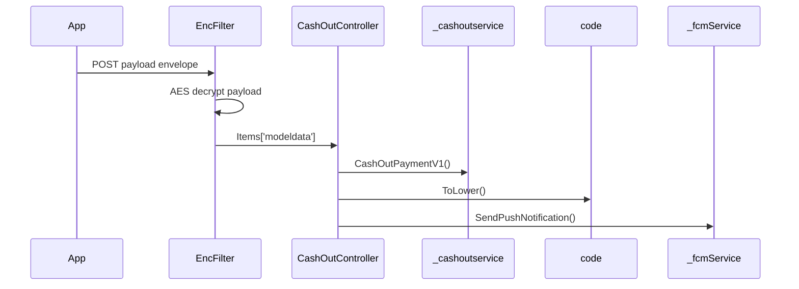

# BE-API-WALLET-002 CashOutController.CashOutPaymentV1
**Service:** BE-SVC-WALLET · **Handler:** `TZ-Tigo-SuperApp-Wallet/TZTigoSuperAppWallet/Controllers/CashOutController.cs › CashOutController.CashOutPaymentV1` · **Conf.:** confirmed

## Match keys
```yaml
match_keys:
  public_method: POST
  public_path: /api/CashOut/cashOutPaymentV1
  internal_path: /api/CashOut/cashOutPaymentV1
  dispatch_field: null
  dispatch_value: null
  controller_action: CashOutController.CashOutPaymentV1
  topic: null
```

## Exposure & security
- **Method / path:** `POST /api/CashOut/cashOutPaymentV1`
- **Auth / filters:** SessionValidationFilter (X-User-Session), EncryptionProviderFilter<CashOutPaymentRequestDto>
- **Headers:** `X-User-Session` (Bearer JWT) when session filter present; `Content-Type: application/json`.
- **Encryption:** whole-body AES on `payload` / response when enabled (`is_encrypted` or `isEncrypted`). Mechanism only; keys not documented.

## Request (decrypted)
Wire envelope (encrypted or plaintext JSON string in `payload`). Table below is the **decrypted** DTO bound after the filter.

| Field (JSON) | Type | Req. | Format / length / enum | Enforced by | Meaning |
|---|---|---|---|---|---|
| `payload` | string | Y | AES ciphertext or JSON | `RequestModel` | whole-body envelope |

**Decrypted type:** `CashOutPaymentRequestDto`

| Field (JSON) | Type | Req. | Format / length / enum | Enforced by | Meaning |
|---|---|---|---|---|---|
| `requestingOrganisationTransactionReference` | `string?` | N | — | shape only | requestingOrganisationTransactionReference |
| `requestID` | `string?` | N | — | shape only | requestID |
| `iPInfo` | `string?` | N | — | shape only | iPInfo |
| `geoCode` | `string?` | N | — | shape only | geoCode |
| `useCaseName` | `string?` | N | — | shape only | useCaseName |
| `channel` | `string?` | N | — | shape only | channel |
| `pushId` | `string?` | N | — | shape only | pushId |
| `deviceType` | `string?` | N | — | shape only | deviceType |
| `appVersion` | `string?` | N | — | shape only | appVersion |
| `languageCode` | `string?` | N | — | shape only | languageCode |
| `deviceId` | `string?` | N | — | shape only | deviceId |
| `deviceMaker` | `string?` | N | — | shape only | deviceMaker |
| `oS` | `string?` | N | — | shape only | oS |
| `accesstoken` | `string?` | N | — | shape only | accesstoken |
| `consumerID` | `string` | N | — | shape only | consumerID |
| `country` | `string` | N | — | shape only | country |
| `correlationID` | `string` | N | — | shape only | correlationID |
| `msisdn` | `string` | N | — | shape only | msisdn |
| `mPin` | `string` | N | — | shape only | mPin |
| `creditParty` | `creditParty` | N | — | shape only | creditParty |
| `amount` | `string` | N | — | shape only | amount |
| `overDraftBrandId` | `string?` | N | — | shape only | overDraftBrandId |

Headers / route / query params: none parsed beyond action signature `[('msg', 'RequestModel')]`

Sample (synthetic):
```json
{"payload": "<ciphertext-or-json>"}
# decrypted payload:
{
  "requestingOrganisationTransactionReference": "<string>",
  "requestID": "<string>",
  "iPInfo": "<encrypted-pin>",
  "geoCode": "<string>",
  "useCaseName": "<string>",
  "channel": "<string>",
  "pushId": "<push-token>",
  "deviceType": "<string>",
  "appVersion": "<string>",
  "languageCode": "<string>",
  "deviceId": "<device-id>",
  "deviceMaker": "<string>",
  "oS": "<string>",
  "accesstoken": "<jwt>",
  "consumerID": "<string>",
  "country": "<string>",
  "correlationID": "<string>",
  "msisdn": "255XXXXXXXXX",
  "mPin": "<encrypted-pin>",
  "creditParty": "<string>",
  "amount": "<amount>",
  "overDraftBrandId": "<string>"
}
```

## Checks & validations (execution order)
| # | Check | On failure | Rule ID | Evidence |
|---|---|---|---|---|
| 1 | Decrypt `payload` with AES when config `is_encrypted`/`isEncrypted` is true; else JSON-deserialize | Filter stores raw string; later cast may fail → 500 | — | `TZ-Tigo-SuperApp-Wallet/TZTigoSuperAppWallet/Controllers/CashOutController.cs › CashOutController.CashOutPaymentV1` |
| 2 | Validate `X-User-Session` JWT (`TokenKey`) then Redis/DB token | HTTP 410 envelope | BE-BR-WALLET-001 | `TZ-Tigo-SuperApp-Wallet › SessionValidationFilter` |
| 3 | `response.code != null && response.code.ToLower(` | branch / error envelope | — | `TZ-Tigo-SuperApp-Wallet/TZTigoSuperAppWallet/Controllers/CashOutController.cs › CashOutController.CashOutPaymentV1` |
| 4 | `_configuration.GetValue<string>("SendFCMViaService"` | branch / error envelope | — | `TZ-Tigo-SuperApp-Wallet/TZTigoSuperAppWallet/Controllers/CashOutController.cs › CashOutController.CashOutPaymentV1` |
| 5 | `response.IsSuccessStatusCode == true` | branch / error envelope | — | `TZ-Tigo-SuperApp-Wallet/TZTigoSuperAppWallet/Controllers/CashOutController.cs › CashOutController.CashOutPaymentV1` |

## Internal call chain
1. Client POST `/api/CashOut/cashOutPaymentV1` with `{ payload }` envelope.
2. Encryption filter decrypts payload into `CashOutPaymentRequestDto` on `HttpContext.Items['modeldata']`.
3. SessionValidationFilter validates `X-User-Session`.
4. `CashOutController.CashOutPaymentV1` runs (`TZ-Tigo-SuperApp-Wallet/TZTigoSuperAppWallet/Controllers/CashOutController.cs`).
5. Calls `_cashoutservice.CashOutPaymentV1`.
6. Calls `code.ToLower`.
7. Calls `_fcmService.SendPushNotification`.
8. Returns via `ApiResponseHandler.CreateResponse` or action result; filter may AES-encrypt whole response.



## Downstream
| Order | Target (BE-API / BE-INT / BE-EVT) | Sync/Async | Condition | Sent / used fields |
|---|---|---|---|---|
| — | none parsed beyond in-process services | — | — | — |

## Data touched
| Entity / table / SP | R/W | Notes |
|---|---|---|
| see service `data-model.md` | mixed | not fully attributed per action |

## Response (decrypted)
| Field (JSON) | Type | Always / when | Meaning |
|---|---|---|---|
| `success` | boolean | always | handler outcome |
| `responseCode` | string | always | mapped via CONFIG when handler used |
| `transactionStatus` | string | success | mapped message |
| `errorDescription` | string | failure | mapped or static |
| `appVersionInfo` | string | often | app version hint |
| `responseData` | object | success | action-specific |

Sample (synthetic):
```json
{
  "success": true,
  "responseCode": "<code>",
  "transactionStatus": "<message>",
  "appVersionInfo": "<version>",
  "responseData": {}
}
```

## Errors
| BE code | HTTP | ID | Condition | Message key/text | Retryable |
|---|---|---|---|---|---|
| 500 | 500 | BE-ERR-WALLET-001 | unhandled exception in action | Internal Server Error | yes (idempotent GETs only) |
| (session) | 410 | BE-ERR-WALLET-002 | invalid/expired `X-User-Session` | session filter envelope | no (re-auth) |
| mapped | 400/200/201 | — | handler `BaseResponse.success` | CONFIG response-code catalogue | depends |

## Side effects
- Possible audit publish via RabbitMQ `IAuditLogsService` in encryption filter (service-dependent).
- Possible FCM via `IFCMService` when the handler calls it.

## Business rules (links)
- Session validity: `BE-BR-WALLET-001` (when session filter present).

## Config keys
- `is_encrypted` or `isEncrypted` (toggle)
- `responseChanel`, `serviceName` / `Tanzania:serviceName` (message mapping)
- `TokenKey` (JWT validation; value not recorded)

## Evidence
- `TZ-Tigo-SuperApp-Wallet/TZTigoSuperAppWallet/Controllers/CashOutController.cs › CashOutController.CashOutPaymentV1` @ `27737b1`
- Decrypted DTO `CashOutPaymentRequestDto` properties from type index.

## Open questions
- Public path may be rewritten by an external gateway not in this repo set.
