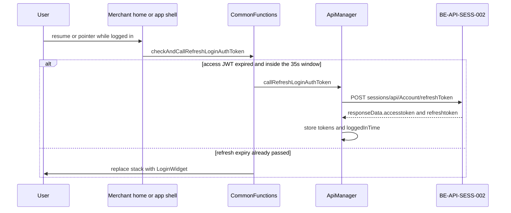

# FLW-0001 Session refresh

**APIs:** API-0003 (`BE-API-SESS-002`) · **Screens:** SCR-0001, plus the app shell in `lib/main.dart` · **Rules:** BR-0001–BR-0007

The access JWT is stored at login from ACCOUNT `LoginProfile` `accessCode` (FLW-0002). This flow only replaces it.

A second entry: any call whose HTTP status is 410 runs the same refresh, then repeats the original request (BR-0004). HTTP 411 goes to login (BR-0005).

Field diff: [../contracts/session-auth-money.md](../contracts/session-auth-money.md).

## Evidence

- `lib/ui/controllers/controller_commons/commons_functions.dart` › `CommonFunctions.checkAndCallRefreshLoginAuthToken` @ `6328b7254`
- `lib/main.dart` pointer listener
- `lib/ui/controllers/homepage/home_page_widget_controller.dart` › `onResumed`
- `lib/core/network/manager/network_manager.dart` › `NetworkManager.callDioAPI`
- `lib/core/network/manager/isolates_network_manager.dart`
