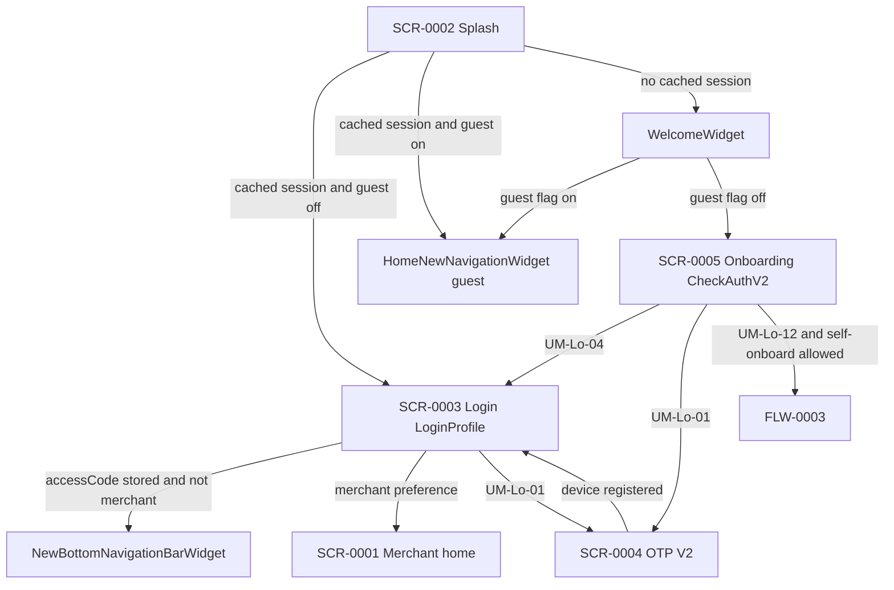

# FLW-0002 Consumer login

**Screens:** SCR-0002 splash → welcome or login → SCR-0005 onboarding → SCR-0004 OTP → SCR-0003 login → consumer shell or SCR-0001 merchant home.

Gateway token (API-0367) and pre-login config (API-0007) run on splash before any of these branches. They are not session JWTs.

PIN length is 4 (BR-0008). Login sends `mpin` and `msisdn` even though the published `LoginProfileRequest` omits both (GAP-0108).

## Evidence

- `lib/ui/controllers/splash/splash_controller.dart` › `redirectUserOnNextScreen`
- `lib/ui/widgets/welcome/welcome_widget.dart`
- `lib/ui/controllers/onboarding/onboarding_screen_controller.dart` › `handleCheckAuthResponse`
- `lib/ui/controllers/otp/otp_second_step_widget_controller.dart`
- `lib/ui/controllers/controller_commons/common_api_functions.dart` › `requestUserLogin`
- `lib/ui/controllers/controller_commons/commons_functions.dart` › `handleLoginResponse`
