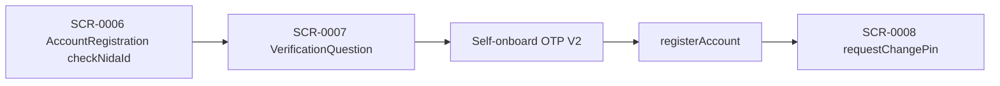

# FLW-0003 Self registration

Entered from SCR-0005 when CheckAuth returns `UM-Lo-12` and pre-login config allows self-onboard for this app version. Foreign numbers go to `DiasStepperWidget` (not traced here).

1. API-0198 `checkNidaId` — controller passes `targetAccount`, `nidaId`, `email`, `operator`. Widget compares `responseData.idValue` to the typed NIDA value. Path match `BE-API-ACCOUNT-012` stays `path-only` (that contract was not in the deepen set).
2. NIDA questions via `handleNIDAQuestion` (not given a separate screen ID).
3. API-0200 / API-0201 self-onboard OTP. Same V2 paths as device OTP, no `otpType`. Still `fe-only`.
4. API-0202 `registerAccount` — camelCase body vs PascalCase DTO fields (GAP-0118).
5. API-0073 `requestChangePin` sets the first PIN (`oldMpin`, `newMpin`, `confirmMpin`, `msisdn`). Path match `BE-API-SELFC-010` stays `path-only`.

Commented OTP branches `userAndDeviceBothNotRegistered` and `userRegisteredButMPinNotCreated` do not navigate in the current OTP controller. `requestCreateUserPIN` (API-0008) has no caller; self-onboard uses `requestChangePin`.

## Evidence

- `lib/ui/controllers/registration_onboarding/account_registration_controller.dart`
- `lib/ui/controllers/registration_onboarding/verification_account_controller.dart`
- `lib/ui/widgets/registration_onboarding/verification_question.dart`
- `lib/ui/controllers/registration_onboarding/change_pin_self_onboarding_controller.dart`
