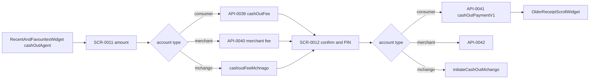

# FLW-0005 Agent cash-out

This is the cash-point flow, not ATM cash-out (`withdrawal_atm` / `getAtmCashoutGenerateOtp`, not traced).

Consumer fee and payment match the deepened wallet DTOs, including `creditParty.key` = `msisdn` and `creditParty.value` = the agent id (BR-0012). Amount must sit between `cashOutMinAmount` and `cashOutMaxAmount`.

## Evidence

- `lib/ui/controllers/cash_point/cash_point_enter_amount_widget_controller.dart` › `cashOutLookUp`
- `lib/ui/controllers/cash_point/cash_point_confirmation_widget_controller.dart` › `initiateCashOut`
- `lib/core/network/manager/api_ manager.dart` › `requestCashOutfee`, `initiateCashOut`
