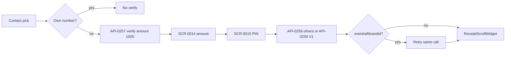

# FLW-0006 Other-operator airtime top-up

Legacy contact book path for `UseCaseTypes.topUpOthers`. Self top-up (`isOther` false) uses the same confirm method and was not walked from the dashboard icon. Bundle purchase is a different widget.

Rules: do not verify the logged-in number (BR-0017). Amount must sit in the operator min/max or the pre-login airtime limits (BR-0016). PIN length 4 (BR-0008).

Contract diff: [../contracts/dashboard-airtime-bills.md](../contracts/dashboard-airtime-bills.md).

## Evidence

- `lib/ui/widgets/contactselection/contact_selection_for_transaction_widget.dart`
- `lib/ui/controllers/contactselection/contact_selection_for_transaction_widget_controller.dart` › `getOperaterTopUpOther`
- `lib/ui/controllers/airtimetopups/credit_telma/mobile_top_up_confirmation_widget_controller.dart`
