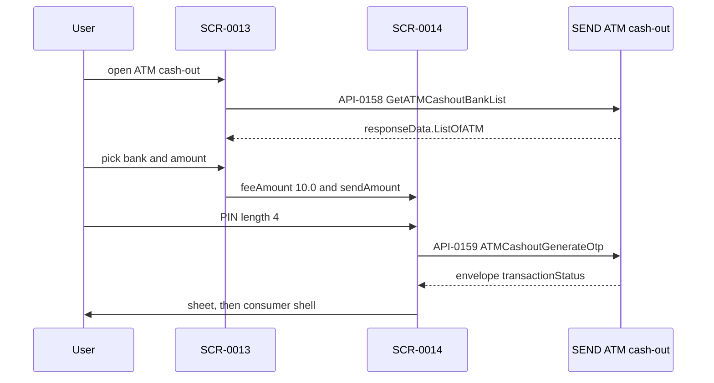

# FLW-0006 ATM cash-out

**APIs:** API-0158 (`BE-API-SEND-008`), API-0159 (`BE-API-SEND-009`) · **Screens:** SCR-0013, SCR-0014 · **Rules:** BR-0008, BR-0013, BR-0014

There is no fee lookup. The confirm screen is opened with a fixed fee string.

Field diff: [../contracts/atm-airtime-bills.md](../contracts/atm-airtime-bills.md).

## Evidence

- `lib/ui/widgets/atm_cashout/atm_cashout_enter_amount_widget.dart` @ `6328b7254`
- `lib/core/network/manager/api_ manager.dart` › `getAtmCashoutBankList`, `getAtmCashoutGenerateOtp`
