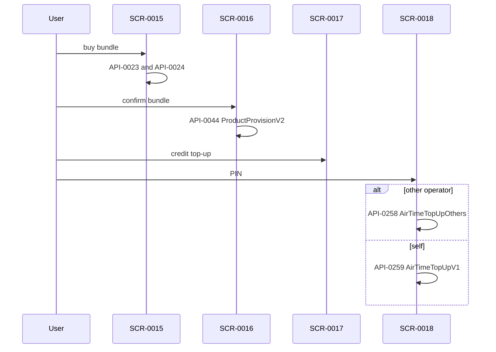

# FLW-0007 Airtime credit and bundles

**APIs:** API-0023, API-0024, API-0044, API-0258, API-0259 · **Screens:** SCR-0015–SCR-0018 · **Rules:** BR-0008, BR-0015, BR-0016

Two journeys share the airtime folder. Bundle purchase does not call the credit top-up methods.

Field diff: [../contracts/atm-airtime-bills.md](../contracts/atm-airtime-bills.md).

## Evidence

- `lib/ui/controllers/airtimetopups/` @ `6328b7254`
- `lib/core/network/manager/api_ manager.dart` › `creditAirTimeTopUpOthers`, `requestProductProvision`, `networkBoBundles`, `networkGetSeziakoBundles`
