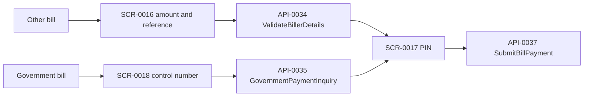

# FLW-0007 Pay a bill

Two entries share the submit call. Bank transfer, DStv, registration, and international remittance also call these methods and are not on this diagram.

Rules: reference non-empty; amount warnings use wallet `mainBalance` and minimum 100 (BR-0018). Control number length at least 7 (BR-0019). PIN length 4 (BR-0008).

Contract diff: [../contracts/dashboard-airtime-bills.md](../contracts/dashboard-airtime-bills.md).

## Evidence

- `lib/ui/controllers/billpayment/enter_amount_for_pay_bill_controller.dart`
- `lib/ui/controllers/billpayment/enter_control_number_widget_controller.dart`
- `lib/ui/controllers/billpayment/bill_pay_detail_controller.dart`
