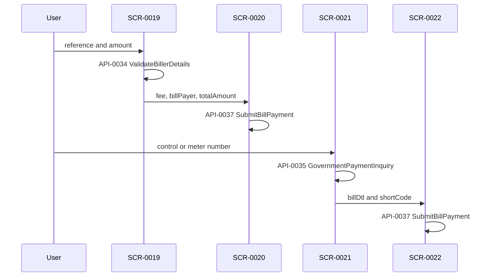

# FLW-0008 Bill payment

**APIs:** API-0034, API-0035, API-0037, plus API-0012 on the other-bills list · **Screens:** SCR-0019–SCR-0022 · **Rules:** BR-0008, BR-0017, BR-0018

Other bills inquire with ValidateBillerDetails, then submit. Government bills inquire with GovernmentPaymentInquiry, then the same submit method.

Not traced: favorites, Zanzibar-only branches, QR from the bill widgets, and the schedule button. Bank transfer and international remittance also call API-0037. They stay on their own feature rows.

Field diff: [../contracts/atm-airtime-bills.md](../contracts/atm-airtime-bills.md).

## Evidence

- `lib/ui/controllers/billpayment/` @ `6328b7254`
- `lib/core/network/manager/api_ manager.dart` › `requestInquiryReferenceNumber`, `requestGovPaymentInquiry`, `submitBilPayment`
