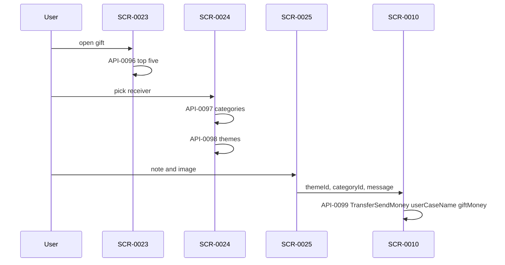

# FLW-0009 Gift money

**APIs:** API-0096, API-0097, API-0098, API-0099 · **Screens:** SCR-0023, SCR-0024, SCR-0025, then SCR-0010 · **Rules:** BR-0008, BR-0019, BR-0020

Theme and history are gift-specific. The payment reuses send-money confirm with a gift body.

The nested `transferMoney[].transactionType` is copied from the contact helper. The preview button does not set it to `giftMoney`.

Field diff: [../contracts/gift.md](../contracts/gift.md).

## Evidence

- `lib/ui/controllers/tanzania_gift/` @ `6328b7254`
- `lib/core/network/manager/api_ manager.dart` › `getTopFiveGiftTransaction`, `getAllThemeCatagory`, `getByIdTheme`, `requestSendMoneyProcessPaymentGift`
