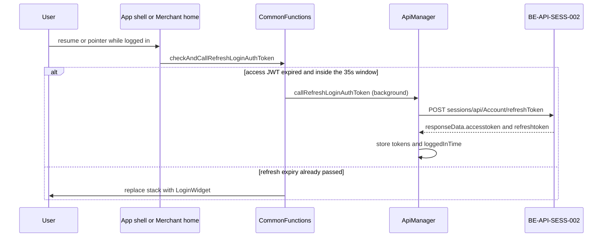

# FE usage of BE-SVC-SESS Mobile session JWT issuance
**BE:** [../../../backend/services/sess/service.md](../../../backend/services/sess/service.md) · **Base-URL key in FE:** `UrlConstants.baseURL` (theme `networkBaseURL`) + gateway prefix `sessions` · **Status:** deep-analyzed

The app uses this service for one job: replace an expired access token before the refresh token itself expires. The access token that later rides in `X-User-Session` is first stored at login from the account service (`accessCode` on `LoginProfile`), then replaced by this refresh call.

## API usage summary

| BE-API | Action | Match status | Screens | Trigger (short) | FE file |
|---|---|---|---|---|---|
| BE-API-SESS-001 | `AccountController.Auth` | not-in-fe | — | — | — |
| BE-API-SESS-002 | `AccountController.Refresh` | fe-used | FE-SCR-001; app shell; HTTP 410 on any call | resume, pointer, or HTTP 410 | [apis/accountcontroller-refresh-002.md](apis/accountcontroller-refresh-002.md) |
| BE-API-SESS-003 | `AccountController.enc_payment` | n/a-helper | — | — | — |
| BE-API-SESS-004 | `AccountController.dec_req` | n/a-helper | — | — | — |

## Screens involved

| FE-SCR | Role in this service |
|---|---|
| FE-SCR-001 Merchant home | On resume, while logged in, asks whether the session should be refreshed. |
| App shell (`main.dart` Listener) | Same check on every pointer down, move, and up while logged in. Covers the consumer shell (`NewBottomNavigationBarWidget`), which has no refresh call of its own. |
| Login (`LoginWidget`) | Destination when the refresh token is finished or HTTP 411 arrives. It does not call SESS. |

## Journey

A second path: any API that returns HTTP 410 calls the same refresh, then repeats the original request. Detail is in the API file.

## Rules (FE-BR) — summary + BE-BR links

| FE-BR | Summary | BE link |
|---|---|---|
| FE-BR-SESS-001 | 35-second refresh window | — |
| FE-BR-SESS-002 | Past refresh expiry goes to login | — |
| FE-BR-SESS-003 | Logout, empty token, bad JWT, guest | — |
| FE-BR-SESS-004 | HTTP 410 refreshes, then retries (max 2) | BE-ERR-SESS-002, BE-BR-SESS-001 |
| FE-BR-SESS-005 | HTTP 411 goes to login | — |
| FE-BR-SESS-006 | Checks run only when logged in | — |
| FE-BR-SESS-007 | No session-expired dialog | — |

Full text: [business-rules.md](business-rules.md).

## Gaps (FE-GAP) — summary

| FE-GAP | Summary |
|---|---|
| FE-GAP-001 | Optional refresh DTO fields are omitted. |
| FE-GAP-002 | `responseData` token fields are used and are not in the BE contract. |
| FE-GAP-003 | The app handles HTTP 411; the BE error list does not mention it. |
| FE-GAP-004 | Envelope `success` / `responseCode` do not decide refresh success. |
| FE-GAP-005 | The access token is sent with a `Bearer ` prefix. |

## Not used by the app

- `BE-API-SESS-001` `POST /api/Account/auth` — searched, no path in the app.
- `BE-API-SESS-003` `POST /api/Account/enc` — helper, no app call.
- `BE-API-SESS-004` `POST /api/Account/decreq` — helper, no app call.

The gateway OAuth token (`grant_type` client credentials, path ending in `token`) is a different call. It is not mapped to `BE-API-SESS-001`.

## Open questions

- Is `POST /api/Account/auth` issued only inside the session service (and unused by this app), or does a gateway rewrite hide it behind another path?
- Confirm the refresh `responseData` field names with the session service.
- Confirm whether the session service returns HTTP 411.
